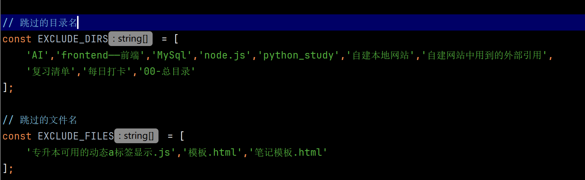

# 我的知识库

> 2025 年大专至今的个人学习笔记与备考记录 —— 以知识库的形式整理。

---

## 快速导航

- [Python 二级备考笔记](#python-完整体系)
- [计算机一级备考笔记](#计算机等级考试)
- [HTML/CSS 与 JavaScript](#前端)

---

## 关于该仓库

这是我 2025 年上大专至今积累的**个人知识库**，包含前端、计算机等级考试、Python 后端开发等学习内容。

---

## 包含的知识

### 前端
- **HTML / CSS**（已完结）
- **JavaScript**（学习进行中）

### 计算机等级考试
- **计算机一级（MS Office）**：备考记录、知识点整理
- **计算机二级（Python）**：备考笔记、错题归纳

### Python 完整体系
基于哔哩哔哩 UP 主「黑马程序员」课程，涵盖：

#### 第一部分 —— Python 启航
- 初识 Python
- 环境准备与 Python 安装
- 入门程序剖析

#### 第二部分 —— Python 核心语法（完整大纲）
- **数据存储与运算**（字面量、变量、标识符、字符串进阶、输入输出、运算符）
- **流程控制语句**（if 分支、match 模式匹配、while/for 循环）
- **数据容器**（列表、元组、字符串、集合、字典）
- **函数**（定义、参数、返回值、作用域、匿名函数、递归）
- **类型注释**（函数类型注释、变量类型注释）
- **模块与包**（导入方式、包机制、`__all__`、`sys.path`）
- **面向对象**（类、实例、属性、魔法方法、继承/多态/封装）
- **异常处理**（try-except、自定义异常、异常传递）
- **文件读写与操作**（open、读写模式、with 语句）

---

## 如何使用

### 在线访问（推荐）
- **Vercel 地址**：[https://my-web-plum-gamma-39.vercel.app/](https://my-web-plum-gamma-39.vercel.app/)  
  （动态加载稳定，推荐使用）

### 备用访问
- **GitHub Pages 地址**：[https://goldenfloweranddust.github.io/my_web/](https://goldenfloweranddust.github.io/my_web/)  
  （注意：GitHub Pages 上部分动态加载可能失败，若遇到此问题，请改用 Vercel 地址）

### 使用说明
- 单击链接即可进入主页，所有自学笔记已按类别整理在「博客」模块中。
- 计算机二级备考笔记使用导航栏+响应式设计，大部分内容通过动态加载显示，单击即可查看。
- 主页导航栏尚在设计中，目前暂时作为展示入口。

---

## 预览

---

## 更新日志

### 历史更新（2026-10-06 之前）

- 目前备考二级，持续补充笔记与错题归纳
- 定期优化导航与布局
- python 二级已经考完，后面大部分时间都是刷题，没有更新，但是大部分前 10 题都有所涉猎

### 2026-10-06 主要更新：专升本英语背单词体验

- 新增 Node.js 脚本 —— 生成 json 索引文件、重置每个板块日期（目前：1、3、7、15、30 天间隔复习）

- [英语单词复习清单](内容文件夹/专升本备考/备考专升本英语/复习清单/复习清单.html)

#### 联动逻辑

- **打勾**：复习清单点「✓ 已复习」后，该条目会记入当天的打卡记录（复习列）
- **新增**：新增一个词根 HTML 并跑完生成脚本后，打卡记录会自动出现「新增」项（以文件创建日期为准）
- **过滤**：被 `生成json索引.js` 排除的目录 / 文件（黑名单），不会进入 json，也就不会出现在打卡记录里

- 

#### 技术架构

- **data.json**：全局索引，由 Node.js 脚本（`生成json索引.js`）扫描目录自动生成
- **复习清单**：读取 data.json，展示今日任务，打勾后本地保存
- **打卡记录页**：按月读取 data.json 的 `created` 和 `lastReviewed` 字段，展示每日「新增」和「复习」
- **复习节奏**：1 / 3 / 7 / 15 / 30 / 60 / 90 天间隔重复
- **AI 协助实现代码，整体架构与学习逻辑为个人设计**

#### 主要更新文件

- [复习清单 - 文件夹](内容文件夹/专升本备考/备考专升本英语/复习清单)
- [每月复习文件夹](内容文件夹/专升本备考/备考专升本英语/每月打卡)