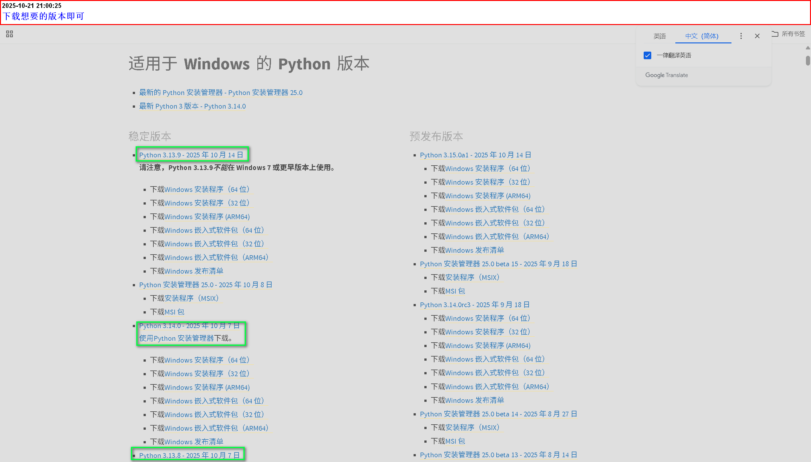
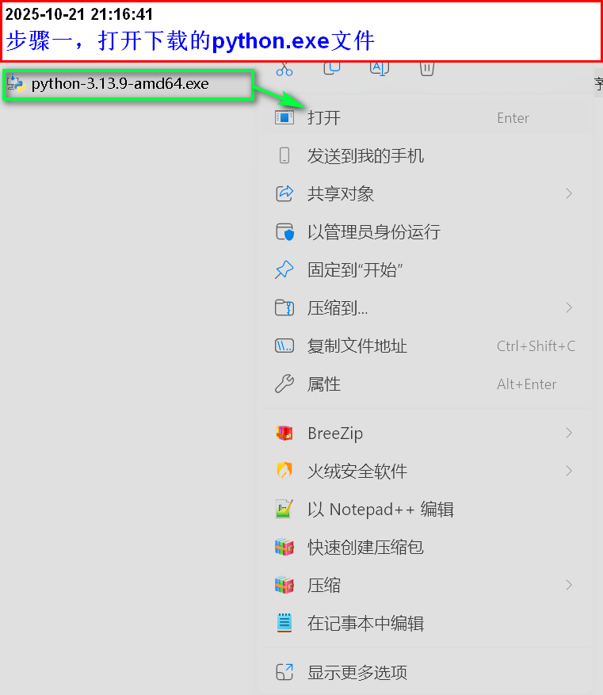
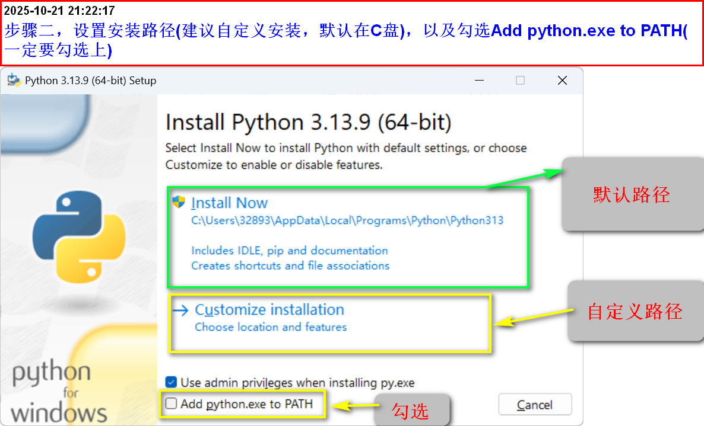
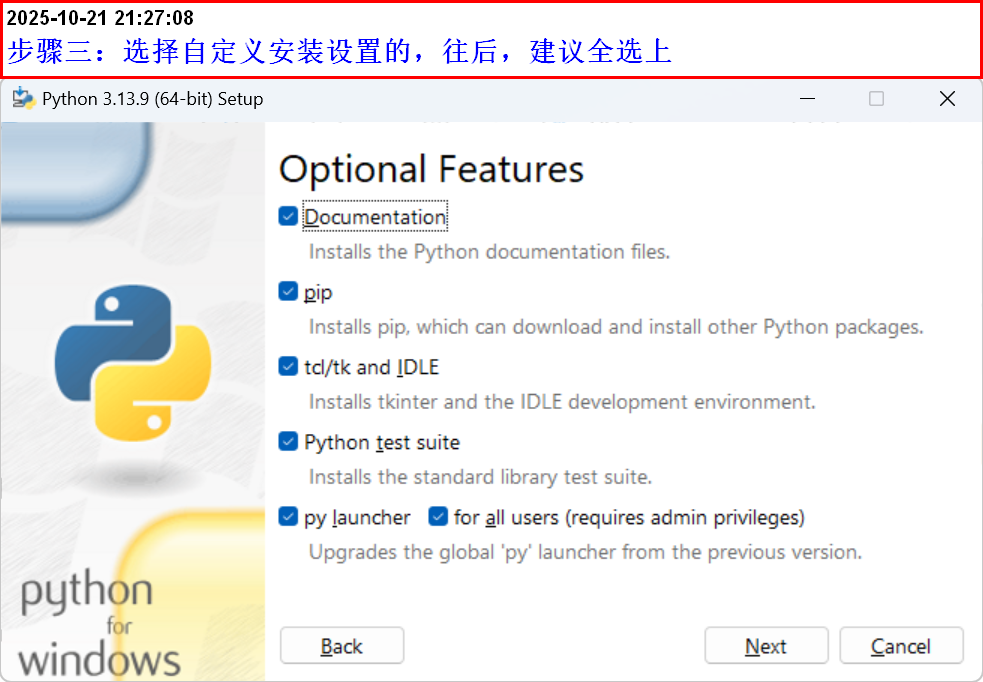
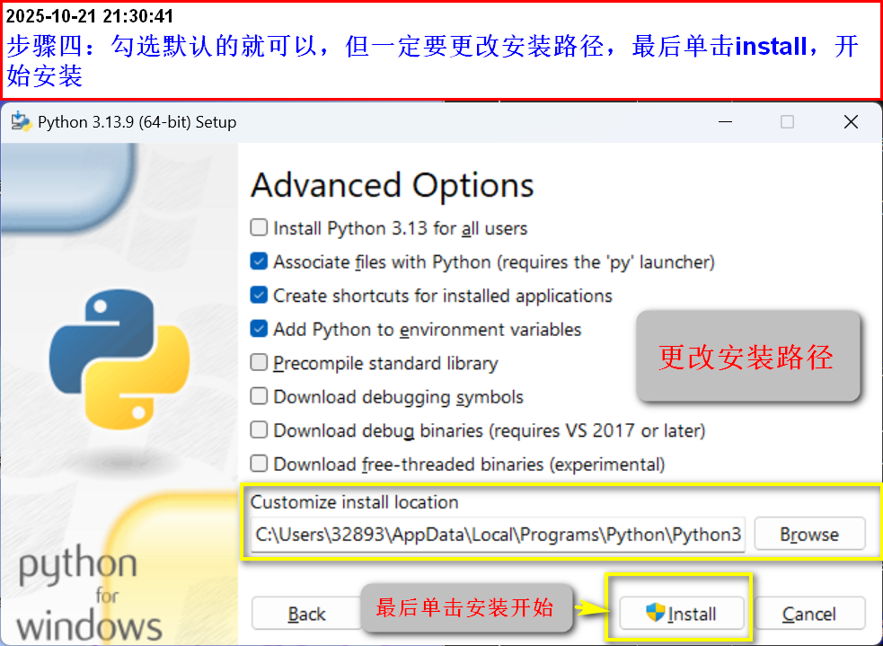
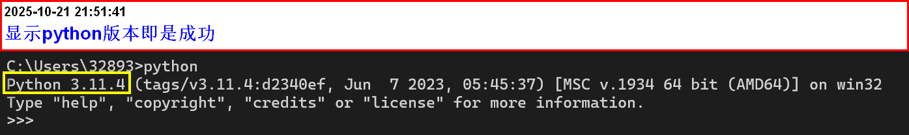
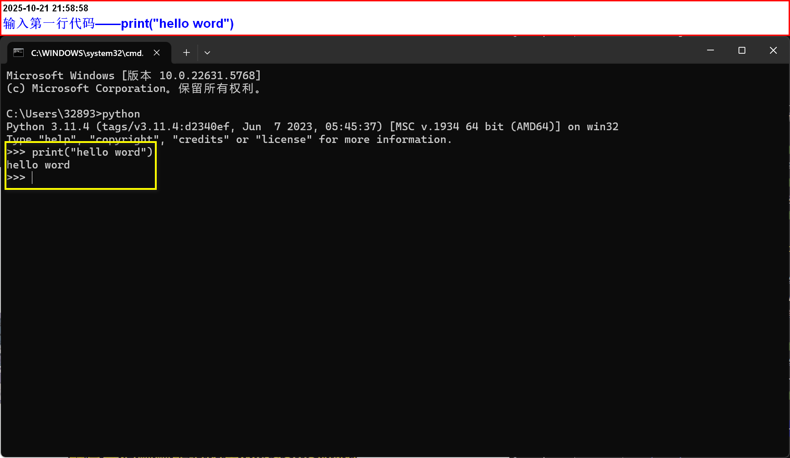

# python环境配置

## 为什么要安装python的运行环境

1. 不管用什么工具开发python程序，都必须安装python的运行环境
2. 该UP主以Windows系统为主，同时python版本在3.X版本为主

## 安装python运行环境

1.  进入python官网(python.org)下载python安装包

    •python有许多版本，单击下载对应的版本即可

    [python版本下载
    ](https://www.python.org/downloads/windows/)

2.  安装下载好的python.exe(因为以前下过python别的版本，我就下载了最新版本做演示)
    - 步骤一:打开下载的python.exe文件
      
    - 步骤二：设置安装路径(建议自定义安装，默认在C盘)，以及勾选Add python.exe to PATH(一定要勾选上)
      ==**Add python.exe to PATH复选框，勾选后，安装程序就会自动将python的路径加到PATH环境变量中==**
      
    - 步骤三：选择自定义安装的往后，建议全选上
      
    - 步骤四：勾选默认的就可以了，但一定要更改安装路径，最后单击install开始安装
      
    
3.  检测安装成功
    - 方法一：在终端运行python检测
      ==**按windows+R键打开运行框，输入cmd，打开终端再，输入python并回车，出现当前界面，表示成功了。==**
      
    - 方法二：在终端运行python \--version检测
      
      - **==这个方法会显示安装python的版本==**
        
    
4.  输入第一行代码------print("hello word")
    
    - 注意：所有的字符都是英文，中文会报错
    - print：输出的意思，就是将结果输出到控制台 ]{.mark}
      

