# 在VScode安装开发环境
- 在python开发领域中，Visual Studio Code(简称VScode)凭借着轻量级、高扩展性和强大的社区支持，已经称为开发者首选的编辑器之一。
- (如pycharm、JupyterNotebook),VScode不仅具备代码高亮、智能提示、调试支持等基础功能、还能通过丰富的插件生态实现虚拟环境管理，Jupyter交互式编程、Git版本控制等高级功能
- (当然我还是用pycharm)

## 第一步：进入VScode官网下载安装包

[[VScode官网]{style="font-size: 25px"}](https://code.visualstudio.com/)

### 具体安装步骤

1.  步骤一：将下载好的安装程序，右击，再单击
    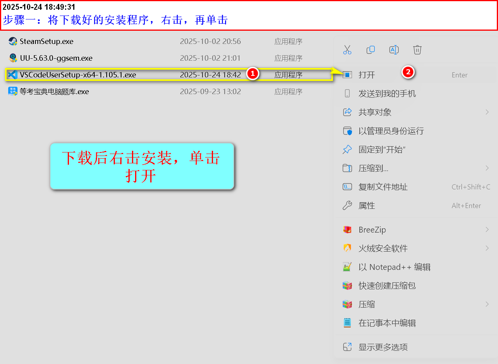

2.  步骤二：单击同意协议，并单击下一步
    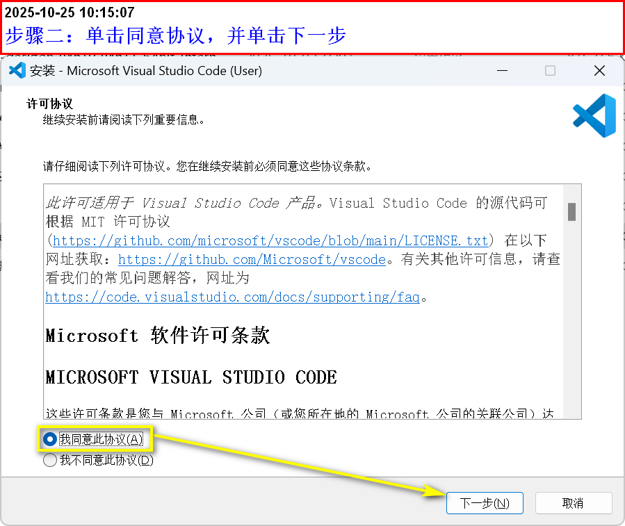

3.  步骤三：单击创建桌面快捷方式复选框，其他默认即可，并单击下一步
    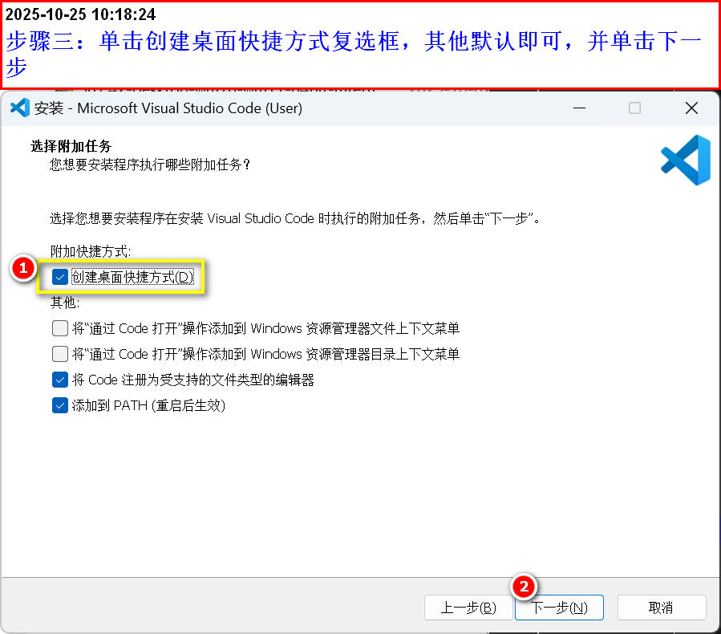

4.  步骤四：单击安装
    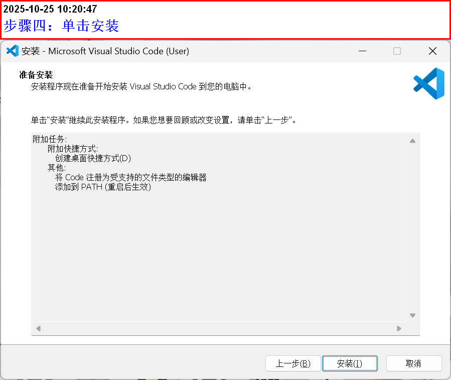

5.  注意：

    可能是因为我在电脑安装了，没有卸载，没有出现更改路径这个选项(默认安装到了D盘)，[如果安装能更改路径，尽量更改到别的盘符。]{.mark}

### 第二步：打开已经安装好的VScode

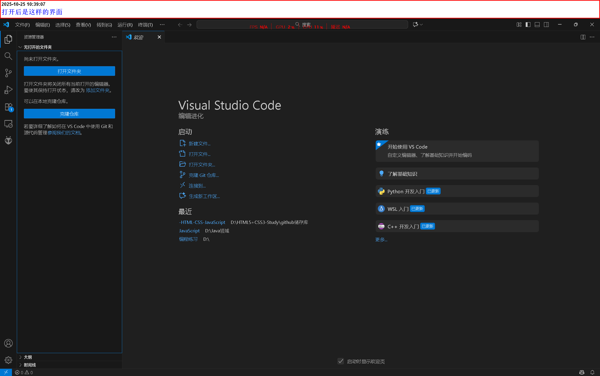

### 第三步：安装插件

- 简体中文插件

  打开VScode，设置简体中文，在扩展商店，搜索Chinese，安装简体中文或繁体中文插件，然后重启即可。

  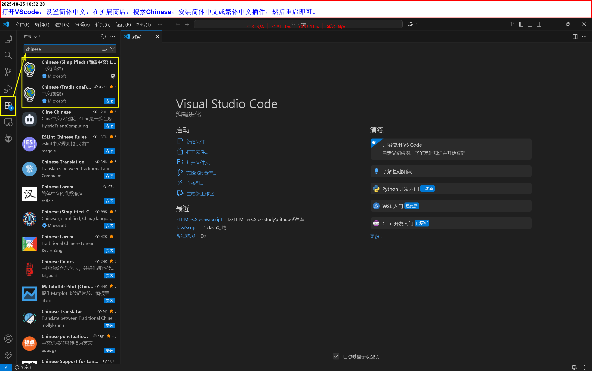

- python扩展

  首先，搜索python，单击安装，我因为安装过了，会显示卸载选项

  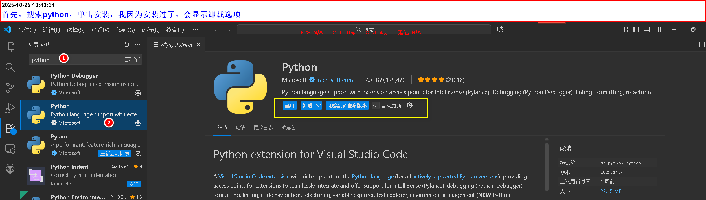

### 第四步：配置python解释器

1.  按Ctrl+Shift+P打开命令面板
    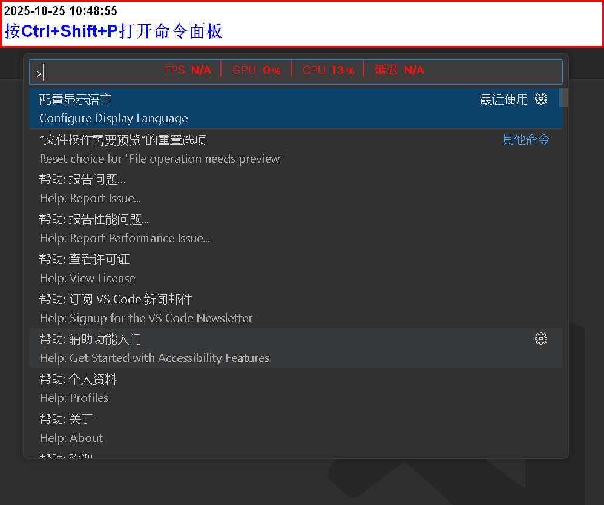

2.  输入python:Select lnterpreter

    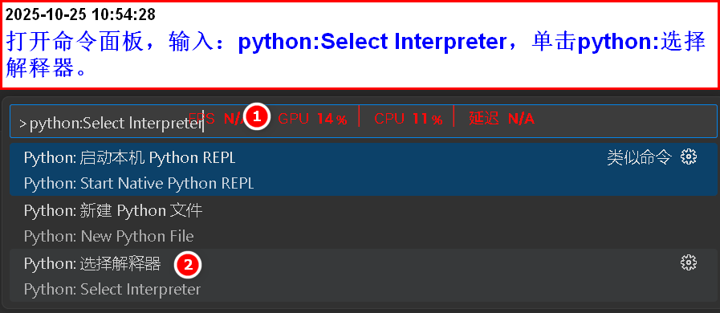
    

    - 过一会，软件会自动搜索，安装的python版本，我的是3.11.4，点击添加即可

    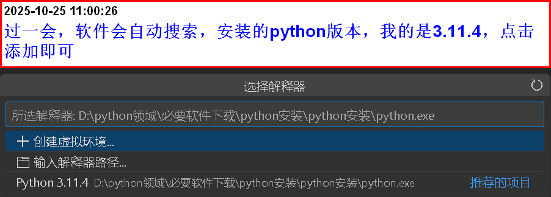

### 第五步：验证配置是否成功

1. 新建立一个文件夹 
2. 在文件夹当中，新建一个.py文件 
3. 输入print(\"Hello
   word\")，并运行。

- 注意:一定要先保存再运行(当文件，右边的小白点小时，即是保存成功)

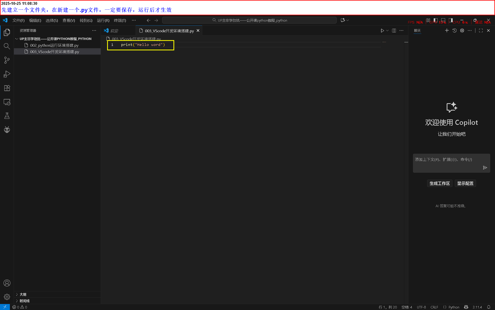

- 保存好后，在空白处右击，找到\[运行python\]，选择在终端运行

**==需要注意的是：设置的文件路径不要太复杂了，运行可能会报错==**
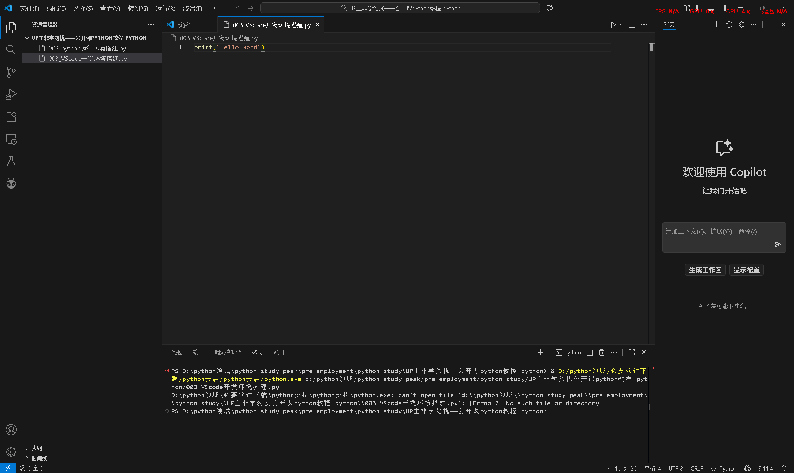

- 最后的显示结果

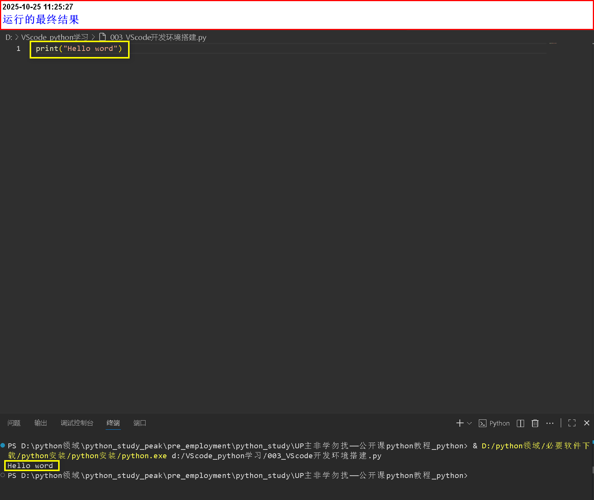
