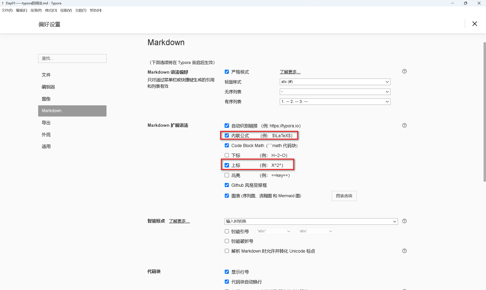
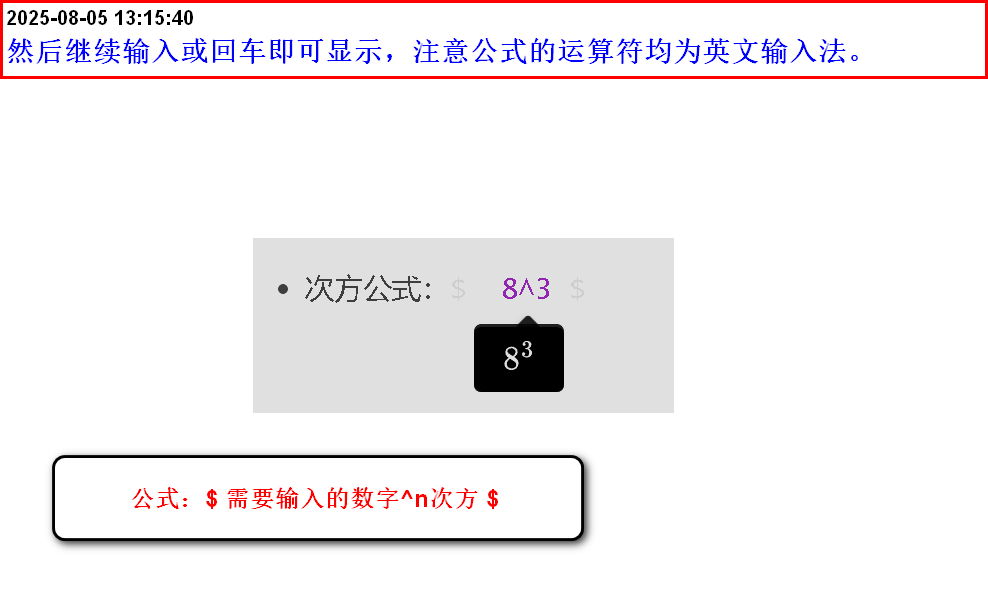

# Day01——markdown学习

## 标题

### 1. **使用方法：#+空格+内容（代表一级标题） ##+空格+内容（代表二级标题）  ###+空格+内容（代表三级标题）以此类推——且最多达到六级标题。**

### 三级标题

#### 四级标题

###### 


## 字体

### 1. 加粗使用方法：** 内容 **（为了方便演示两边加了空格，正常情况下不需要）

#### **Hello,word!**

### 2. 斜体使用方法：* 内容 *（为了方便演示两边加了空格，正常情况下不需要）

#### *Hello,word!*

### 3. 斜体加粗使用方法：***内容 ***（为了方便演示两边加了空格，正常情况下不需要）

#### ***Hello,word!***

### 4. 删除线使用方法：~~ 内容 ~~（为了方便演示两边加了空格，正常情况下不需要）

#### ~~Hello,word!~~


## 引用

### 引用使用方法：>(按空格即可，一般引用他人的句式)

>
>
>选择狂神说Java，走向人生巅峰


## 分割线

### 分割线使用方法：---（三个减号按空格）或  ***（三个星号按空格）

---

***


## 图片

### 图片的插入方法： （符号均为英文输入法)[输入该图片的注解]（输入该图片的路径)——图片分为网页地址和本地地址

 


## 超链接

### 超链接的使用方法：[]() ——符号均为英文输入法 [输入该超链接的注解]（超链接的地址）——注意：超链接在Typora中不会跳转，但在博客当中会跳转。

[博客园超链接]([博客园 - 开发者的网上家园](https://www.cnblogs.com/))


## 列表

### 列表表示方法1：数字. 内容（.后要加空格）——这个写法按回车健后他会从第一个数字依次往后递增，内容不限—俗称有序列表

1. A
2. B
3. C


### 列表表示方法2：-加空格然后输入内容——这个写法没有顺序，俗称无序列表。

- A
- B
- C


## 表格

### 表格方法一：在空白处，右击选着插入选项，选着表格——最后输入列、行单机确定即可。

|      |      |      |
| ---- | ---- | ---- |
|      |      |      |
|      |      |      |
|      |      |      |

### 表格方法二：标题|标题|标题——换行（输入--|--|--|）——换行（输入与第一行标题对应的内容）——若没有出现表格，只需要单机查看源码删去多余行数即可——说起来有点复杂，看成果——点击左下脚查看源码。

名字|性别|生日
--|--|--
张三|未知|2005.4.13


## 代码

### 代码使用方法：先输入```（必须是英文的）按空格，输入你想写代码编辑器(JAVA、python等)最后回车即可。

``` JAVA
```


## 缩进

### 减少缩进:每当用了列表，往后的每一行都会往后移一位，减少缩进就是往前移一位。

#### 方法：使用组合键shift+Tab

### 增加缩进:就是往后移一位(与减少缩进相反)

#### 方法：使用快捷键Tab


## 插入数学公式

### 现在偏好设置勾选内联公式复选框



- 次方公式：$  8^3 $

  

## 高亮显示格式

- 先选中需要高亮显示的文本
- 然后再文本首尾添加双等号

== 你好 ==
