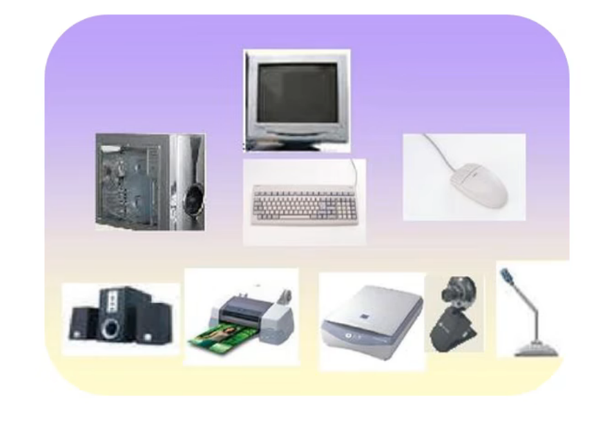
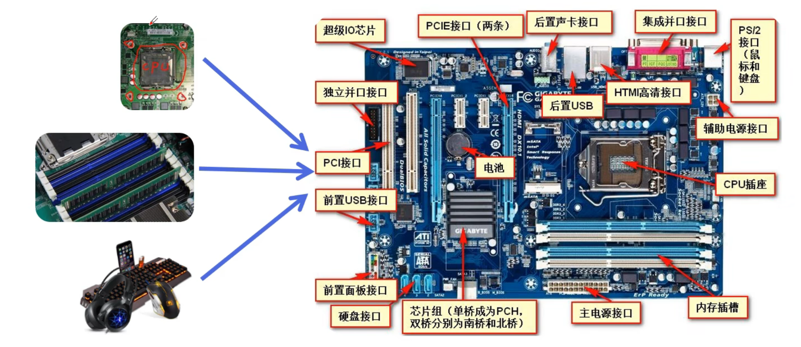
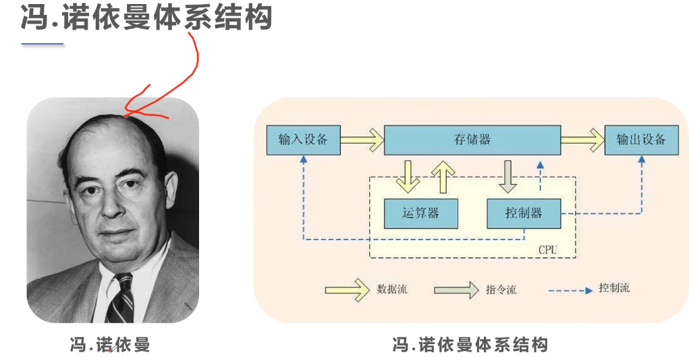

# Day03——计算机硬件

## 简介

1. 一些物理装置按系统结构的要求构成一个有机整体为计算机软件运行提供物质基础。
2. 计算机的硬件组成：
   1. CPU
   2. 主板
   3. 内存
   4. 电源
   5. 显卡
   6. 键盘、鼠标
   7. 显示器
   8. 等.......

## 聊聊装机

1. CPU(造价最贵的)
2. Memory(内存)
3. Motherboard(主板)
4. I/O设备(输入/输出设备)
5. 显卡(图形处理)
6. 计算机最简单的组成(CPU 内存 主板)

 ## 冯.诺依曼体系结构

冯.诺依曼被评为：

1. 最后一位杰出的数学家
2. 20世纪最具科学头脑的人(普遍认为是现代科学家的巨人)  
3. 计算机之父

 