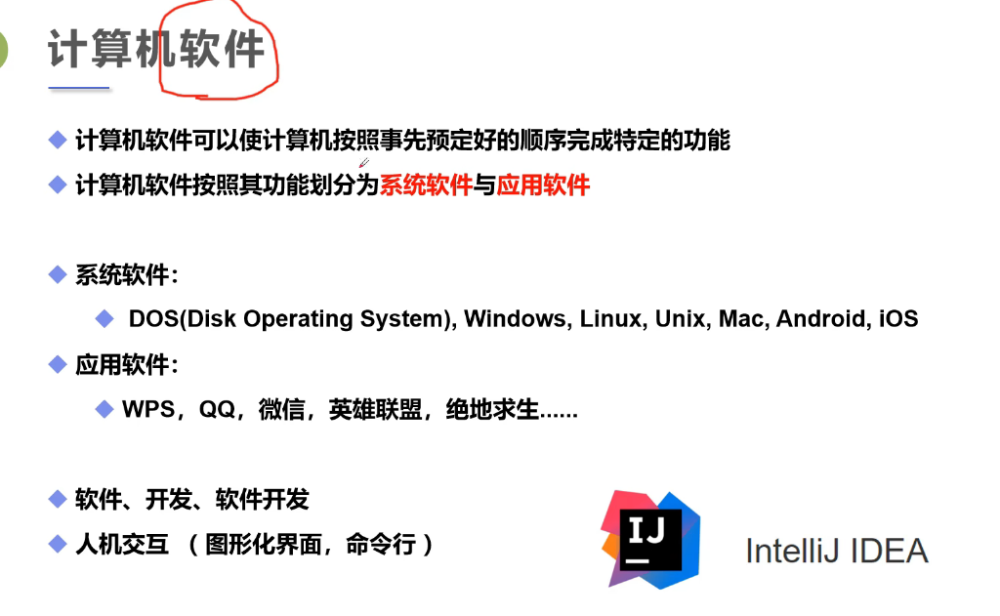

# Day04——软件及软件开发

## 1. 计算机软件

1. 计算机软件可以使计算机按照事先预定好的顺序完成特定的功能
2. 计算机软件按照其功能划分为系统软件与应用软件

### 系统软件

DOS(Disk Operating System)——磁盘操作系统，Windows——可视化，Linux(常用于服务器)，Unix，Mac(苹果电脑操作系统)，Android(安卓) ，IOS(苹果手机操作系统).......

### 应用软件

Wps，QQ，微信，英雄联盟，绝地求生.....

## 2. 软件、开发、软件开发

1. 软件：按照特定程序有组织的运行的
2. 开发：制做软件这个过程
3. 软件开发：借助一些开发工具或计算机语言去制做软件的这个过程  

## 人机交互(图形化界面、命令行)

1. 图形化界面： 可以看的懂得(Windows)
2. 命令行：看不懂得(比如一整个屏幕都是二进制语言)

