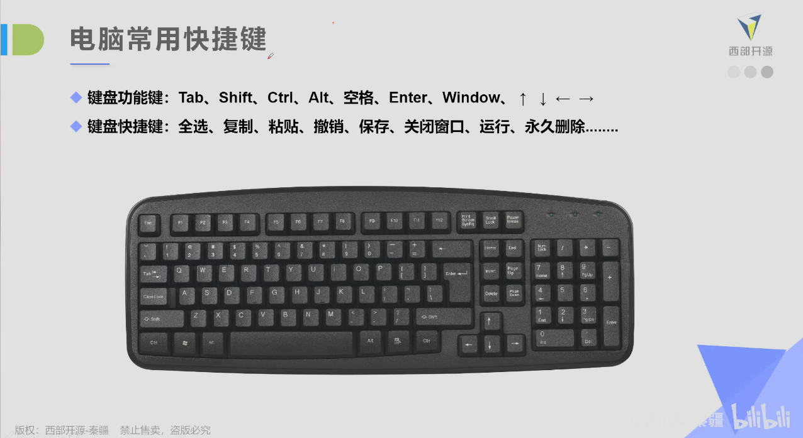

# Day05——Windows常用快捷键

## 人机交互——计算机快捷键

### 键盘功能键：

1. Tab——(切换菜单)
2. Shift——(与其他键组合使用使用)
3. Ctrl——[控制键] (与其他键组合使用)——如：Shift+Ctrl(切换输入法)

4. Alt——(与其他键组合使用)
5. 空格
6. Enter——(回车键)
7. Windows——(打开菜单)
8. ↑  ↓  ←  →
9. NumLock——(开启/关闭【小键盘】)
10. CapsLK——(英文大写锁定键)

### 键盘快捷键：

1. 全选——Ctrl+A 
2. 复制——Ctrl+C
3. 粘贴——Ctrl+V
4. 剪切——Ctrl+X
5. 撤销——Ctrl+Z
6. 保存——Ctrl+S
7. 关闭窗口——Alt+F4
8. 运行——Windows+R
9.  永久删除——Shift+Delete
10. 打开我的电脑——Windows+E 
11. 任务管理器——Ctrl+Shift+Esc、Ctrl+Alt+Delete
12. 切换应用程序——Windows+Tab、Alt+Tab
13. ...........

