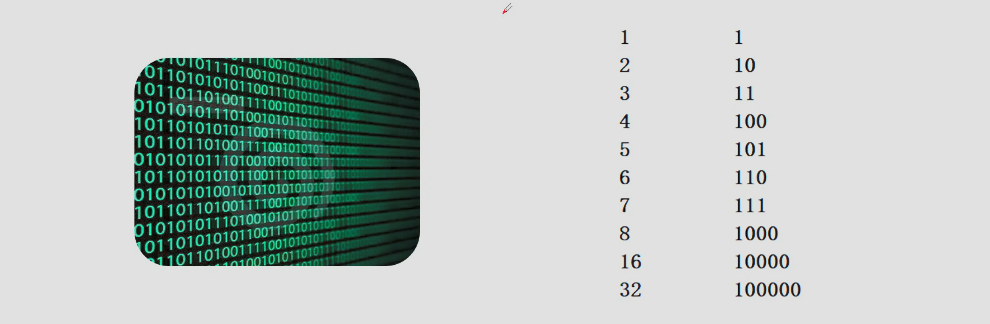
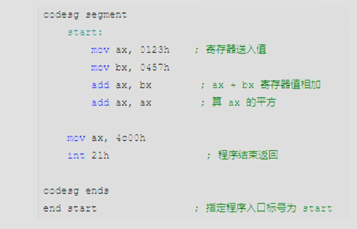
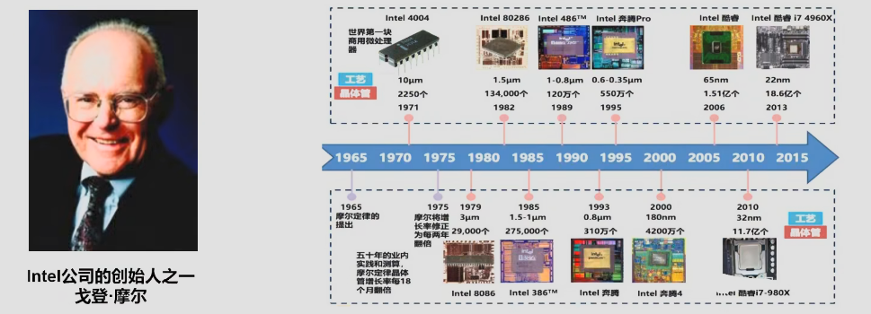
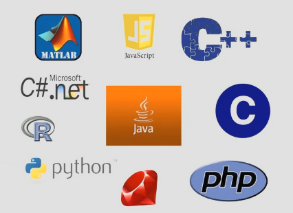

# Day07——计算机语言发展史

## 第一代语言

### 机器语言

1. 我们都知道计算机的基本方式都是基于二进制的方式
2. 二进制：由0和1组成  列如：01011100101011100101110100
3. 这种语言码是计算机能够直接识别和执行的语言

## 第二代语言(汇编语言)

### 汇编语言：

1. 解决人类无法读懂机器语言的问题(使用了大量的助记符)
2. 指令代替二进制
3. 汇编语言→[汇编器]→翻译成电脑能直接识别的语言[机器语言(二进制语言)]
4. 机器语言和汇编语言称为(低级语言)

### 目前应用：

1. 逆向工程
2. 机器人
3. 病毒
4. .......

### 摩尔定律(lntel公司的创世人之一[戈登·摩尔])

当价格不变时，集成电路上可容纳的晶体管数目，约每个18个月便会增加一倍，性能也将提升一倍。换言之，每一美元能买到的电脑性能，将每隔18个月翻两倍以上

## 第三代语言(高级语言)

1. 大体上分为：面向过程和面向对象两大类(两语言相辅相成)
2. C语言是典型的面向过程语言
3. C++、JAVA、python是典型的面向对象语言

### 面向对象与面向过程语言的区别

1. 面向过程：以步骤为核心，代码按解决问题的流程顺序编写，通过函数实现具体操作，数据和操作数据的函数是分离的。(意思就是亲力亲为，什么事情从头到尾都是自己完成)——口诀：自己干，写步骤，传数据，累！

   - 类比:将自己比作(厨师)——老板要求你——现在需要炒名为(番茄炒蛋)的菜——有且只有你一位厨师
   - 具体流程[切菜(番茄)——炒菜(切好的番茄、鸡蛋)——装盘]
   - 以上的每一步骤都要自己一步一步完成。
   - 因为只有你一位厨师，当你罢工了，整个过程(程序)终止。

2. 面向过程：以"对象"为核心，将数据(属性)和操作数据的行为(方法)封装在对象种，通过对象之间的交货完成功能，更注重数据和行为的结合。(意思是先创造一个名为"对象"的帮手，将它样子描绘出来"属性——名词"，并且教会它需要做什么"方法——动词")

- 类比：将自己比作食堂老板(主程序)——雇佣多位员工(对象——有一身本领)——老板定制目标(调用对象)——员工(对象)自主工作——最后员工完成工作——老板检查工作。
- 若当中有一位员工生病，无法工作，只会拖慢工作进度，并不会像(面向过程)一样过程(程序)终止，最后剩下的员工完成目标。
- 老板只在乎结果而不是过程
- 员工可以自由选着完成任务的方式

### 各种语言：

1. C语言(最重要的)
2. C++语言
3. JAVA语言
4. C#语言——C sharp
5. python、PHP、JavaScript
6. ......

