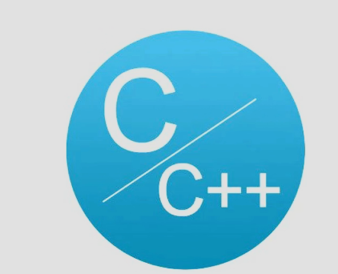
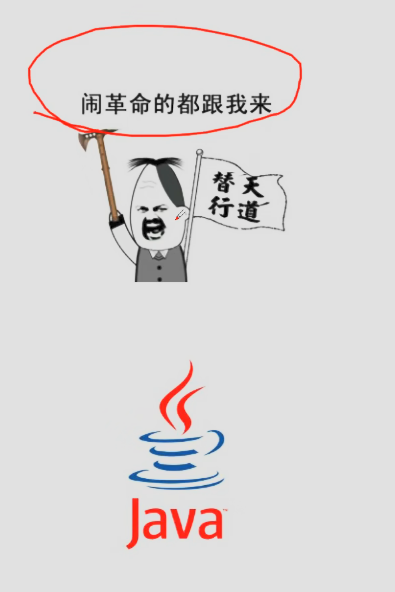

# Day08——Java帝国的诞生

## C & C++ (诞生时间)

### 1972年C诞生——[Java——1995诞生时间]

1. 贴近硬件，运行极快，效率极高。
2. 操作系统，编译器，数据库，网络系统等
3. 指针和内存管理(一般发现不了，当程序运行的时候便会出现诟病)——程序员最头疼的
4. 移植性较差，但凡出一点差错，在别的地方就运行不了。

### 1982年C++诞生——(比C语言更难掌握)

1. 面向对象
2. 兼容C
3. 图形领域、游戏等

### 反抗

#### 因为一些程序员觉得C语言很难，走捷径发明了Java

##### java的特点——原名叫C++--

1. 语法有点像C
2. 没有指针
3. 没有内存管理
4. **真正的可移植性，编写一次，到处运行**
5. 面向对象
6. 高质量的类库
7. .........

## Java初生

1. 1955年的网页简单而有粗糙，缺乏互动性，于是就发明了图形界面的程序(Applet)
2. Bill Gates说：这是迄今为止设计的最好的语言！
3. Java 2 标准版(J2SE)：去占领桌面
4. Java 2 移动版(J2ME)：去占领手机
5. Java 2 企业版(J2EE)：去占领服务器
6. 大量的巨头加入

## Java发展

1. 他们基于java开发了巨多的平台，系统，工具
2. 构建工具：Aut、Maven、Jekins
3. 应用服务器：Tomcat、Jetty、Jboss、Websphere、weblogic
4. Web开发：Struts、Spring、Hibernate、myBatis
5. 开发工具：Eclipse、Netbean、intellij idea、Jbuilder
6. .......

1. 2006：Hadoop (大数据领域)
2. 2008：Android (手机端)

### 三高：高可用、高性能、高并发

