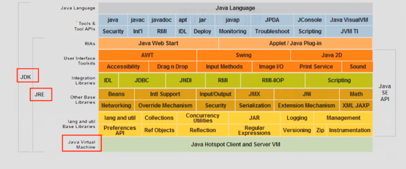

# Day10——JDK-JRE-JVM

## 全称

1. JDK：java Development Kit
2. JRE：java Runtime Environment
3. JVM：JAVA Virtual Machine

### 如图中一些名词的解释

1. API：接口
2. JDK：java Development Kit——Java开发者工具
3. JRE：java Runtime(运行) Environmen(环境)——Java运行环境
4. JVM：JAVA Virtual Machine——虚拟机
5. JDK包含了：JRE、JVM
6. JRE包含了: JVM(虚拟机)
7. Java和Javac：编译和运行Java程序
8. apt：使Java程序生成一些文档
9. Jar：将Java程序打包成一些应用
