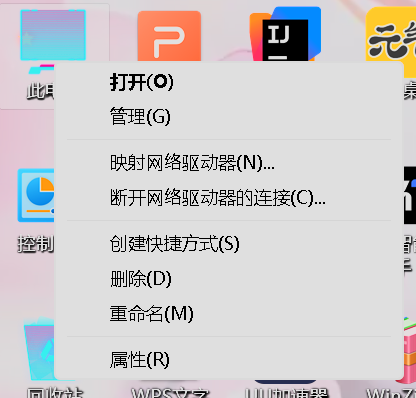
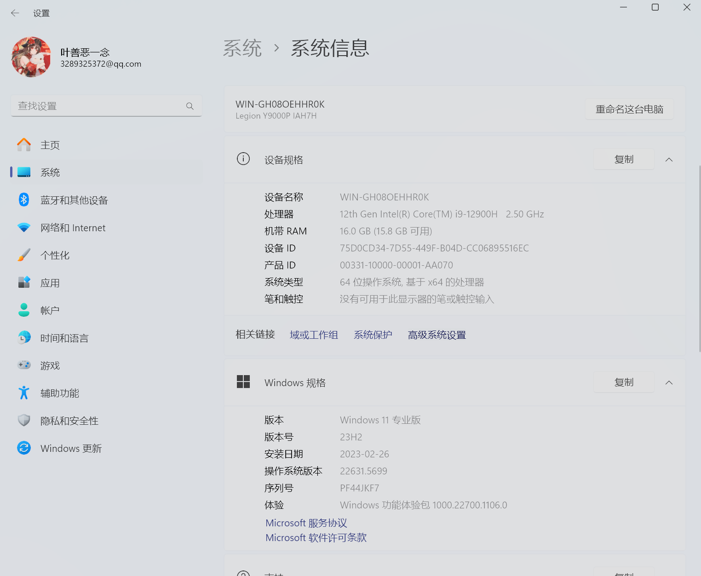
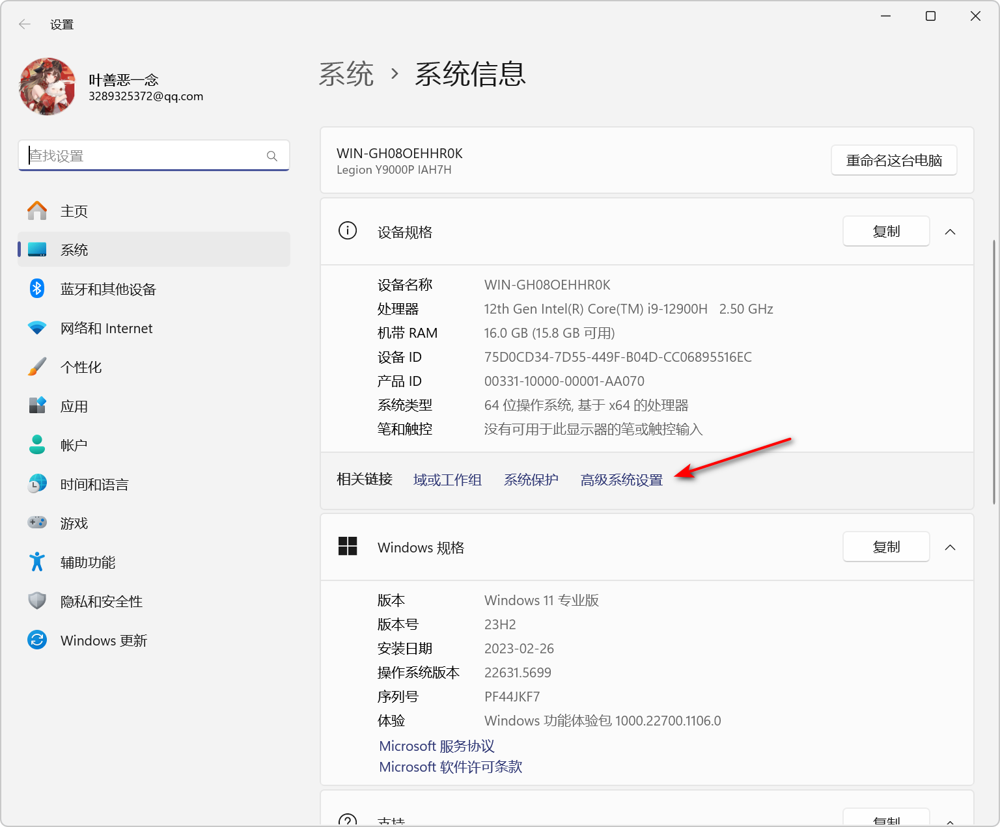
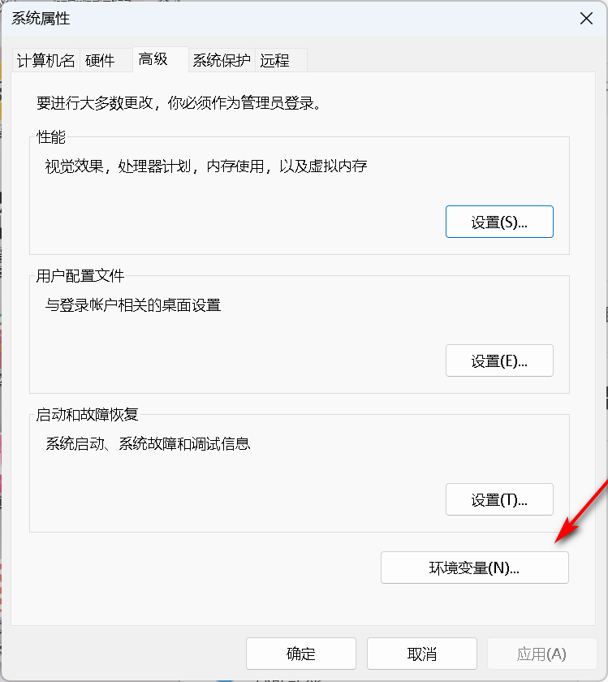
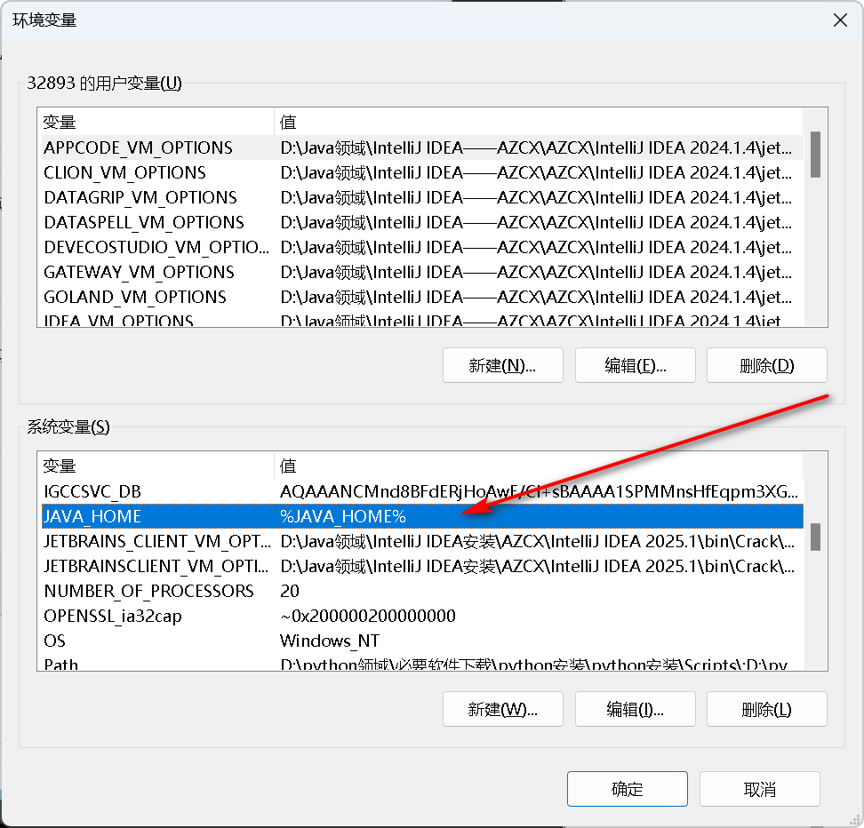
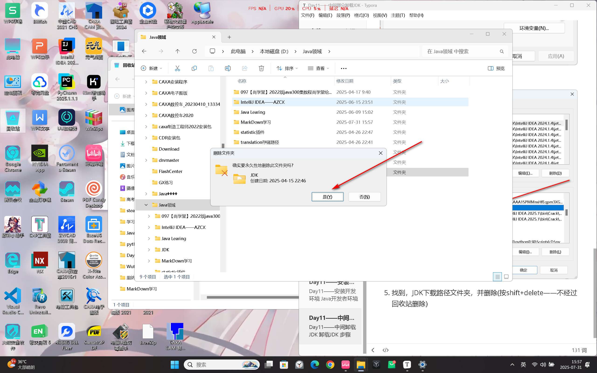
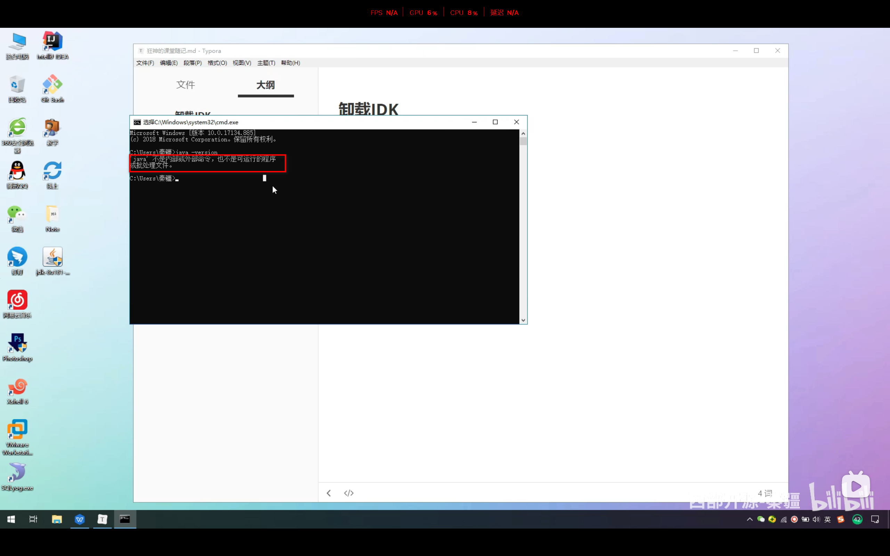

# Day11——中间卸载JDK

## 卸载JDK

### 步骤一：找到JDK安装的目录

1. 此电脑右键，单击属性，找到高级系统设置

### 步骤二：单击高级系统设置

### 步骤三：找到环境变量，并单击

### 步骤四：找到Java_HOME

### 步骤五：找到，JDK下载路径文件夹，并删除(按shift+delete——不经过回收站删除)

### 步骤六：在环境变量中找到全部与JDK相关的变量全部删除

## 证明已经将JDK全部删除

使用win+R，弹出运行框，输入cmd,进入DOS界面，输入(java -version)——Java后有个空格，当出现如图所示即为卸载成功。

