# Day12——HelloWord详解

## HelloWord及简单语法规则

1. 谁便新建一个文件夹，存放代码[**code**(代码)]

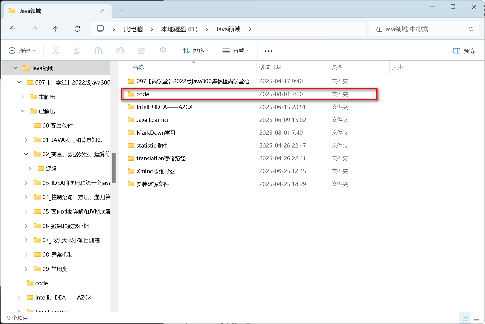

### 显示文件后缀名

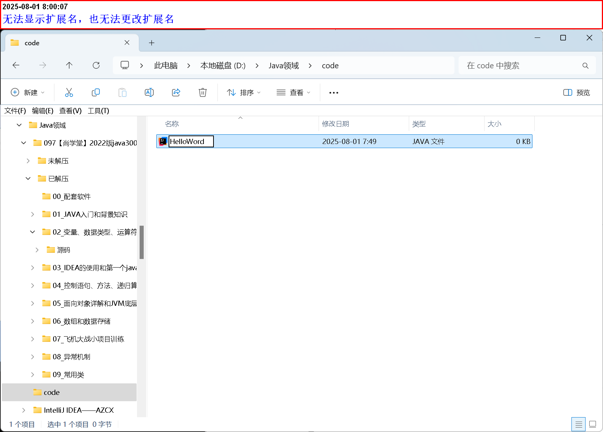

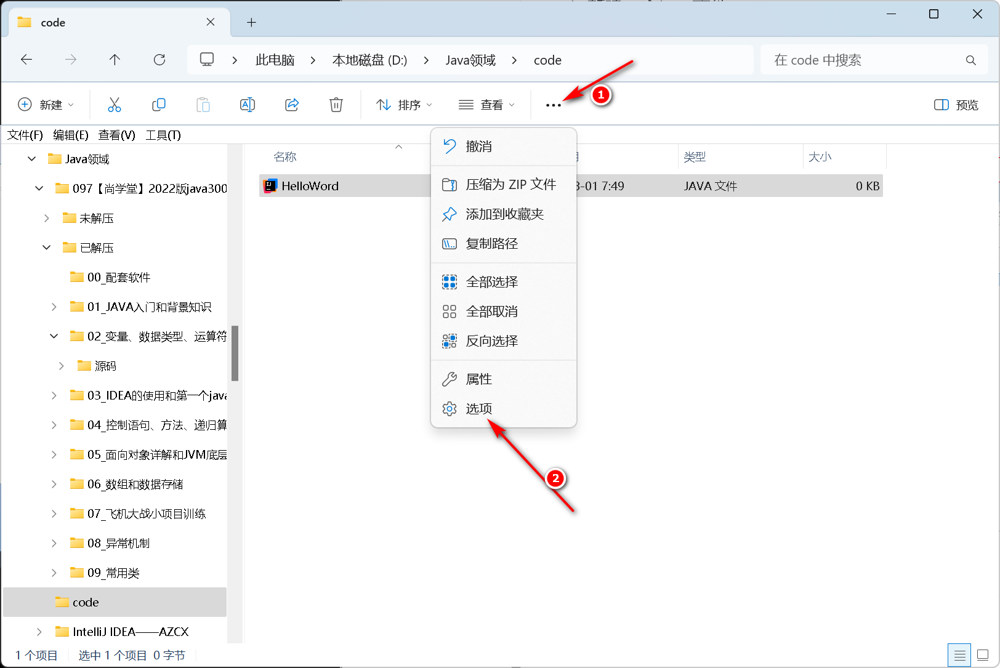

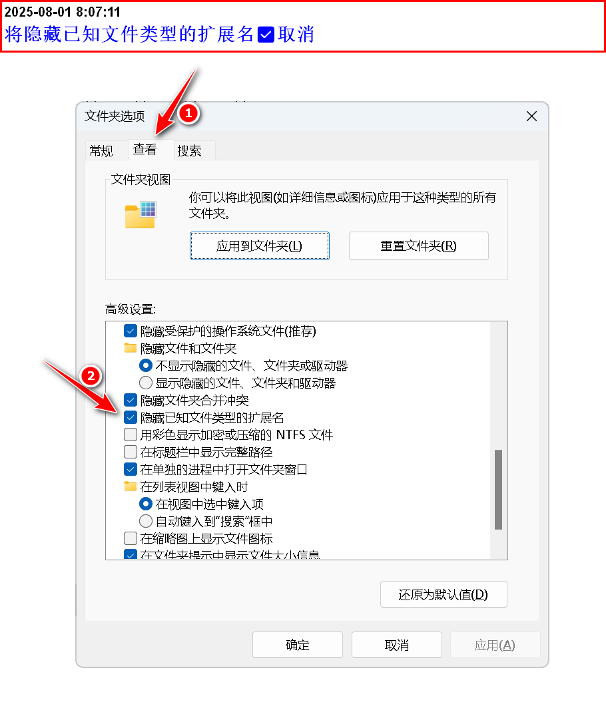

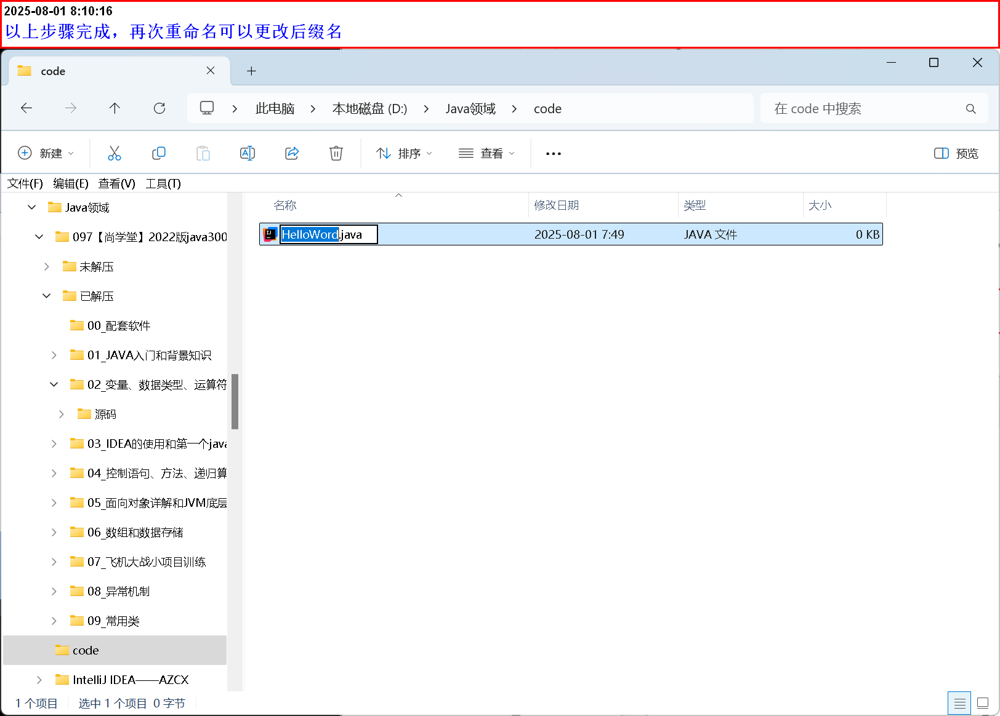

1. 新建一个Java文件——

- 后缀名[.java]

- 命名为：HelloWord.java

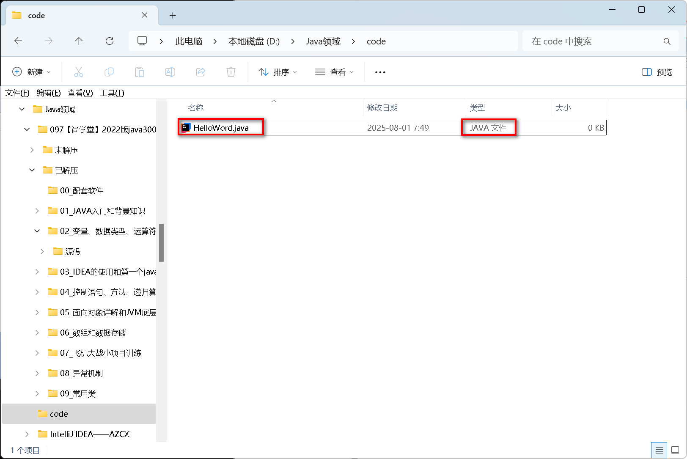

## Notepad++安装和使用

1. [注意]：若提前下载了IDE，要使用Notepad++打开


2. 最后打开界面是：


3. 开始编写代码

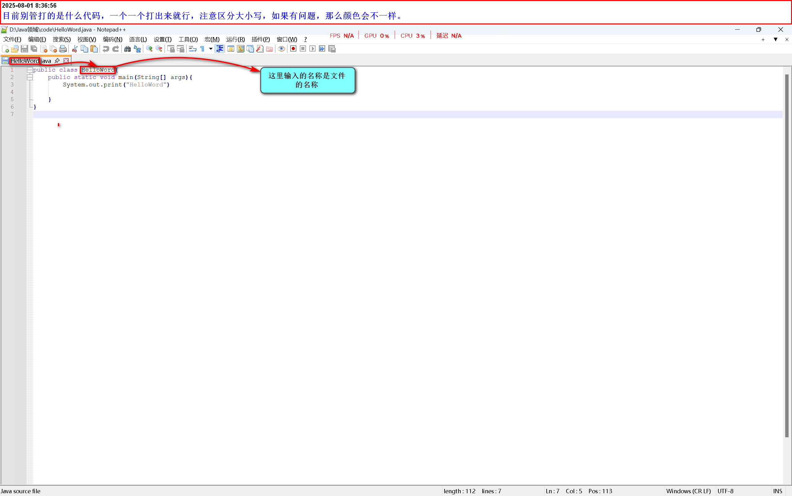

4. 运行代码

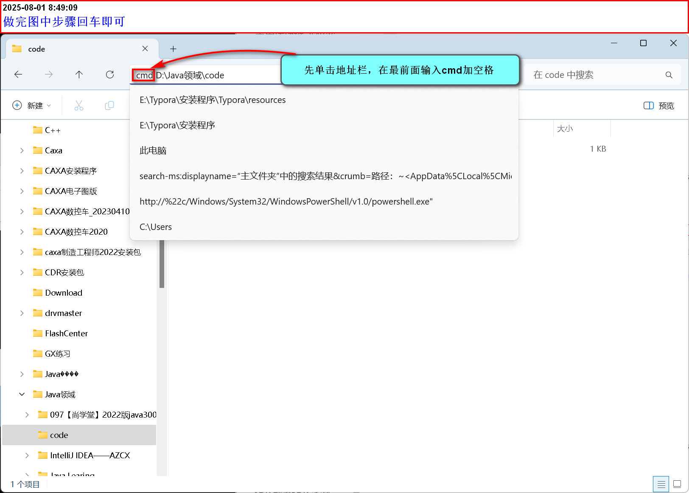

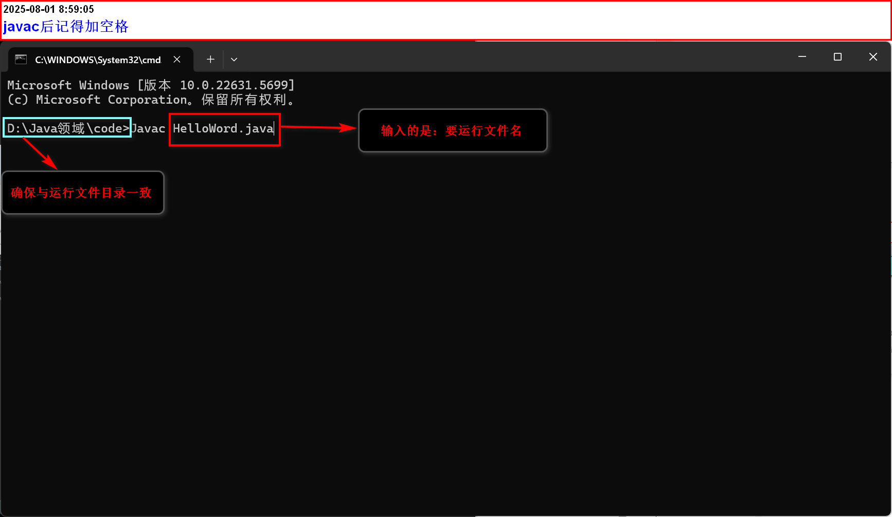

### 错误示范1

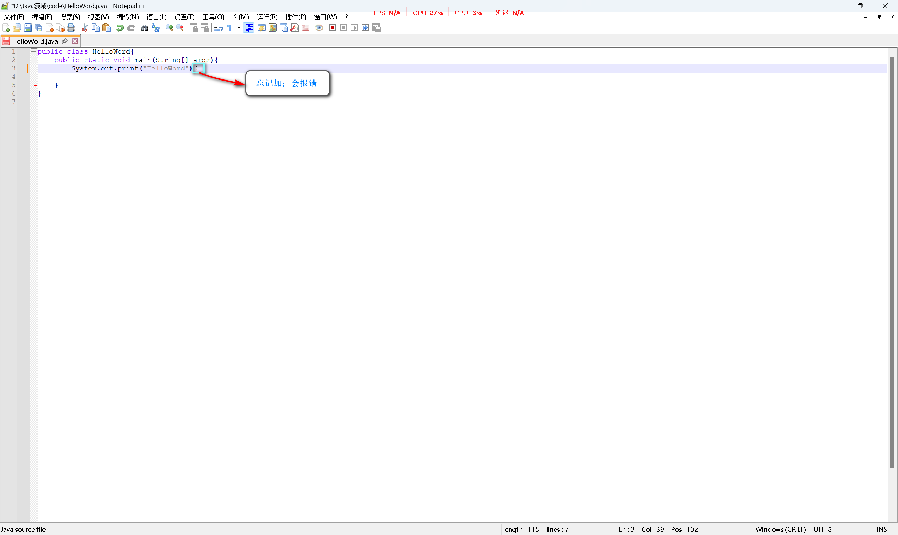

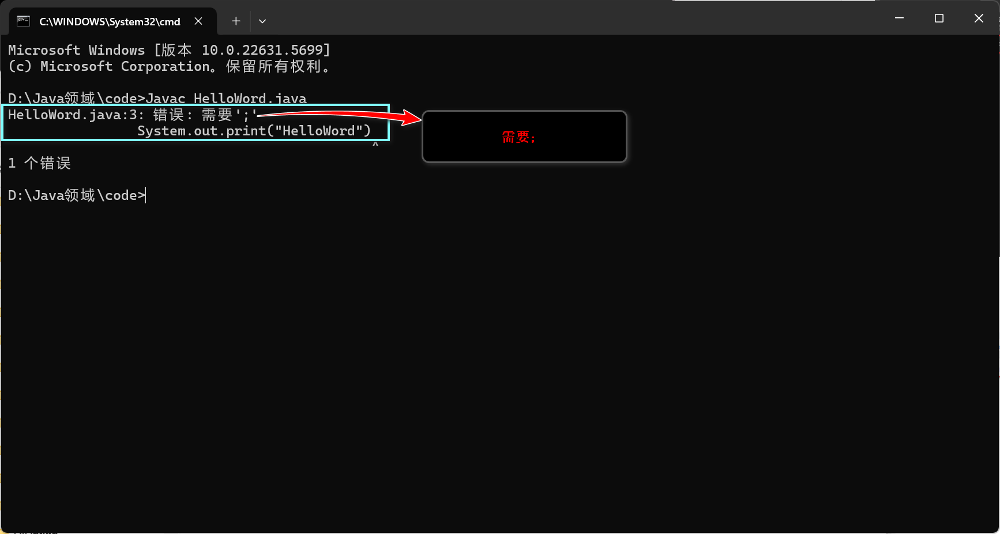

### 错误示范2——任何标点都是英文类型

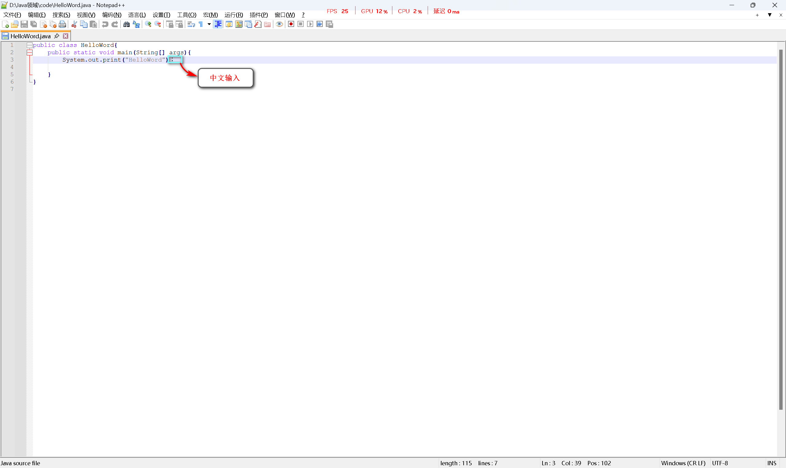

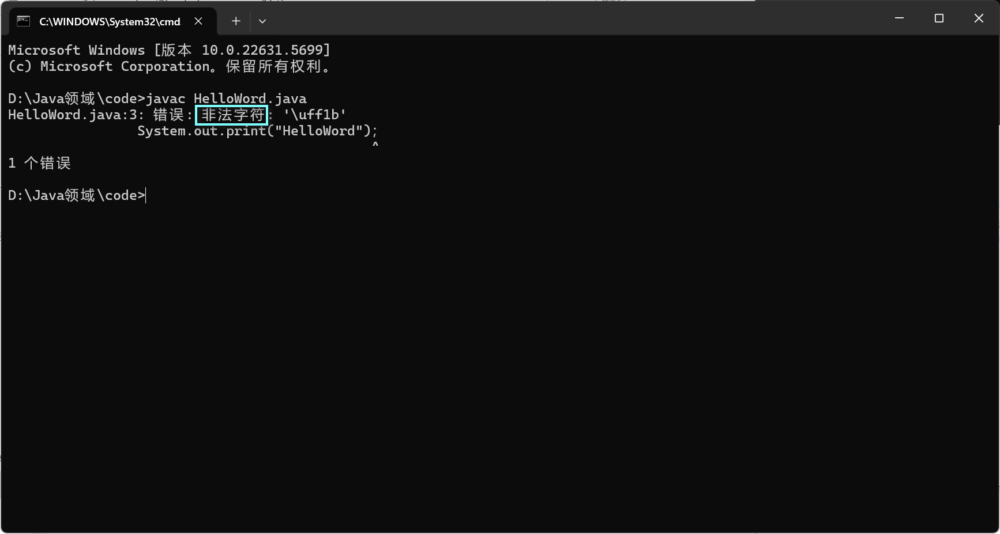

### 成功示范

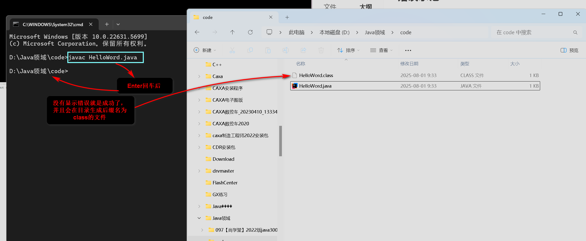

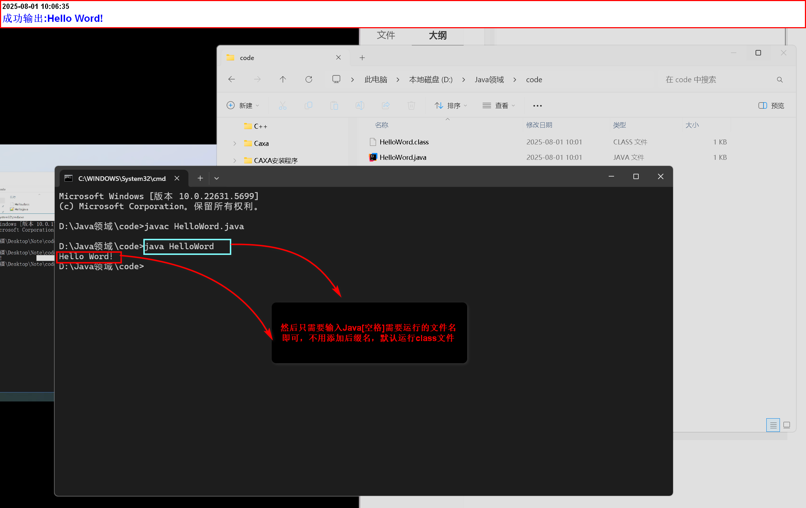

## 最后总结

1. 首先编写代码

``` java 
public class HelloWord{
    public static void main(string[] args){
        sytem.out.print("Hello Word!");
    }
}
```

2. 编译：javac java文件，运行后会生成一个class文件
3. 运行class文件，java class文件

## 注意事项

1. 每个单词的大小不能出现问题，Java是大小写敏感的
2. 尽量使用英文输入法
3. 文件名和类名必须保证一致，并且首字母大小写
4. 符号使用了中文输入法

## 代码讲解

1. public class(表示一个类)
2. public static void(是修饰符和关键字，一定要按[要求写])
3. main(方法——作用【执行文件】)
4. (string[] args)——是一个参数
5. sytem.out.print("Hello Word!")；(输出Hello Word!)
