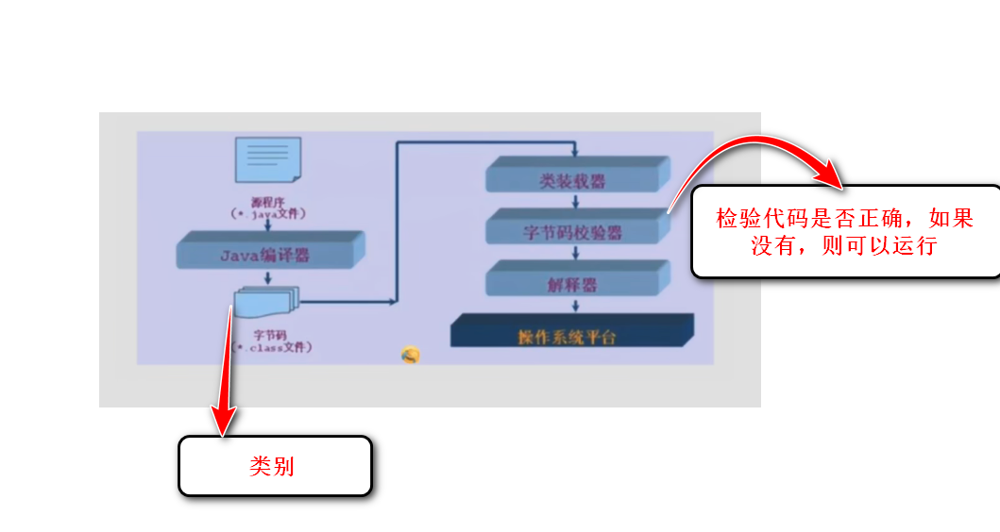

# Day13——编译型和解释型

## Java程序运行机制——Java是[混合型语言——编译型、解释型、JIT(编译优化器)]

- 编译型(compile)
- 解释型(interpreter)
- 编译优化器(JIT)——(Java先编译为字节码，运行时由JVM解释执行+JIT热点编译)

### 相同点

- 它们同为**翻译**的意思

### 不同点

- 它们选着的翻译**时机**不对
- 编译型：它将编写的程序，全部翻译。
- 解释型：它将编写的程序，逐句翻译。

### 两者的特点

#### 编译型的特点

- 编译型：
  1. 一次性编译：源码→完整机器码(或java字节码)。
  2. 直接运行机器码，无需逐句翻译。
  3. 平台依赖：需要在不同操作系统重新编译(Java字节码除外)
  4. 响应延迟：代码修改后必须全部重新编译再输出结果。
- 类比：读者看重一本英语书籍，但是没有翻译成中文的书籍，于是他找人翻译全文成中文，就在拿到手，仔细阅读时，发现里面好几个词翻译错误，无奈全部整本书重印。

##### 注意：

- 编译型：当程序改动的时候，需要花费大量时间重新翻译。当代码需要改动的时候，无法快速翻译出来。
- 类比：当遇到大项目时，会加大编译难度。

#### 解释型的特点

- 解释型：
  1. 多次翻译：运行时实时翻译并执行每一条指令。
  2. 跨平台强：编码一次可以在任何由解释器的平台运行
  3. 灵活修改：代码改动后可以立即生效(与编译型不同：需要重头，重新编译)
  4. 执行缓慢：重复的代码需要反复翻译

- 类比：读者看重一本外语书籍，但是没有翻译成中文的书籍，于是买了一位翻译机器人，读到后面发现作者为了凑字数，将重复的词句叠加在一起，而机器人死脑筋一个，一直重复一句话，导致阅读效率大大降低。

##### 注意：

- 可以让计算机很快的处理程序的改动状态，及时输出结果。
- 它依赖解释器(JVM)
- 当遇到中小规模的项目时，启动速度更快，但是长期来看，会随着代码的增加而变慢。

#### JIT特点

1. 动态编译：翻译官监控到读者常翻阅某章节，**提前编译该章节，并且保存起来**
2. 混合执行：后续来到该章节，直接调用，其他章节仍实时翻译。
3. 效率跃升：因为有缓存编译结果避免重复翻译，所以全书阅读时间飞速提升，完善了解释型在执行效率上的弊端。

#### 程序运行的机制

1. Java文件→javac(Java编译器)→生成[.class]字节码文件(跨平台的中间代码)→类加载器(JVM组件)→字节码校验器(安全屏障)→执行阶段[**解释器(首次执行时逐行翻译字节码)**+**JIT编译器(将高频代码编译为机器码缓存)**]→操作系统→硬件CPU执行

