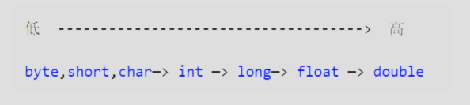
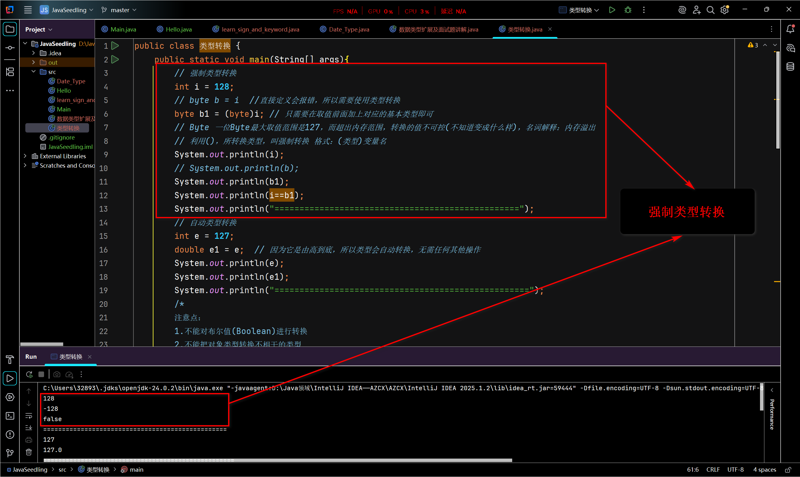
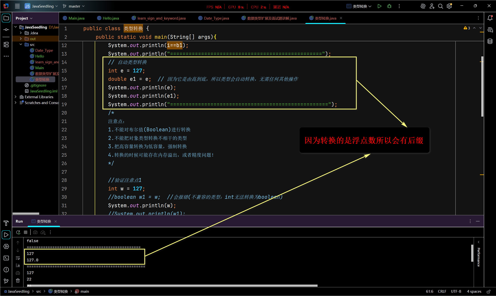
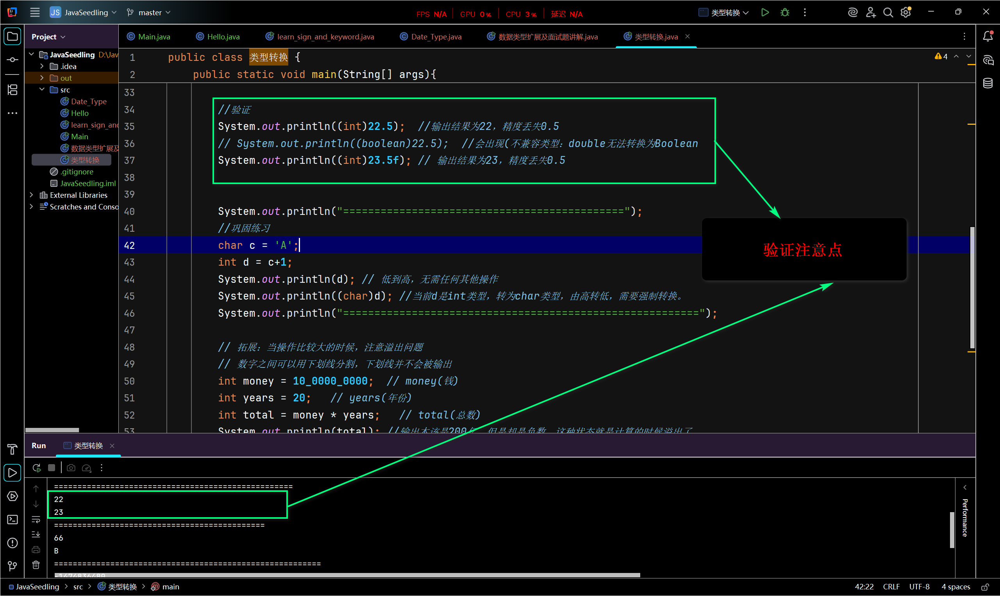
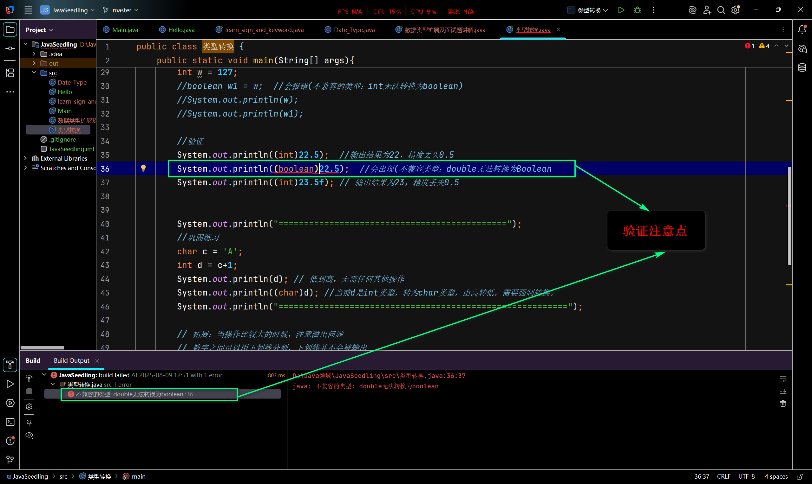
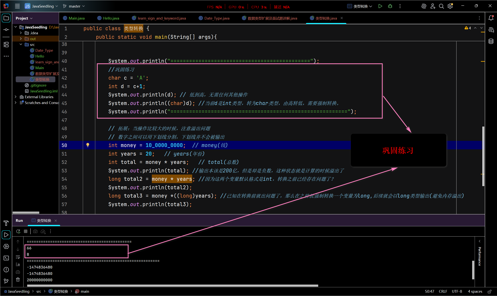
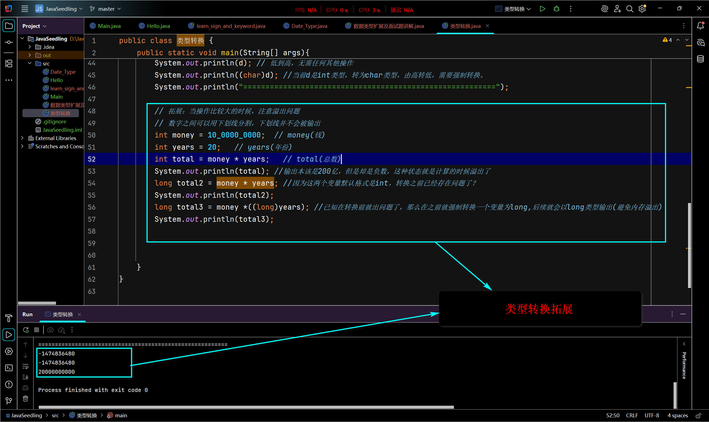

# Java基础05——类型转换

## 类型转换

- 由于Java是强类型语言，所以要进行有些运算的时候，需要用到类型转换。

如：

- byte(占1个字节)，short(占2个字节)，char(占2个字节)→int(4个字节)→long(占8个字节)→float(占4个字节)→double(占8个字节)

- float之前**均为整数类型**，之后为浮点数(小数)类型

- 由此可见**浮点数**(小数)的优先级一定大于整数。

- 运算中，不同类型的数据先转化为同一类型，然后进行运算

- 强制类型转换：

  - **由高到低**

  - **利用()**，所转换类型，叫强制类型转换 格式：**(类型)变量名**

    ```java
    public class 强制类型转换{
        public static void main(String[] args){
            int i = 128;
            byte b =(byte)i; //(类型)变量名
            // 并且byte的最大取值范围是127，最小是-128，以上取值128，超出范围，输出的结果不可控(不知道变成什么)，专用名词：内存溢出。
            // 所以，取值要避免内存溢出  
        }
            
    }
    ```

  - 转换时，要避免**内存溢出**

- 在IDEA上实操：



整数类型和浮点数类型(具体范围)：在Java基础03中，[**Java的数据类型分为两大类]标题**上

- 自动类型转换
  - **由低到高(并不需要任何其他操作)**

```java
public class 自动类型转换{
    public static void main(String[] args){
        int i = 128;
        double = i;  //因为式由高到低，会自动转换
        
    } 
}
```

- 在IDEA上实操



### 注意点：

```java
/*
注意点：
1.不能对布尔值(Boolean)进行转换
2.不能把对象类型转换不相干的类型
3.把高容量转换为低容量，强制转换
4.转换的时候可能存在内存溢出，或者精度问题！
*/
```

```java

public class 验证注意点{
    public static void main(String[] args){
        System.out.println((int)22.5);  //输出结果为22，精度丢失0.5
        //System.out.println((boolean)22.5);  //会出现(不兼容类型：double无法转换为Boolean
        System.out.println((int)23.5f); // 输出结果为23，精度丢失0.5
    }
}

```

- 在IDEA上实操




```java
public class 巩固{
    public static main(String[] aegs){
        char c = 'A';
        int d = c+1;
        System.out.println(d); // 低到高，无需任何其他操作
        System.out.println((char)d); //当前d是int类型，转为char类型，由高转低，需要强制转换。
    }
}
```

- 在IDEA上实操



## 类型转换拓展——当操作比较大的时候，注意溢出问题

```java
public class 类型转换拓展{
    public static void main(String[] args){
        // 拓展：当操作比较大的时候，注意溢出问题
        // 数字之间可以用下划线分割，下划线并不会被输出
        int money = 10_0000_0000;  // money(钱)
        int years = 20;   // years(年份)
        int total = money * years;   // total(总数)
        System.out.println(total); //输出本该是200亿，但是却是负数，这种状态就是计算的时候溢出了
        long total2 = money * years; //因为这两个变量默认格式是int，转换之前已经存在问题了？
        System.out.println(total2);
        long total3 = money *((long)years); //已知在转换前就出问题了，那么在之前就强制转换一个变量为long,后续就会以long类型输出(避免内存溢出)
        System.out.println(total3);
    }
}
```

解决办法总结：

- 步骤1.**先将最后输出结果放到能承受的类型当中(由底到高)**
  - 就好比例子中：int和long，因为int范围是-2147483648~2147483647(21亿左右)而输出的结果却是200亿，远高于int范围，那么就要转化为比它更高的long
- 步骤2.若**两个(或多个)变量均低于结果输出类型**(那么最后的结果是先计算低类型的值，在转换为高类型的值，若低类型的值先溢出，再转换为高类型的值已经晚了)
  - 就好比例子中：两个变量都是int，它们相乘的时候，最终结果也是int，结果本身已经超出int的范围(已经出问题了)，在转换为long晚了。
- 步骤3.**那么将它们其中一个强制转换为高类型(那么最后的结果是直接以高类型的值输出，结果就非常准确)**
  - 就好比例子中：先将变量[years]转化为long，再进行计算，就不会出现int溢出的情况，最后的结果是直接以long类型输出的，long类型的范围-9223372036854775808~9223372036854775807(远超200亿)不会出现溢出的情况，所以最后的结果是准确的。

在IDEA上实操



