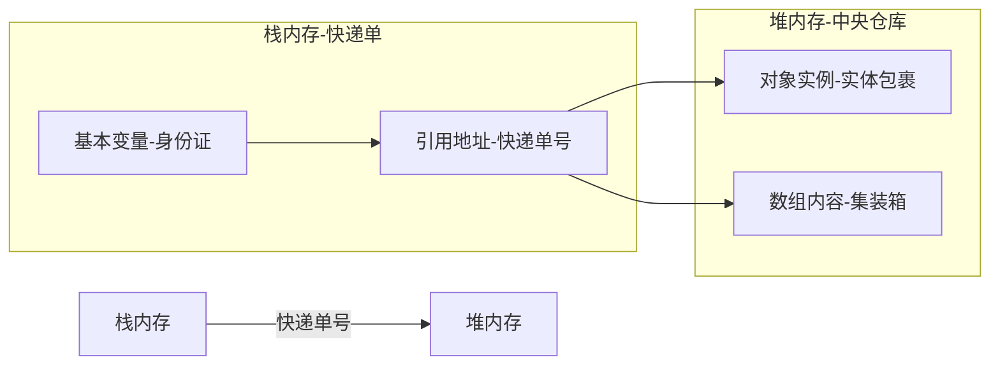

# Java基础06——变量、常量、作用域

## 变量

- 变量是什么：就是可以变化的量！
- Java是一种强类型语言，每个变量都必须声明其类型
- Java变量是程序中最**基本的存储单位**，其要素包括变量名，变量类型和**==作用域==**。

```java
type varName [=value][{,varName[=value]}];
//数据类型     变量名=值；可以使用逗号隔开来声明多个同类型变量。

```

定义变量

```java
//定义整数类型变量
byte a = 10;
short b = 20;
int c = 100;
long d = 100000000000;
//定义浮点数类型变量
float e = 3.5f;
double f = 25.63333;
//定义字符类型
char g = '中';
//定义字符串
String name = "YLH";

```

- 注意事项：
  1. 每个变量都有类型，类型可以是基本类型，也可以是引用类型。
  1. 变量名必须是合法字符
  1. 变量声明是一条完整的语句，因此每一个声明都必须以**分号结束**
  1. 不建议在一行定义多个变量


### 基本类型变量(primitive Variables)

- 定义：直接存储数据值本身的简单数据类型。
- 包含类型：8种基本数据类型：
  - 整型：byte、short、int、long
  - 浮点型：float、double
  - 字符型：char
  - 布尔型：boolean
- 特点：
  - 直接存储值：变量本身包含实际数据
  - 内存分配在栈(Stack)：空间固定(如int占4字节)。
  - 赋值是值复制：修改副本不影响原变量。
  - 比较用：==(直接比较值是否相等)

- 示例代码

```java
int a = 10;  //基本类型变量a存储值10
int b = a;  //b复制a的值(10)，与a独立
b = 20;  //修改b不影响a
System.out.println(a);  //输出10(a没有变化)

int x = 5;
int y = 5; 
System.out.println(x == y); // 运行后显式true(值相等)

```

### 引用类型变量(Reference Variables)

- 定义：存储对象的内存地址(引用)
- 包含类型：
  - 类(如String、自定义类person)
  - 接口
  - 数组
  - 枚举
- 特点：
  - 存储对象引用：变量指向堆(Heap)中的对象
  - 内存分配：引用在栈，对象在堆
- 赋值是引用复制：多个变量可指向同一对象
- 比较 == 与  equals()
  - == 比较引用地址是否相同
  - equals()比较对象内容(需重写，默认行为同为==)

示例代码：

```java
// 引用类型示例
String S1 = new String("Hello");// S1指向堆中”Hello“为对象
String S2 = S1;  //S2复制S1的引用(指向同一对象)
S2 = "word";    //S2指向新对象，S1不变
System.out.println(S1);    //输出结果为"Hello"
// == 与 equals()的区别
String a = new String("java");
String b = new String("java");
System.out.println(a==b);    //最后的输出结果为false,因为地址不相同
System.out.println(a.equals(b)); //最后的输出结果为true，因为内容相同
// 数组也是引用类型
int[] c = {1,2,3};
int[] d = c;  // d与c指向同一数组
d[0] = 100;   //修改d也会影响c
System.out.println(c[0]);  //最后的输出结果为100 


```

#### 名词解释：

1. 栈(Stack)特点:
   - 存储内容：
     - 基本类型变量的值(如int a = 10 中的10)
     - 引用类型变量的引用地址(指针，指向堆中的对象)
     - 方法调用的栈帧(局部变量、方法参数、返回地址)
   - 生命周期：
     - 变量生命周期与其作用域绑定(如方法结束时，栈帧被弹出，所有局部变量自动销毁)
     - 内存分配/释放由编译器自动完成(无需开发者干预)
   - 内存分配：
     - 内存连续分配，访问速度极快
     - 每个线程有独立的栈(线程私有)
     - 大小有限(默认约1MB）
2. 堆(Heap)特点：
   - 存储内容：
     - 所有对象实例(如new String()创建字符串)
     - 数组内容(int[] arr = {1.2.3}中的数组元素)
     - 静态变量(static字段)
     - 字符串常量池(部分JVM实现)
   - 生命周期：
     - 对象存活时间与引用无关(即使创建它的方法已结束，对象仍在)
     - 内存通过垃圾回收(GC)，自动回收(当对象无任何引用时)
   - 内存分配：
     - 内存动态分配，空间更大(受物理内存限制)
     - 所有线程共享堆内存
     - 访问速度慢于栈

##### 核心总结

|   特性   |           栈(Stack)            |           堆(Heap)           |
| :------: | :----------------------------: | :--------------------------: |
| 存储内容 | 基本类型值，引用地址，方法栈帧 | 对象实例、数组内容、静态变量 |
| 生命周期 |      随着方法结束自动销毁      |     由垃圾回收器(GC)管理     |
| 分配速度 |         极快(连续内存)         |        较慢(动态分配)        |
| 内存大小 |     固定(较小，默认约1MB)      |  动态(较大，受物理内存限制)  |
| 线程安全 |    线程私有(每个线程独立栈)    |           线程共享           |
| 管理方式 |         编译器自动管理         |    垃圾回收器(GC)自动回收    |
| 典型错误 |  StackOverflowError(递归过深)  |  OutOfmemoryError(对象过多)  |

##### 类比

###### 1. 栈内存 → 个人快递单（线程私有）

| 计算机概念       | 快递系统比喻          | 技术本质                                     |
|------------------|-----------------------|---------------------------------------------|
| **基本类型变量** | 随身小件物品          | 身份证、钥匙等小物件（直接存储在快递单夹层里） |
| **方法调用栈帧** | 临时取件码            | 快递柜的一次性验证码（用后即焚）             |
| **引用地址**     | 快递单号              | 12位数字编码（指向仓库位置）                 |
| **私有性**       | 个人快递APP           | 只有你能查看包裹（线程私有）                 |
| **临时性**       | 快递柜暂存            | 超时未取自动清除（方法结束数据销毁）         |

**特点**：  
- ⏱️ 临时存储，方法结束自动清理  
- 🔒 线程私有，互不可见  
- ⚡ 访问速度极快  

###### 2. 堆内存 → 中央仓库（线程共享）

| 计算机概念       | 快递系统比喻          | 技术本质                                     |
|------------------|-----------------------|---------------------------------------------|
| **对象实例**     | 仓库中的实体包裹      | 实际存在的货物（占用物理空间）               |
| **数组内容**     | 集装箱货柜            | 多个包裹组成的集合（结构化存储）             |
| **共享性**       | 公共分拣中心          | 所有快递员都能操作（线程共享）               |
| **长期存储**     | 保税仓库              | 包裹可长期存储（与取件人无关）               |
| **垃圾回收(GC)** | 滞留包裹清理          | 30天未认领的包裹被销毁（GC回收）             |

**特点**：  

- 🏭 所有线程共享访问  
- ⏳ 对象长期存在（直到被GC回收）  
- 🚚 动态分配空间  

###### 3. 内存关系图解（mermaid）



### 变量作用域

- 类变量(写在类中的变量)
  - 被所有对象共享
  - 内存中只有一份副本
  - 静态方法中可直接访问
- 实例变量(写在类中间)
  - 在类的中，在方法外
  - 每个对象独立拥有
  - 必须通过对象实例访问
  - 未初始化有默认值
- 局部变量(写在方法里的变量)
  - 必须手动初始化
  - 作用域仅限于声明它的代码块(如main)

```java
public class 作用域{
    static int allClick = 10;    //类变量(有关键字static)
    String str = "hello word";   // 实例变量(没有关键字static)

    public void method(){
     int i = 0;   //   局部变量(写在方法内的)
        }
 	}

```

```java
public class VariableScopeDemo {//VariableScop(变量的作用域)  Demo(示例/演示)
    // 类变量 (前加static)
    static int classVar = 10;
    static double salary = 2500; //salary(工资)

    // 实例变量(在类里面，但在方法外面)——可以不赋值，在方法内引用，有默认值
    String instanceVar = "hello world";
    String name; // 默认值null
    int age; //默认值0

    public static void main(String[] args) {
        // 局部变量(只有在声明它的代码块有效)
        int localVar = 20; // 必须初始化
        System.out.println(localVar);

        // 访问类变量：可以直接使用，因为是在同一个类中
        System.out.println(classVar);
        System.out.println(salary);

        // 访问实例变量：需要先创建对象
        VariableScopeDemo demo = new VariableScopeDemo();
        System.out.println(demo.instanceVar);
        System.out.println(demo.name); // 默认值null
        System.out.println(demo.age);  // 默认值0
    }

    public void add() {
        // 另一个局部变量

    }
}
```

| 生命周期 | 名称     | 说明                   |
| -------- | -------- | ---------------------- |
|          | 类变量   | 从类加载到JVM卸载      |
|          | 实例变量 | 从对象创建到GC回收     |
|          | 局部变量 | 从声明位置到代码块结束 |

## 常量

- 常量(Constant)：**初始化(initialize)后不能再改变值**！不会变动值
- 所谓常量可以理解成一种**特殊的变量**，它的值被设定后，在程序运行过程中不允许被改变

```java
final 常量名 = 值;
final double PI = 3.14D;
```

- 常量名一般使用大写字符。

```java
public class Constant {  //constant(常量)
    /*static——修饰符，不存在前后顺序
    变量类型前的都是修饰符，如例子：
    修饰符：double前的都是
    变量类型：double
    变量名：PI
    变量值：3.14D
    */
    // 常量通过final定义，一般都用大写字母表示
    static final  double PI = 1.14D;  //设置一个类变量(静态的)

    public static void main(String[] args) {
        System.out.println(PI); //因为设置了类变量，所以直接引用就可以了
    }
}

```

## 变量的命名规范

- 所有变量、方法、类名：==见名知意==
- 类成员变量：首字母小写和==驼峰原则==：monthSalary
- 局部变量：首字母小写和驼峰原则
- 常量：大写字母和下划线：MAX_VALUE
- 类名：首字母大写和驼峰原则：Man，GoodMan
- 方法名：首字母小写和驼峰原则:run()，runRun()
- 驼峰原则(Camel Case)：
  - 将多个单词连接在一起，每个单词的首字母大写(除第一个单词外)，形成类似骆驼峰的形状
  - 小驼峰命名法(lower camel case)：
    - 使用场景：变量、方法名
    - 规则：
      - 第一个单词全小写
      - 后续每个单词首字母大写
  - 大驼峰命名法：
    - 使用场景：类名、接口名
    - 规则：
      - 所有单词首字母都大写
  - 好处是：
    - 提高可读性
    - 避免空格问题
    - 行业标准
    - 区分不同元素