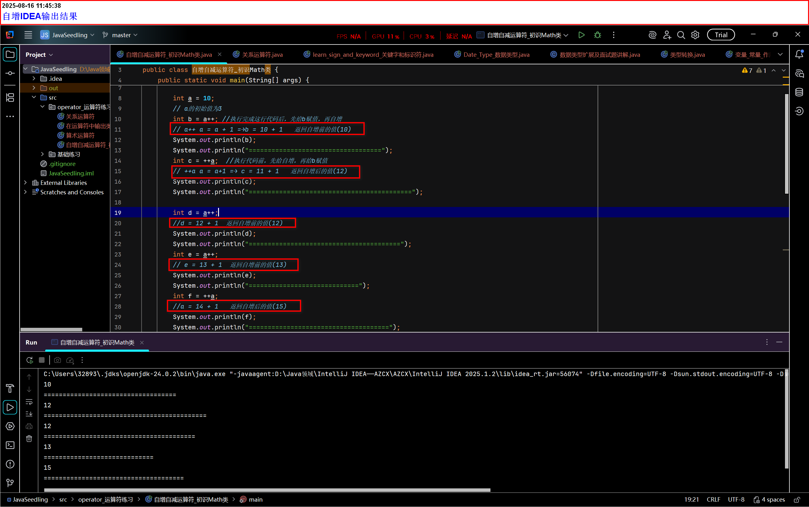
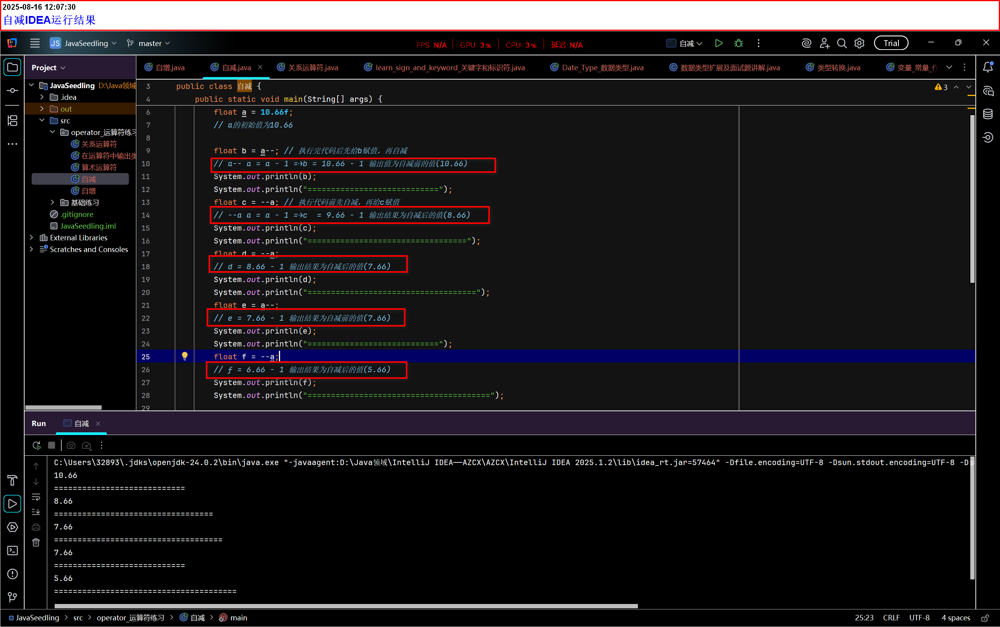
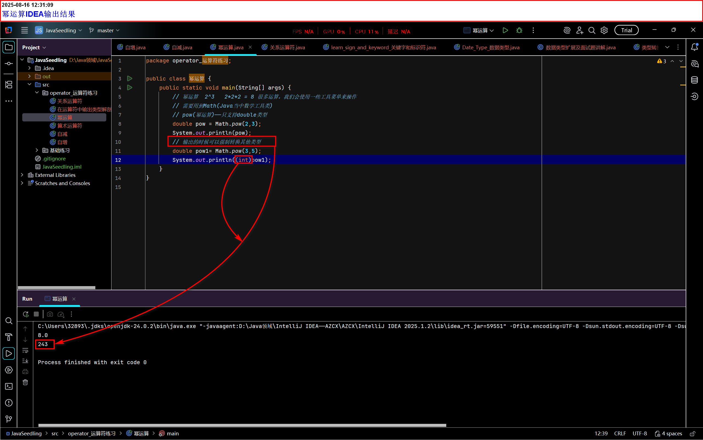

# Java基础08——自增自减运算符、初识Math类

## 自增(++)

有两种形式：(任何数字形式)++ 或 ++(任何数字形式)

核心总结：

- ()++：
  - 执行顺序：先返回当前值，再自增。
  - 表达式返回值：返回自增前的原始值
  - 内存变化：执行后的值增加1

- ++()：
  - 执行顺序：先自增，再返回新值
  - 表达式返回值：返回自增后的新值
  - 内存变化：执行后的值增加1

```java
//++  自增 一元运算符(只允许一个值运算)
        int a = 10;
        // a的初始值为3


        int b = a++; //执行完成这行代码后，先给b赋值，再自增
        // a++ a = a + 1 =→b = 10 + 1   返回自增前的值(10)
        System.out.println(b);
        System.out.println("===================================");

        int c = ++a;  //执行代码前，先给自增，再给b赋值
        // ++a a = a+1 =→ c = 11 + 1   返回自增后的值(12)
        System.out.println(c);
        System.out.println("===========================================");

        int d = a++;
        //d = 12 + 1  返回自增前的值(12)
        System.out.println(d);
        System.out.println("========================================");

        int e = a++;  
        // e = 13 + 1  返回自增前的值(13)
        System.out.println(e);
        System.out.println("=============================");

        int f = ++a;
        //a = 14 + 1   返回自增后的值(15)
        System.out.println(f);
        System.out.println("=====================================");

```



## 自减

有两种形式：(任何数字形式)-- 或 --(任何数字形式)

 核心总结：

- ()--：
  - 执行顺序：先返回当前值，再自减。
  - 表达式返回值：返回自减前的原始值
  - 内存变化：执行后的值减1
- --()：
  - 执行顺序：先自减，再返回新值
  - 表达式返回值：返回自增后的新值
  - 内存变化：执行后的值减1

```java
float a = 10.66f;
        // a的初始值为10.66

        float b = a--; // 执行完代码后先给b赋值，再自减
        // a-- a = a - 1 =→b = 10.66 - 1 输出值为自减前的值(10.66)
        System.out.println(b);
        System.out.println("============================");
        float c = --a; // 执行代码前先自减，再给c赋值
        // --a a = a - 1 =→c  = 9.66 - 1 输出结果为自减后的值(8.66)
        System.out.println(c);
        System.out.println("==================================");
        float d = --a;
        // d = 8.66 - 1 输出结果为自减后的值(7.66)
        System.out.println(d);
        System.out.println("====================================");
        float e = a--;
        // e = 7.66 - 1 输出结果为自减前的值(7.66)
        System.out.println(e);
        System.out.println("============================");
        float f = --a;
        // f = 6.66 - 1 输出结果为自减后的值(5.66)
        System.out.println(f);
        System.out.println("=======================================");
```



## 幂运算_初识Math类

```java
// 幂运算  2^3   2*2*2 = 8 很多运算，我们会使用一些工具菜单来操作
        // 需要用到Math(Java当中数学工具类)
        // pow(幂运算)——只支持double类型
        double pow = Math.pow(2,3);
        System.out.println(pow);
        // 输出的时候可以强制转换其他类型
        double pow1= Math.pow(3,5);
        System.out.println((int)pow1);
```


