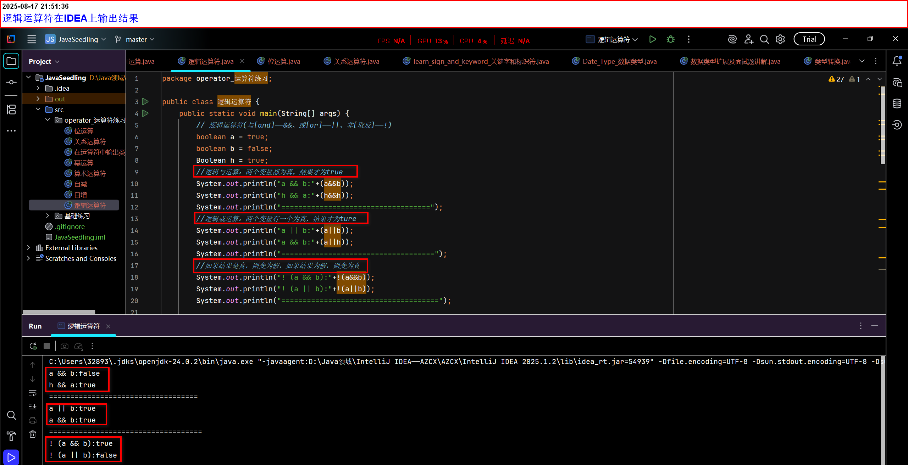
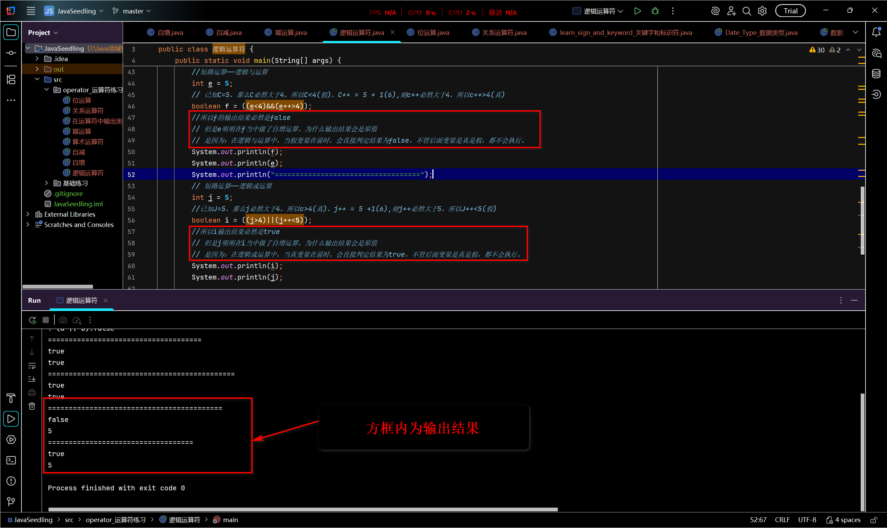
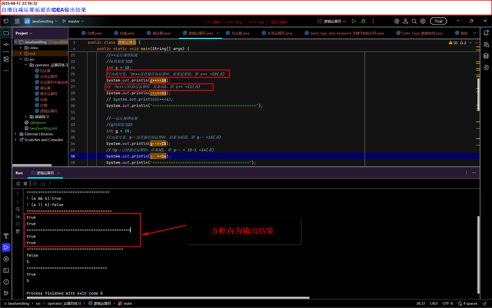
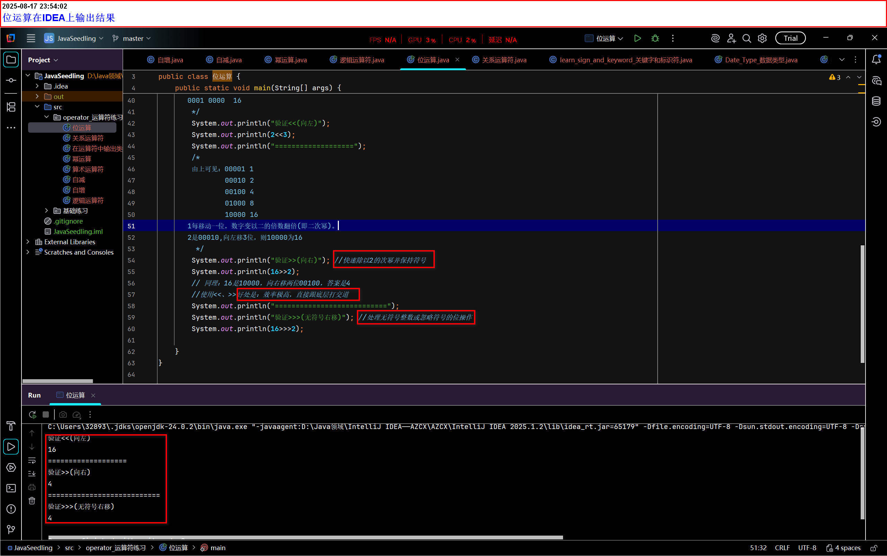

# Java基础09——逻辑运算符、位运算符

## 逻辑运算符(&&、||、！)——作用于布尔值运算符

1. &&(与)：
   - 逻辑与运算：两个变量都为真，结果才为true

2. ||(或)：
   - 逻辑或运算：两个变量有一个为真，结果才为ture
3. ! (非[取反])：
   - 果结果是真，则变为假，如果结果为假，则变为真
   - 注意：它是单一运算符，不能做比较

```java
public class 逻辑运算符{
    public static void main(String[] args ){
        boolean A = true;
        boolean B = false;
        // &&(逻辑与运算)——两真为真(true)，其他为假(false)
        System.out.println("A && B:"+(A&&B)); //已知A为真，B为假，则输出结果为false
        //||(逻辑或运算)——两假为假，其他为真
        System.out.println("A || B:"+(A||B));//已知A为真，B为假，则输出结果为true
        //!(逻辑非[取反]运算)——真亦假，假亦真
        System.out.println("!A && B:"+(!A&&B));//已知A&&B为false，则输出结果为true
        System.out.println("!A || B:"+(!A||B));//已知A||B为true，则输出结果为false
       
    }
}
```



### 特殊情况(短路运算)

- 短路运算：在逻辑运算与中，当假变量在前时，会直接判定结果为false，不管后面变量是真是假，变量内容都不会执行(可以理解为是短路了)

```JAVA
public class 短路运算{
    public static void main(String[] args){
        //短路运算(逻辑与运算)
        int e = 5;
        boolean f = ((e<4)&&(e++>4)); 
        //已知e=5,则e必然大于4，所以首变量为假，e++必然是大于4的，所以为真
        System.out.println(b); 
        //一真一假，在逻辑与中，输出结果必然是false
        System.out.println(a);
        //e在f中做了自增运算，但是返回值却是原值5
        //这是因为：在逻辑与运算中，首变量是假时，会直接判定结果为false，不管后面变量是真是假，变量内容都不会被执行(可以理解为是短路了)
       System.out.println("===================================");
        
        //短路运算(逻辑或运算)
        int j = 5;
        boolean i = ((j>4)||(j++<5));
        //已知J=5，那么j必然大于4，所以c>4(真)，j++ = 5 +1(6),则j++必然大于5，所以J++<5(假)
        System.out.println(i);
        //一真一假，在逻辑或运算中，输出结果必然是true
        System.out.println(j);
        // j在i中做了自增运算，为什么输出结果却是原值5
        // 是因为：在逻辑或运算中，当真变量在前时，会直接判定结果为true，不管后面变量是真是假，都不会执行。
    }
}

```

总结：

1. 短路运算分为：逻辑与运算和逻辑或运算
2. 逻辑非(取反)运算因为是单一运算符，不具备比较的能力，只有一个变量取反，所以不存在短路运算符。
3. 不同点：
   - 逻辑与短路运算：
     - 要求：必须是在逻辑与运算当中
     - 特点：首变量为假即触发短路
     - 短路特点：首变量触发短路后，直接判定输出内容为false，后面一概变量的内容不会被执行
   - 逻辑或短路运算：
     - 要求：必须是在逻辑或运算当中
     - 特点：首变量为真即触发短路
     - 短路特点：首变量触发短路后，直接判定输出内容为true，后面一概变量的内容不会被执行



## 自增自减运行规律拓展

- 当自增或自减没有做任何运算时，结果为原值(比如在逻辑[与、或]短路运算当中)

如：

```java
public class 自增自减运行规律拓展{
    public static void main(String[] args){
        //++运行规律拓展
        //c的原值为10
        int c = 10;
        //由此可见，当c++没有做任何运算时，结果是原值，即 c++ =10(真)
        System.out.println(c++==10);
        // 当c++已经做过运算时，结果加1，即 c++ =11(真)
        System.out.println(c++==11);
        // System.out.println(c++<4);
        System.out.println("=============================================");

        //--运行规律拓展
        //g的原值为15
        int g = 15;
        //由此可见，g--没有做任何运算时，结果为原值，即 g-- =15(真)
        System.out.println(g--==15);
        //当g--已经做过运算时，结果减1，即 g-- = 15-1 =14(真)
        System.out.println(g--==14);
        System.out.println("==========================================");
    }
}

```



## 位运算

- 位运算即二进制运算

1. 运算符有(&（与）、|（或）、~（非(取反)）、^（异或）、>>(右移)、<<(左移)、>>>)

2. &(与)：

   - 用于比较

   - 出现11为1，其余为0——(0为假，1为真)

   - 口诀：一假即假(两真为真)

3. |(或)：

   - 用于比较

   - 00为0，其余为1——(0为假，1为真)

   - 口诀：一真即真(两假为假)

4. ~(非[取反])：

   - 不用于作比较(单一变量使用)

   - 1是0，0是1——(0为假，1为真)

   - 口诀：真亦假时假亦真

5. ^(异或)：

   - 用于比较

   - 相同为0，不同为1——(0为假，1为真)

   - 口诀：相同为假，不同为真

6. (>>右移)：所有位向右移动指定位数(低位补0)
   - ==快速除以2的次幂并保持符号==

7. (<<左移)：所有位向右移动指定位数(高位补符号位[正数补0，负数补1])
   - ==快速乘以2的次幂==

8. (>>>无符号右移)：所有位向右移动指定位数(高位)
   - 快速除以2的次幂
   - ==正数结果与>>相同==
   - 负数有显著区别

实操：

```JAVA
package operator_运算符练习;

public class 位运算 {
    public static void main(String[] args) {
        /*
        位运算：&（与）、|（或）、~（非(取反)）、^（异或）、>>(右移)、<<(左移)、>>>
        A = 0011 1100
        B = 0000 1101
        ================================================
        &(与运算)
        则：A&B = 0000 1100

        |(或运算)
        则：A|B = 0011 1101

        ~(非(取反)运算)
        A~ = 1100 0011
        B~ = 1111 0010

        ^(异或运算)       
        则：A^B = 0011 0001

        2*8 = 16 2*2*2*2=16
        <<(左移)：
        >>(右移):
       // 0000 0 开头，逢二进一
       0000 0000  0       0000 0001  1
       0000 0010  2       0000 0011  3
       0000 0100  4       0000 0101  5
       0000 0110  6       0000 0111  7
       0000 1000  8       0000 1001  9
       0000 1010  10      0000 1011  11
       0000 1100  12      0000 1101  13
       0000 1110  14      0000 1111  15
       0001 0000  16
        */
        System.out.println("验证<<(向左)");
        System.out.println(2<<3);
        System.out.println("===================");
        /*
        由上可见：00001 1
                00010 2
                00100 4
                01000 8
                10000 16
       1每移动一位，数字变以二的倍数翻倍(即二次幂)。
       2是00010,向左移3位，则10000为16
         */
        System.out.println("验证>>(向右)"); //快速除以2的次幂并保持符号
        System.out.println(16>>2);
        // 同理：16是10000，向右移两位00100，答案是4
        //使用<<、>>好处是：效率极高，直接跟底层打交道
        System.out.println("===========================");
        System.out.println("验证>>>(无符号右移)"); //处理无符号整数或忽略符号的位操作
        System.out.println(16>>>2);

    }
}

```

注意：

1. 左移(<<)、右移(>>)、无符号右移(>>>)：都是在二进制上移动

如：0000 0000  0       0000 0001  1
        0000 0010  2        0000 0011  3
        0000 0100  4        0000 0101  5
        0000 0110  6        0000 0111  7
        0000 1000  8        0000 1001  9
        0000 1010  10      0000 1011  11
        0000 1100  12      0000 1101  13
        0000 1110  14      0000 1111  15
        0001 0000  16

2. 二进制逢二进一
3. 好处是：效率极高，直接跟底层打交道。



