# Java基础11——包机制

## 什么是包机制

### 定义：

Java包(package)是Java语言中用与组织类和接口的命名空间机制。它是一种组相关类和接口的集合，通过目录结构进行物理存储，并使用点分命名法(如：com.java_Fundamentals)进行逻辑表示。

### 主要作用：

1. 避免命名冲突：包提供了命名空间管理，不同包中可以使用相同名称的类
2. 访问控制：包级别的访问权限(默认修饰符)允许同一包内的类相互访问
3. 组织代码结构：将功能相关的类组织在一起，提高代码的可维护性
4. 提供封装性：包可以作为封装的边界，隐藏实现细节
5. 包机制是Java模块化编程的基础，有助于构建大型、可维护的应用程序。

### 命名规范：

1. 使用小写字母
2. 采用逆域名惯例：如(com.baidu.www)
3. 具有描述性和唯一性

### 课堂上的笔记

1. 包机制也叫**分组交换**
2. 为了更好地组织类，Java提供了包机制，用于==**区别类名的命名空间**==

3. 包语句的语法格式为：

```java
package pkg1[.pkg2[.pkg3……]];
```

4. 一般利用公司**==域名倒置==**作为包名；

   - 如引用：www.baidu.com包，则需要改为com.baidu.www

   -  在IDEA新建package具体步骤：

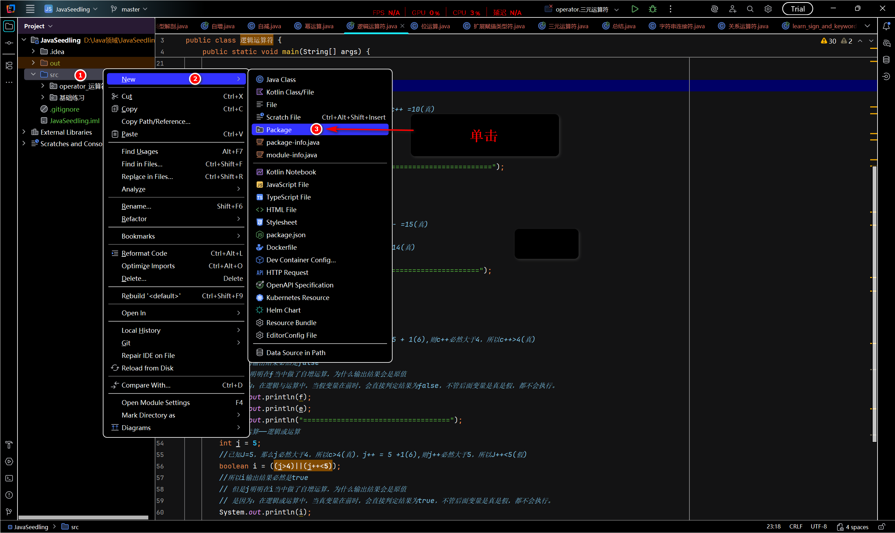

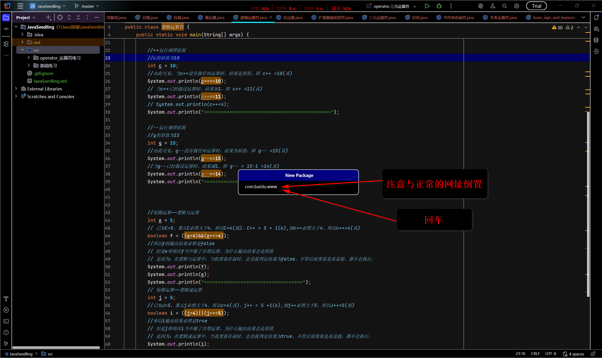

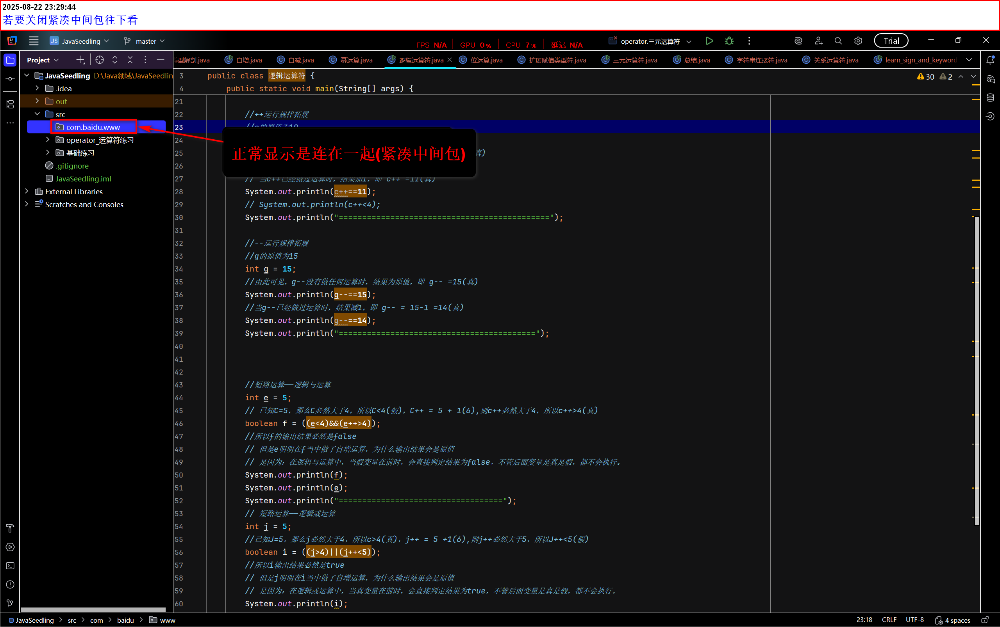

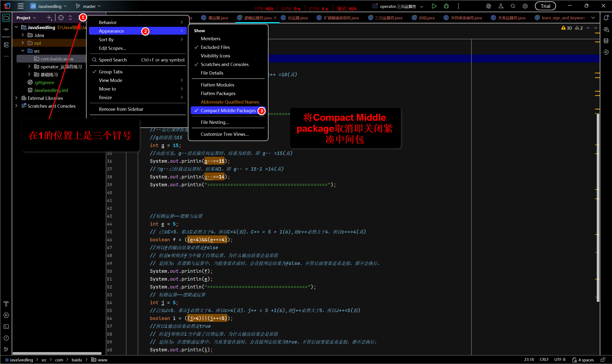

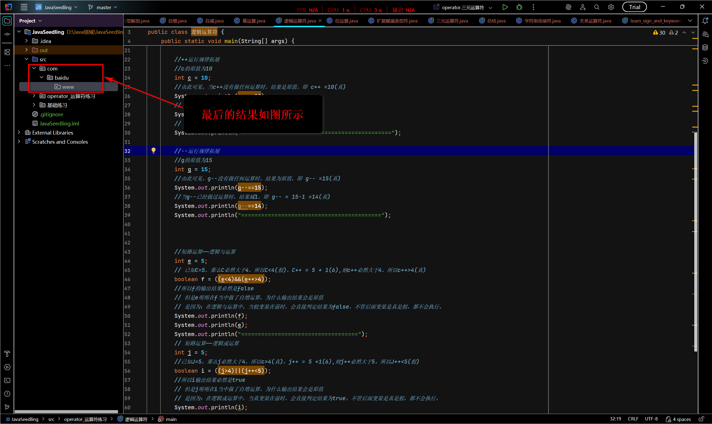

- 现在新建一个名为Java_Fundamentals（java入门）package将以前学的放入到里面内

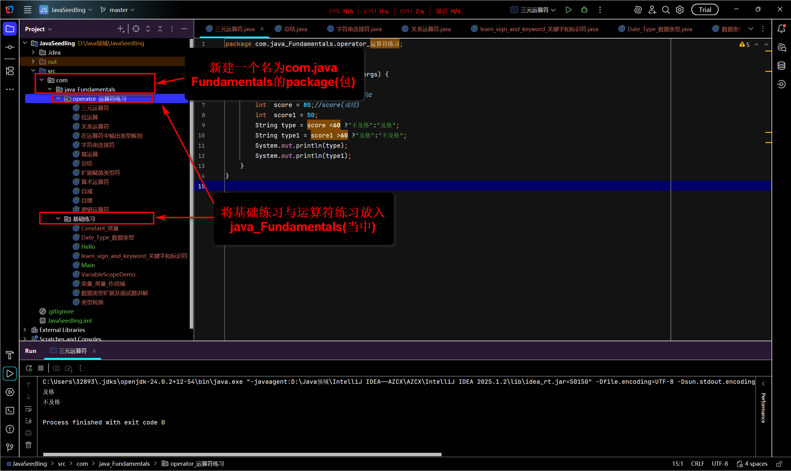

4. 为了能够使用某一个包的成员，我们需要在Java程序中明确导入该包。应当使用"import"语句可完成此功能
   - 快捷键：Alt+Shift+Enter

```java
import package1[.package2].(classname|*);
```

- 在IDEA当中实操导入包成员

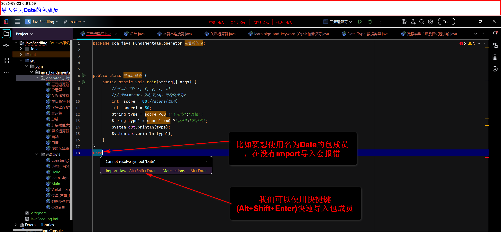

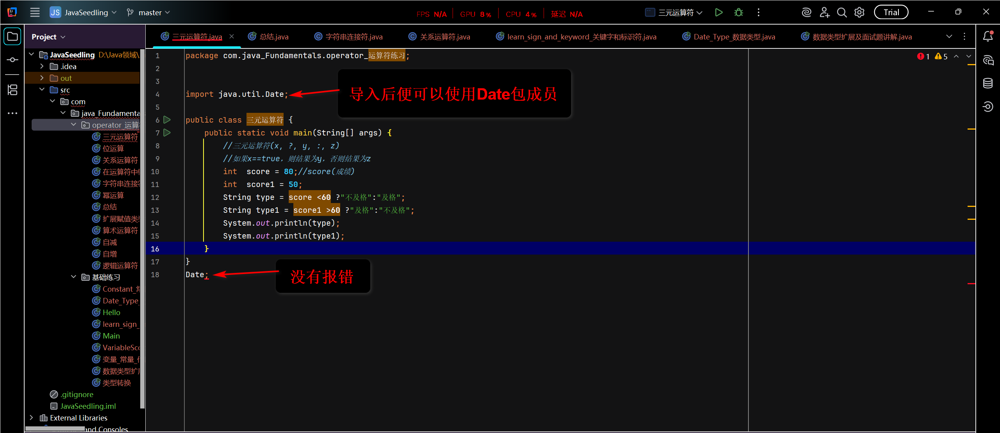

- 注意点：
  1. 导入(import)只能在包名下面，在上面会报错

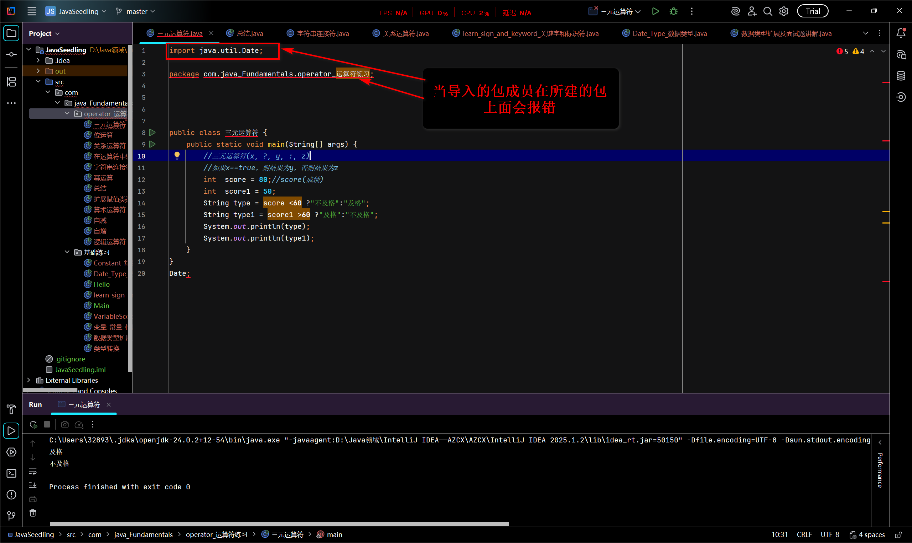

2. 可以导入自己写的类，但是不能导入与当前类命名一样的类，不然会报错。

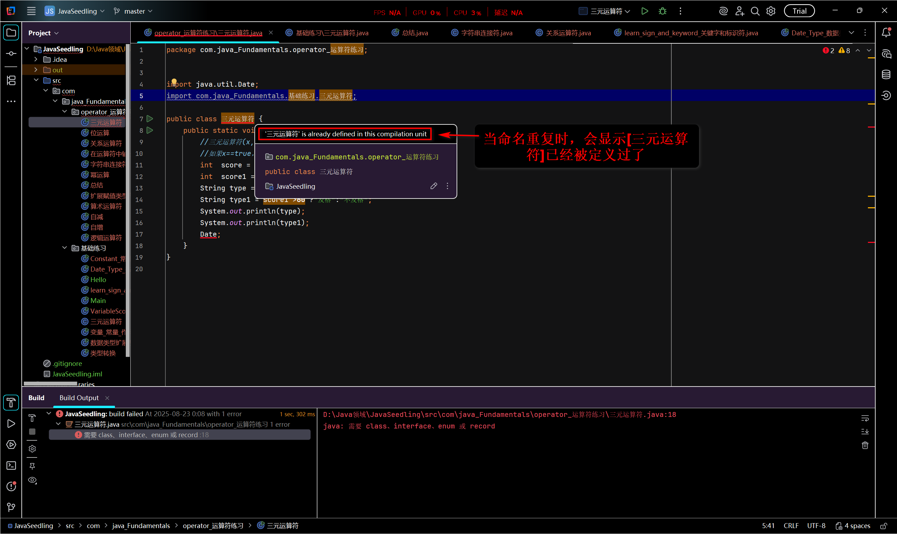

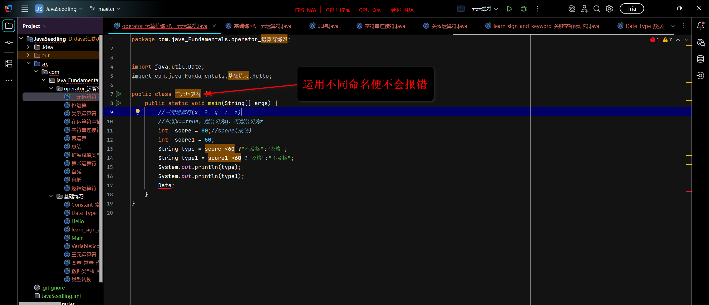

3. 到要导入同一包内多种类，则可用.*代替，意思是导入所在包内所有类

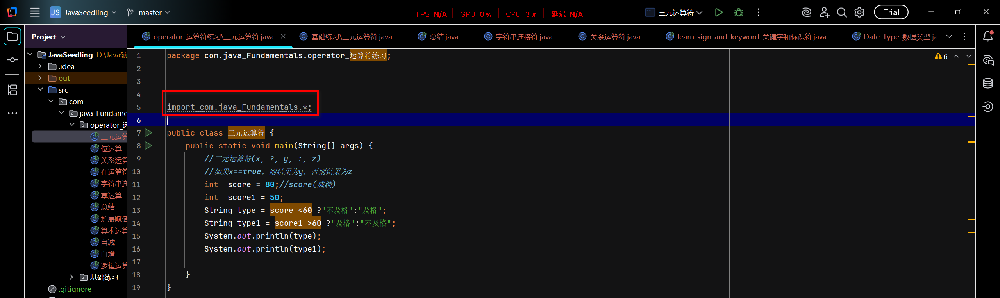

#### 总结：

1. 定义包：package
2. 导入包：import
3. 规范包名要倒置写

4. 到要导入同一包内多种类，则可用[.*]代替
5. 阿里巴巴Java开发手册路径：
   - [阿里巴巴Java开发手册]([阿里巴巴Java开发手册(正式版）免费在线阅读_藏经阁-阿里云开发者社区](https://developer.aliyun.com/ebook/6561/read?spm=a2c6h.26392459.ebook-detail.2.6e1a1869QDt43e))
