# Java基础12——JavaDoc生成文档

## 什么是JavaDoc——它是一种技术

1. JavaDoc命令是用来生成自己API文档的——类

2. 具体的参数设置：
   - @author——作者名
   - @version——版本号
   - @since——指明需要最早使用的jdk版本
   - @param——参数名
   - @return——返回值情况
   - @throws——异常抛出情况

3. 在现的API帮助文档地址：

   [在线的API帮助文档地址]([Overview (Java 2 Platform SE 5.0)](https://docs.oracle.com/javase/1.5.0/docs/api/))

## 现IDEA中写入JavaDoc注释

步骤:

1. 新建名为JavaDoc的类(因为后面会生成多种文件，导致笔记文件夹看的难受，建议在新建一个包，在操作)
2. 输入文档注释(javaDoc)的语法规则：
   - 输入/**（后按回车[Enter]）
3. 先输入：
   - @author  作者名(自取)
4. 再输入：
   - @version 版本号（1.0开始）
5. 然后输入：
   - @since jdk版本
   - 不知道在DOS界面中输入Java -version)回车后显示jdk版本

- 再IDEA 实操：

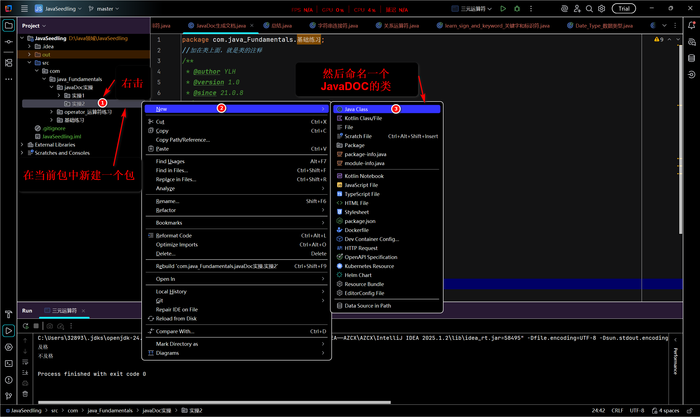

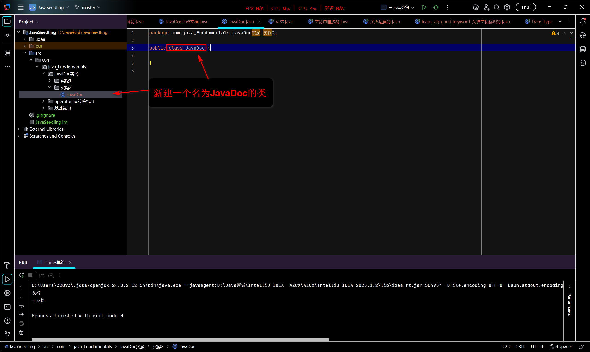

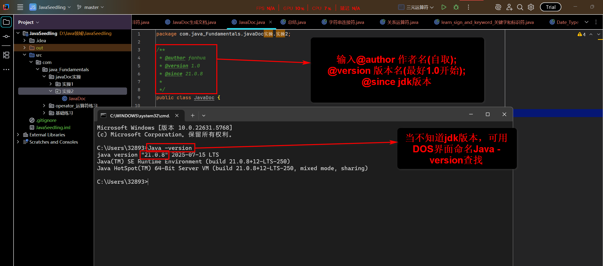

注意：

- 加在类上面的叫类的文本注释

- 加在方法上面的叫方法的文本注释

6. 类的文本注释已经写入了
   - 步骤：
     1. 先定义一个类变量(String name)
     2. 然后定义一个public(访问修饰符)
     3. String(返回类型)
     4. test(){}——test为方法名，(括号内填参数，因为上面的参数是类变量，照抄就行)
     5. 然后定义return(返回值name的情况)

- 最后是这样的

```JAVA
String name;
public String text (String name){
    return name;
}	
```

6. 最后定义方法的文本注释:
   - 只需要在方法上面输入语法规则[/**]按回车即可
   - 会自动生成，参数(param)、返回值(return)

- 在IDEA上实操

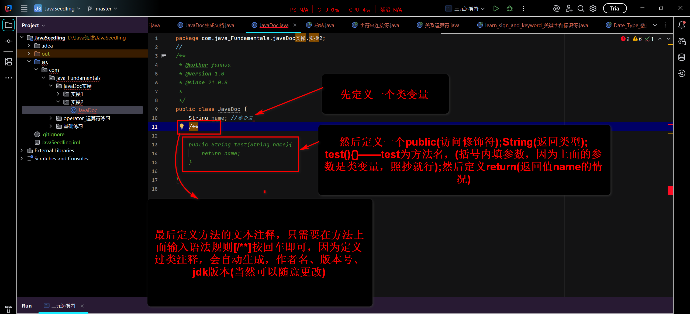

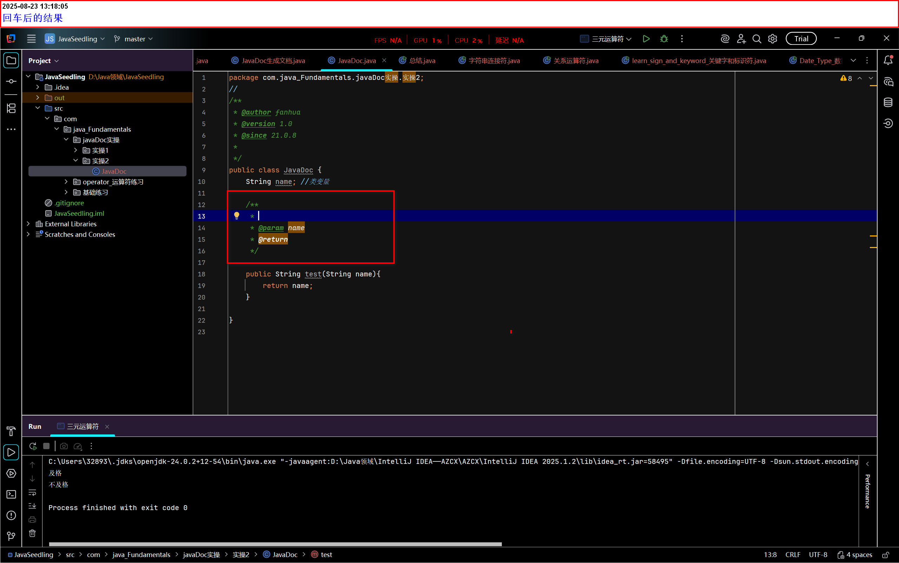

7. 因为没有返回值得情况，所以需要重新注释
   - 先删除方法的文本注释
   - 在text()方法后
   - 抛出一个：throws
     - throws：是一个关键字，用在方法声明的末尾，用于该方法可能抛出的"受检异常"(checked Exceptions)
   - 然后在输入：Exception
     - 异常本身
     - 实际作用于发生的问题对象
     - 类比：就像是一种具体的疾病，比如：流感(IOException)或胃痛(SQLException)
   - throws Exception
     - 主要用于方法声明中
     - 这是一种事先的警告和责任转移
     - 类比：就像是你在工作职责说明书上写的一句声明：我可能会请假(抛出异常)，如果我真的病了，你需要自己处理工作(处理异常)
   - 然后再次输入文本注释。

```JAVA
//最后的代码形式
/**
内容在IDEA上会自动生成
String name;
public String text(String name) throws Exception{
    return name;
}
```

- 在IDEA上实操

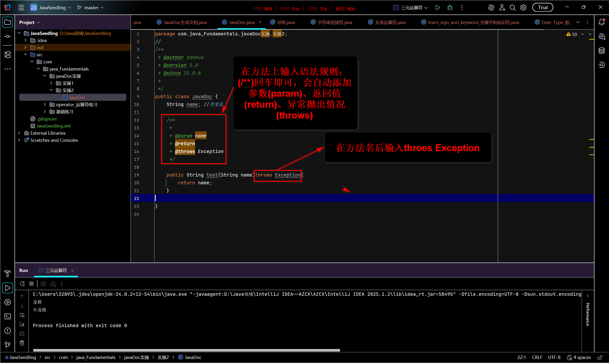

- 当然方法的文本注释也是可以增加作者名、版本名、JDK版本

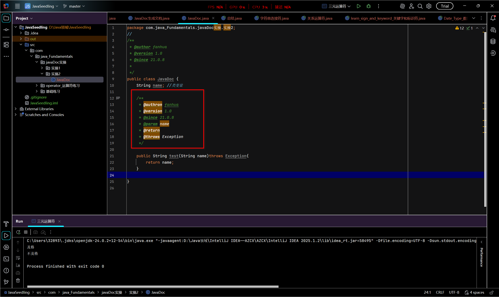

- 到目前位置文本注释差不多已经设置好了。

## 生成JavaDoc

有两种方法：

- 同过命令行(DOS命令)
  - 步骤：
    - 打开类所在包的文件夹
    - 在地址栏最前面输入cmd+空格，最后回车
    - 输入JavaDoc 目标文件名即可
      - 注意：如果文本注释和文件名含中文可能会出现乱码错误
      - 则需要编码

```txt
最后的的形式是：JavaDoc -encoding UTF-8 -charset UTF-8
// -encoding(启用编码)采用UTF-8格式
// -charset(字符集编码)采用UTF-8格式
```

- - 在DOS界面实操
    1. 打开所在文件夹

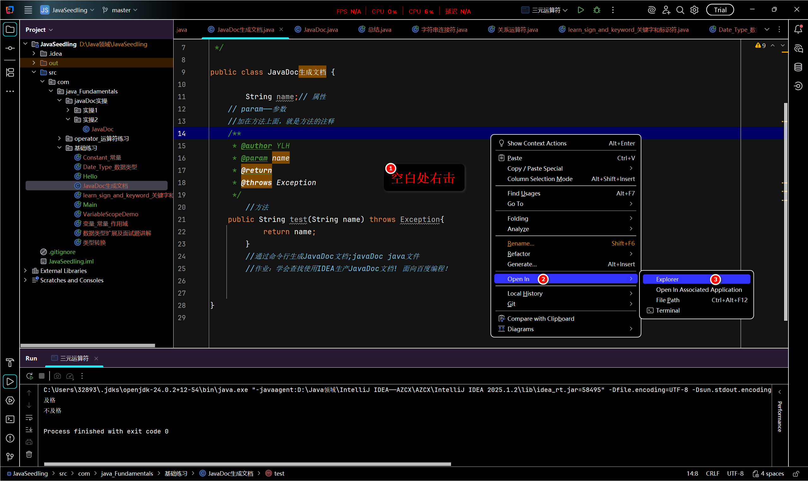

- - 2. 地址栏最前面输入cmd+空格，回车；进入DOS界面

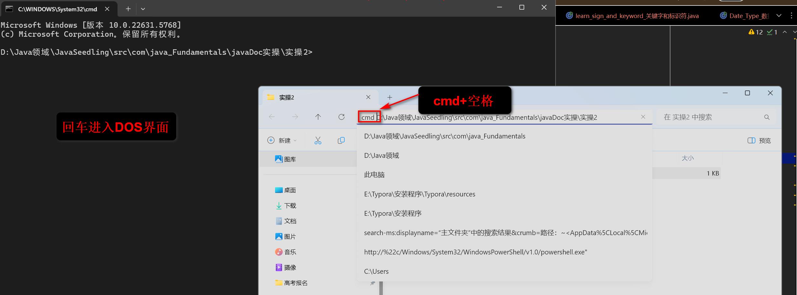

- - 3. 输入JavaDoc -encoding UTF-8 -charset UTF-8

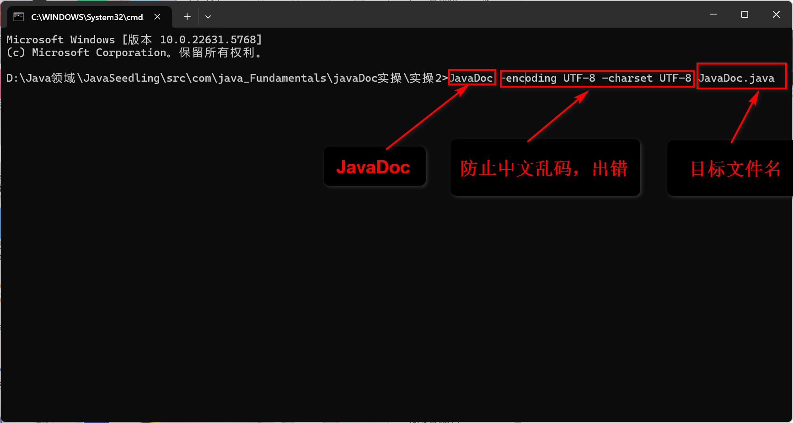

- - 4. 回车

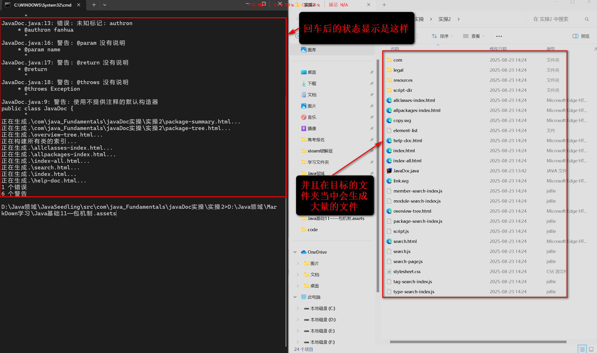

- - 5. 打开生成的JavaDoc的首页(index.html)

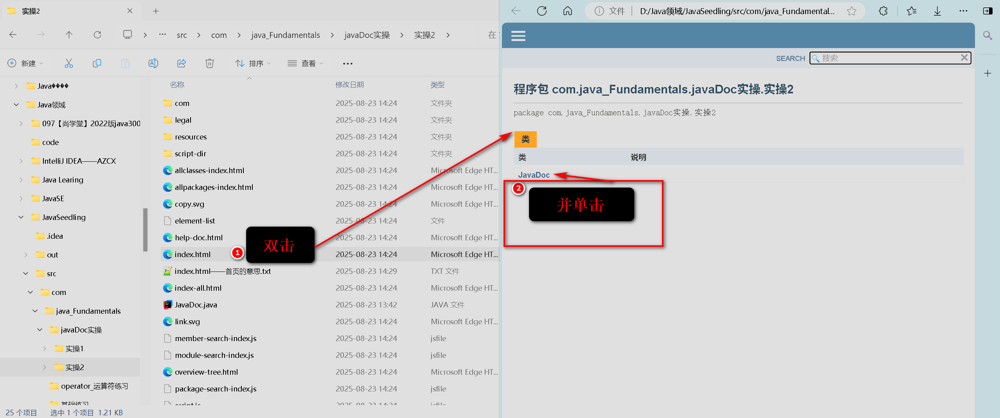

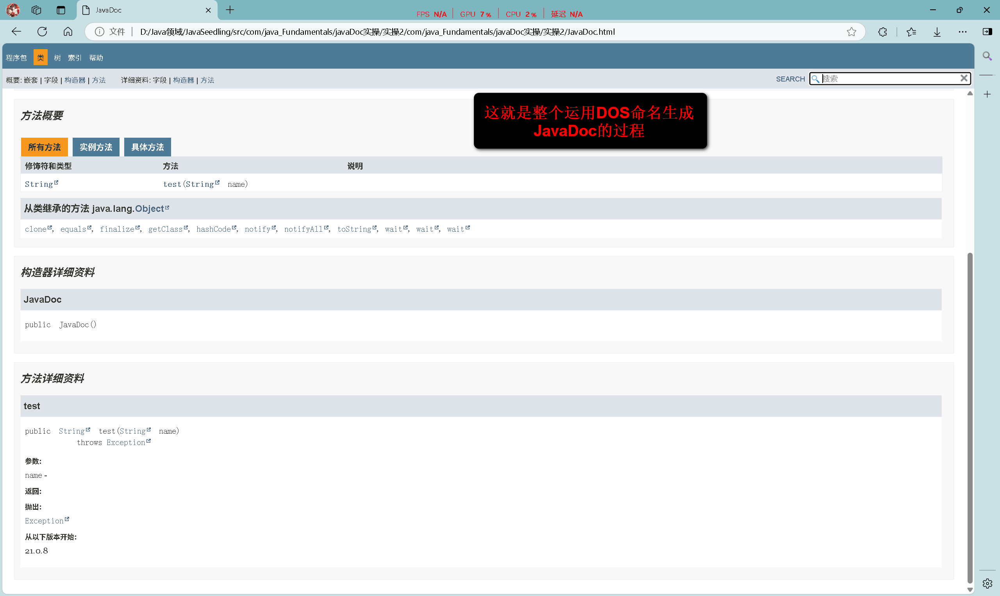

- 通过IDEA生成
- [知识的来处]([使用IDEA生成JavaDoc文档（2种方法）_idea 生成doc-CSDN博客](https://blog.csdn.net/q2453303961/article/details/118693918))
  - 前置步骤:
    - 同样为了防止最后生成的大量文件影响观赏，在同一包下新建一个包。
    - 同样命名一个名叫：JavaDoc的类
    - 将上次写的内容复制，并粘贴到新建的类中
      - 注意：最上面的package………………要与当前类一致
  - 使用IDEA内置的方法
    - 在菜单栏找到Tools选项卡
    - 找到并单击：Generate javadoc……（生成JavaDoc）
    - 在弹出的界面配置好各种参数
    - 最后单击生成JavaDoc
      - 注意
        1. IDEA默认Whole project(整个项目)，我们需要选着file开头的(意思选着当前文件)
        2. 需要自定义目录(Output directory)
        3. 在locale(区域设置)输入zh_ZN(意思是中国区域)
        4. 为了防止因为内有中文出现乱码，报错，可以在：command line arguments(命令行参数)框内输入：-encoding UTF-8 -charset UTF-8
  - 在IDEA实操

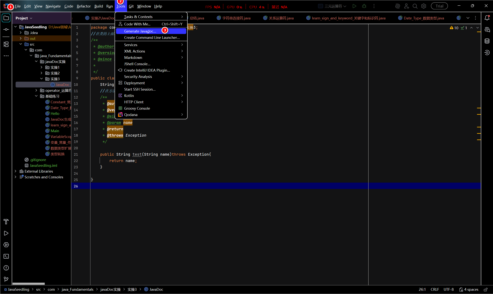

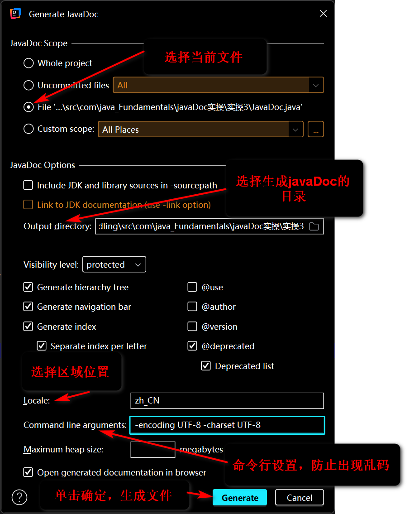

- 检查是否生成成功：只需要检查目录是否出现大量的文件，有index.html即是成功

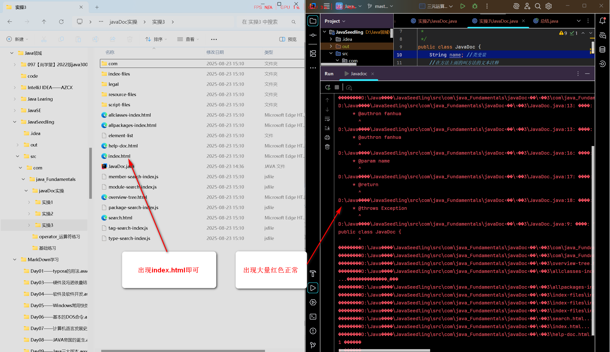

- 打开index.html(首页)

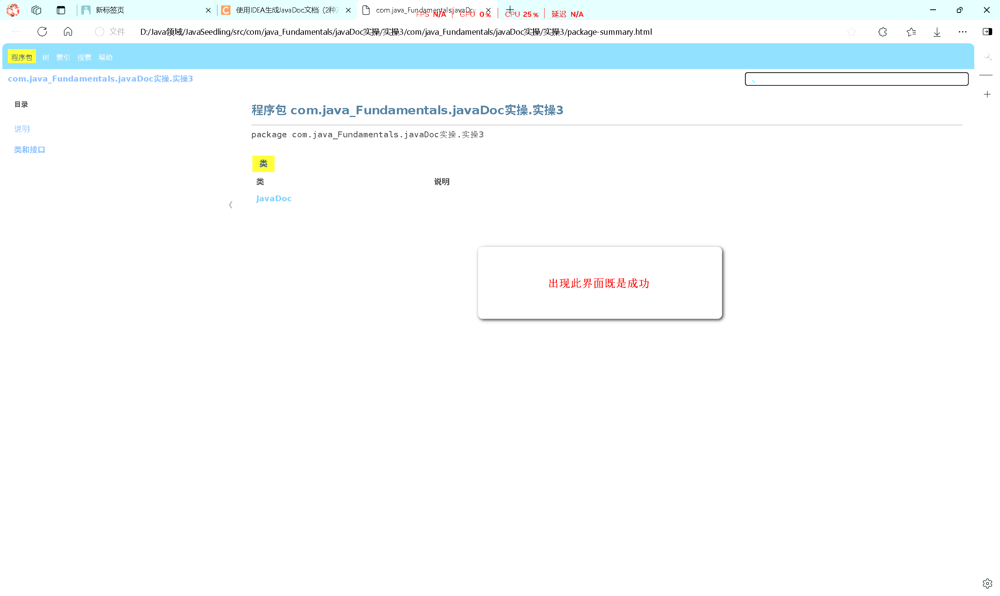
