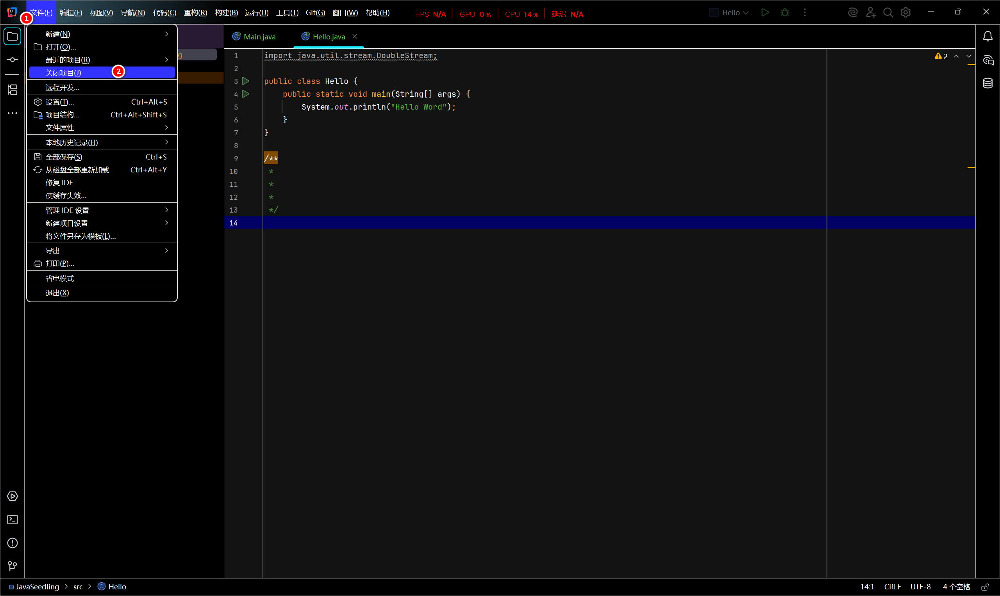
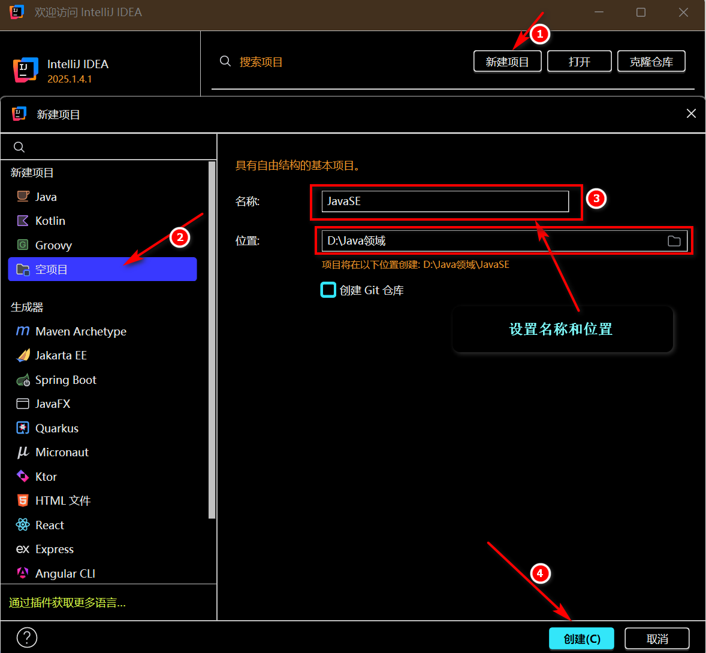
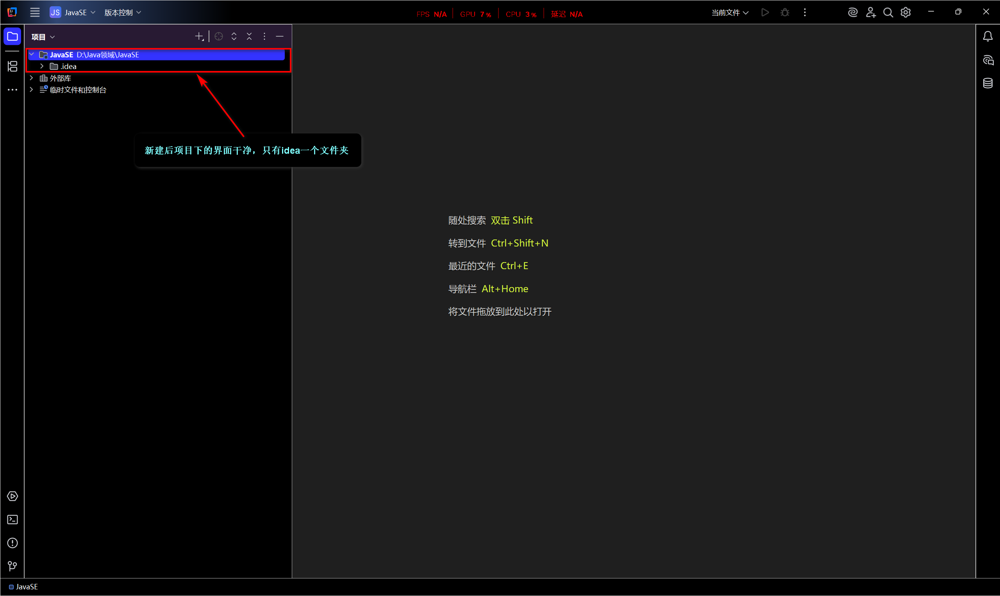
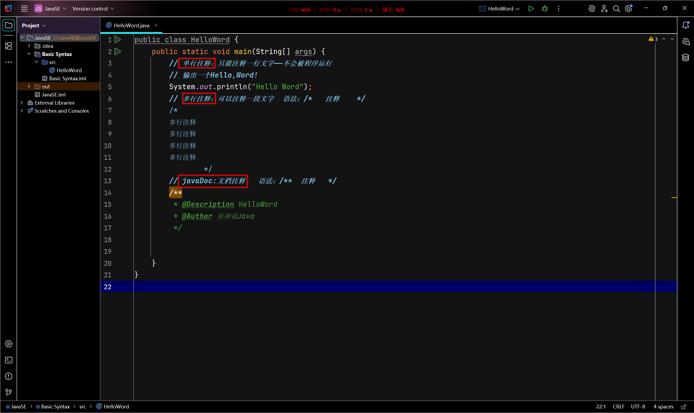
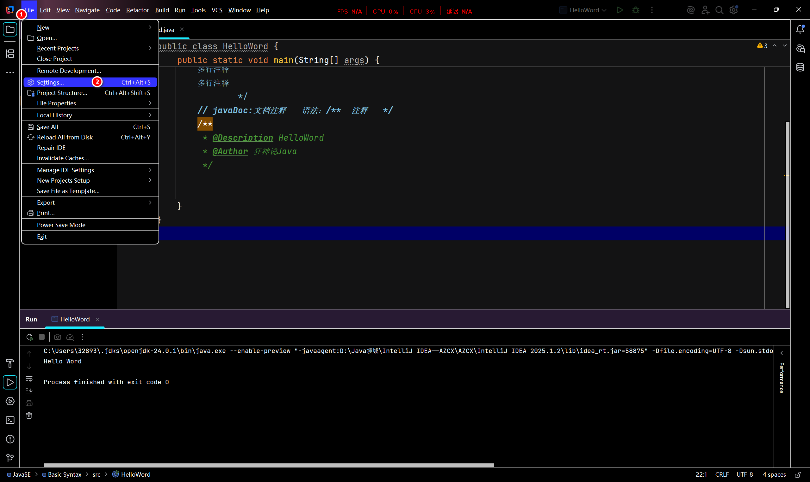
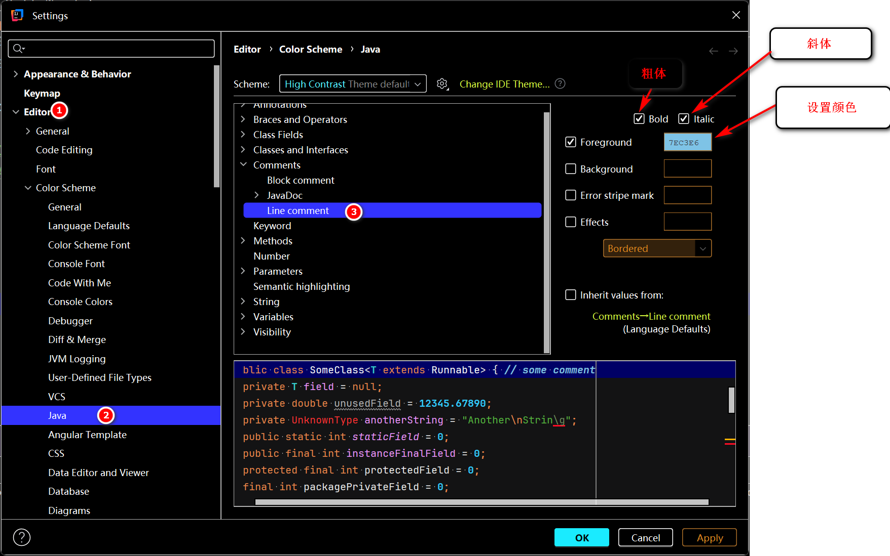

# java基础01——注释

## 注释

### 什么是注释

1. 字面意思是：代码的标注和解释
2. 它的作用是：
   - 提升代码的可读性(读者)
   - 帮助开发者理解代码逻辑(作者自己/协作者)
3. 注释是不会被执行的。

### 为什么要注释

1. 提醒自己：当代码量增长时，为了避免自己自定义变量/方法的用途，注释就发挥提醒自己，便于后续的调试和修复BUG
2. 提示(读者和协作者)：当读者/协作者读到自己定义变量/方法的用途时，注释可以提高读者阅读兴趣、加快协作者的开发速度。

## 注释的类型

- 单行注释：

1. 字面意思：仅这一行是注释，不会被程序执行
2. 语法：//

实例：

``` java
// 单行注释的语法是：//(英文输入法)
```

- 多行注释：

1. 字面意思：是可以连续几行注释，不会被程序执行

2. 语法：/* 注释内容*/

   - 注意：
     1. /*是多行注释的开头
     2. */是多行注释的结尾
     3. 内容格式：仅支持纯文本
     4. 核心用途：临时代码说明

   实例：

``` java 
/* 这是多行注释的开头
   从这里开始都是注释区域
   可以包含多行文本
   甚至包含代码：int X = 10;  ←这行代码不会被执行
   直到遇到结束符号*/
```

- 文档注释(javadoc)

  1. 它是一种特殊的多行注释，用于生成专业的API文档。

  2. 语法规则：

     -  /**是文档注释的开头

     - 由*/结尾

     - 内容格式：支持HTML标签和Javadoc标签

     - 核心用途：生成API文档(javadoc命令)

  1. javadoc的五个标签：

   ## 三、Javadoc 核心标签详解

| 标签          | 用途                                               |
|:--------------:|:-----------------------:|
| **`@param`**  | 描述方法参数             |
| **`@return`** | 描述返回值          |
| **`@throws`** | 描述可能抛出的异常       |
| **`@see`**    | 添加相关参考             |
| **`@deprecated`** | 标记已过时的方法     |

​     实例：

  ``` java
  /**
   *  这是文档注释
   *  包含多行注释
   *  @标签名 标签说明
   *   
  */
  ```

 ### 书写注释是一个非常好的习惯

## 新建一个Enpty project（空项目）

1. 若原来新建过项目，先关闭原来的项目



2. 新建Enpty project(空项目)

- 特点：它是一种完全无预设代码和配置文件的基础项目框架，通常用于从零开始自定义项目结构。





3. 编译并输出HelloWord——在IDEA实操注释



4. 更改注释的颜色/类型




