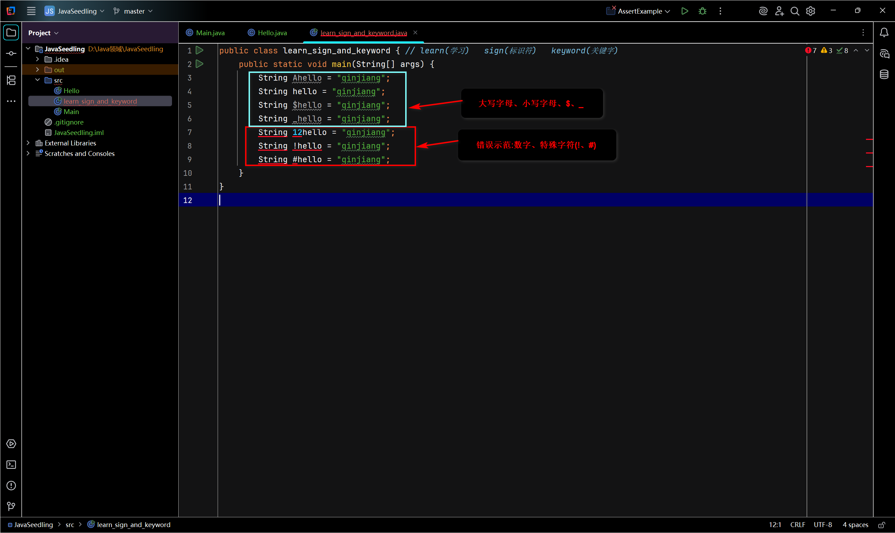
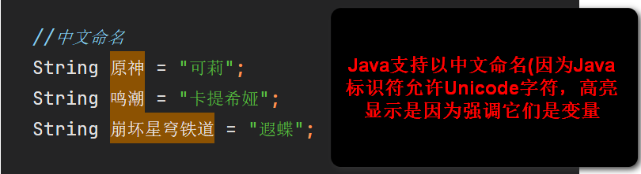
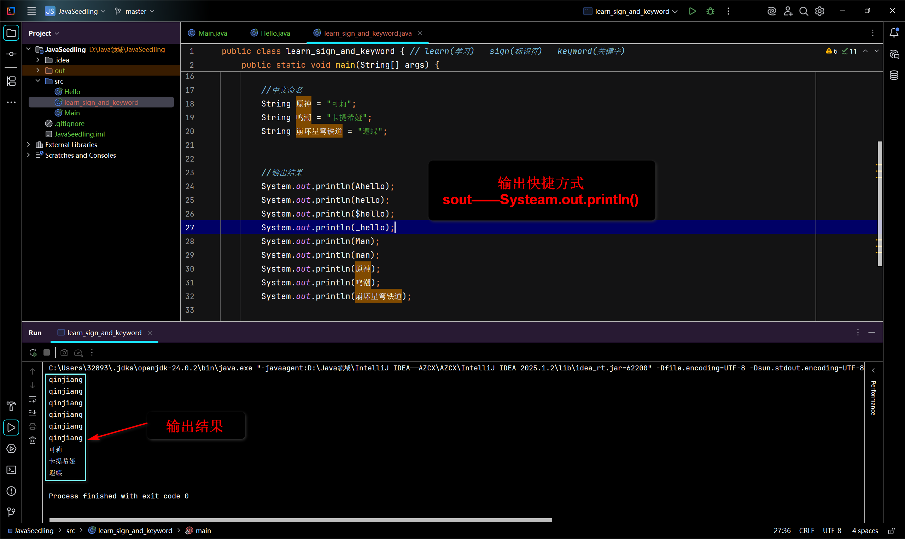

# Java基础02——标识符和关键字

## 标识符

### 关键字：

| 类别       | 关键字                                                                 | 数量 | 说明                          |
|------------|----------------------------------------------------------------------|------|-------------------------------|
| **基本类型** | `boolean`, `byte`, `char`, `double`, `float`, `int`, `long`, `short` | 8    | 定义变量和返回值的数据类型      |
| **流程控制** | `if`, `else`, `switch`, `case`, `default`, `while`, `do`, `for`, `break`, `continue`, `return`, `instanceof` | 12   | 控制代码执行流程              |
| **类与方法** | `class`, `interface`, `extends`, `implements`, `abstract`, `static`, `final`, `synchronized`, `native`, `volatile`, `transient`, `strictfp` | 12   | 定义类和方法特性              |
| **访问控制** | `public`, `private`, `protected`                                     | 3    | 控制类/方法/字段的可见性       |
| **异常处理** | `try`, `catch`, `finally`, `throw`, `throws`                         | 5    | 处理程序错误和异常            |
| **其他**    | `new`, `this`, `super`, `void`, `package`, `import`, `enum`, `assert` | 8    | 杂项功能和基础操作            |

注意：关键字不能用于取名字

如：

```java
public class calss{  // 第二个class会报错
    
}
```

Java所有的组成部分都需要名字。类名、变量名以及方法名等都被称为标识符。

如:

```java
public class HelloWord{ //其中HelloWord是类名，class是定义类的关键字，类名支持中文格式(但是不规范)
    public static coid main(String[] agrs){  // 其中方法是main
        string_teacher = "秦疆"  // 定义一个方法变量，变量名是teacher 
        System.out.pringtln("Hello Word!");
    }
    
}
```

## 标识符注意点：

- 所有的标识符都应该以字母(A~Z或者a~z)，美元符($)、或者下划线(_)开始

- 首字符之后可以是字母(A~Z或a~z)，美元符($)、下划线(_)或数字的任何字符组合

- **不能使用关键字作为变量名或方法名。**

- 标识符是**大小写敏感的**

- 合法标识符举例：age、$salary、_value、__1_value

- 非法标识符举例：123abc、-salary、#abc(即数字开头、空格、特殊字符[+、-、*、/]开头命名)

- **可以包含中文命名，但是不建议这样去使用，也不建议使用拼音。**

- 在IDEA上实操

  1. 合法标识符与非法标识符

  

  2. Java敏感英文大小写

  

  3. 中文命名

  

  4. 最后输出的结果

  

#### 解释关键字

##### 一：abstract

Abstract：定义抽象类和抽象方法

1. 抽象类(Abstract class)

- 定义：用abstract修饰的**类**

- 特点：
  1. 不能被直接实例化(不能被new)
  2. 可以包含普通方法、成员变量、构造方法、以及抽象方法。
  3. 必须被继承，子类需实现所有抽象方法(除非子类也是抽象类)
- 用途：定义通用的模板或基础结构，强制子类实现特定逻辑。

2. 抽象方法(Abstract Method)

- 定义：用abstract修饰的**方法**
- 特点：
  1. 没有**方法体**(以分号；结尾)
  2. 必须在抽象类中声明
  3. 强制**子类**重写(除非子类也是抽象类)
- 用途：定义必须由子类实现的契约

3. 关键规则：

- 抽象类中不一定有抽象方法(可以有零个或多个)
- 包含抽象方法的类**必须是**抽象类
- 子类必须实现**父抽象类**的所有抽象方法，否则子类也许声明为：abstract
- 抽象类可以有构造方法(用于初始化通用状态)，但只能通过子类调用

4. 总结：

   - 抽象类：定义部分实现的模板，强制子类补全逻辑。
   - 抽象方法：声明未实现的方法，强制子类重写。
   - 核心目的：实现代码复用+规范子类行为(多态的基础)

5. 标粗体的名词解释：

   1. 类(Class)：

      - 是什么：类是创建对象的"模板"或"蓝图"

      - 类比：就像汽车的图纸，它本身不是一辆车，但是它构造出了车的样子(形状、颜色)和行为(启动、刹车)和汽车肉眼能看见的(方向盘、座椅、杯架)——统称为类的属性
      - 作用：创建对象的模板

   2. 方法(Method):

      - 是什么：方法是类中定义的行为或功能

      - 类比：就像类(汽车图纸)所构造的汽车内的功能，如转动方向盘(行为)、将水杯放到杯架上(动作)、音乐(功能)、播放音乐(动作)、导航(功能)——统称为类的方法
      - 作用：定义对象的行为

   - 总结：所以现有类再有方法，类包含方法，没有类就没有方法。

   3. 方法体(Method Body):

      - 是什么：方法的具体实现(在{ }里的内容)

      - 类比：启动功能(内部操作)汽车操作：踩刹车→拧钥匙→点火(这个过程就是方法体)

      - ```java 
        public class HelloWord{
            public static coid main(String[] args)
            Sytem.out.println("Hello Word!")    
                //在大括号内的都叫方法体
        }
        ```

      - 作用：方法的具体实现

   4. 子类(Subclass):

      - 是什么：通过继承父类创建的新类
      - 类比：用"汽车图纸"为基础设计的"电动车图纸"
      - 关键点：
        1. 使用extends关键字继承
        2. 自动获取父类的属性和方法
      - 作用：继承父类的新类

   5. 父抽象类(Abstract Superclass)

      - 是什么：被声明为abstract的类，是子类的"半成品模板"

      - 类比：通过车辆设计规范(要求所有车辆必须有方向盘，但没说具体样式)——意思是我想怎么造都可以，但必须是方向盘，它必须有方向盘的功能

      - 关键点：

        1. 用abstract修饰
        2. 不能直接创建对象
        3. 包含抽象方法(没有方法体)

      - 作用：定义子类必须实现的规范。

        ---

##### 二、assert

1. assert定义：关键字用于声明一个断言(assertion)，它是一种调试机制，用于在程序运行是验证某个条件为真。如果条件不满足(结果为false),JVM会抛出AssertionError异常，导致程序终止。
2. 核心作用：
   - 验证假设：确保代码中的关键条件符合预期(例如参数合法性、状态一致性等)
   - 调试辅助：快速定位开发阶段的逻辑错误
   - 文档说明：显示标记代码中的前置/后置条件

3. 语法格式：

   1. 简单形式：

      - assert condition；
      - 若condition 为false，抛出无详细信息的AssertionError。

   2. 扩展形式：

      - assert 
      - condition :

      - exppression;
      - 若condition为false，将expression的值作为错误信息传递给AsserionError(expression可以是任何返回值的表达式)。

   3. 关键注意事项：

      1. **默认禁用**：

      - Java虚拟机(JVM)默认关闭断言检查
        - 启动断言需添加JVM参数：
          - 启用所有断言：-ea
          - 启动特定包的断言：-ea:com.example......
          - 启动系统类断言：-esa(慎用)

   4. 适用场景：

      - 仅用于调试：断言不是错误处理机制！
      - 禁止用于公共方法参数校验：
        - 应使用:if + IllegalArgumentException等常规异常。
      - 避免副作用：断言条件中的表达式不应该改变程序状态(如修改变量值)

   5. 总结：

      - 设计目的：调试(验证内部逻辑)
      - 默认启用：默认禁用(需要手动开启)
      - 生产环境使用：不应启用
      - 错误类型：AssertionError(未检查异常)

      ----

##### 三、Boolean

1. Boolean定义：是一个基本数据类型的关键字，用于声明一个只能存储真值(true)或假值(false)的变量。

2. 它代表逻辑判断的结果，是条件语句(如if、while)的核心基础。

3. 关键特性：

   - 取值唯一：

     - true：表示逻辑真(成立)
     - false：表示逻辑假(不成立)
     - 严格区分大小写(不可写为Ture或FALSE)

   - 默认值：

     - 作为类的成员变量时，默认为false
     - 局部变量必须手动初始化，否则编译报错

   - 内存占用：

     - 官方规范未明确定义大小(通常由JVM实现决定)
     - 实际使用中通常按1字节处理(但不可依赖此特性进行内存计算)

   - 禁止数值转换：

     - 与C/C++不同，Java的Boolean不能与整数互换(如0/1不能替代false/true)

       ```JAVA
       int flag = 1;
       if (flag){...}    //编译错误！不能将int 转为 Boolean
       ```

   - 常见应用场景：

     1. 条件控制、循环控制、返回布尔值的方法

4. 重要注意事项：

   - 不可替代性：Java中任何需要布尔值的地方(如if条件)必须使用Boolean类型，不能使用其他类型(如int、String)隐式交换。

   - 包装类：对应包装类型为Boolean(用于泛型集合等场景)，支持自动装箱/拆箱

     ```JAVA
     Boolean wrappedBool = true;   // 自动装箱
     boolean rawBool = wrappedBool;    // 自动拆箱
     ```

5. 主要作用：通过Boolean类型，Java确保了逻辑判断的严格性和代码的清晰性，避免了其他语言中可能出现的隐式类型转换错误

   ---

##### 四、break

break的定义：主要用于**立即终止当前循环**或switch语句的执行，并将程序控制权转移到被终止语句之后的代码。

- 具体用途：

  - 在循环语句中跳出循环：
    - 在for、while或do-while循环中执行break时，循环会立即终止，继续执行之后的代码。
  - 在switch语句中终止case：
    - 在switch语句中，break用于结束当前分支，防止代码"穿透"到下一个case(避免多个case被继续执行)
  - 带标签的break(跳出多层循环)：
    - 通过标签(Label)，break可以跳出指定的外层循环(而不仅仅是当前内层循环)

- 注意事项：

  - 仅用于循环或switch：
    - 在循环或switch之外使用break会导致编译错误
  - 与continue的区别：
    - break是完全终止循环；continue是跳过当前迭代，进入下一次循环。
  - 避免滥用：
    - 过度使用break可能降低代码的可读性，建议优先使用条件控制循环。

- 总结：break的核心作用是强制中断当前执行流，用于循环提前结束遍历，用于switch时防止逻辑穿透。合理使用可提升代码效率，但需确保逻辑清晰。

  ---

##### 五、byte

byte的定义：用于声明一个8位(1字节)有符号整数的基本数据类型。

- 核心要点：
  1. 取值范围：
     - 最小：-128(二进制：10000000)
     - 最大：127(二进制：01111111)
     - 范围公式；$-2^7$~$2^7-1$

- 内存占用：

  - 固定占用1字节(8位)内存，远小于int(4字节)和long(8字节)

- 使用场景：

  1. 节省内存：处理大量数据时(如数组、集合)，可显著减少内存开销。
  2. 二进制数据：文件可读写，网络传输、图像处理等涉及原始字节的操作(如InputStream/OutpuStream)
  3. 兼容性：与C/C++等语言的二进制数据交互。

- 注意事项：

  - 默认类型问题：整数字变量(如100)默认位int，但若在byte范围内(-128~127)，可直接赋值。
  - 运算时类型提升：byte参与运算(如+、-、*、/)会自动提升位int，需显式强制转换才能赋回byte。
  - 溢出风险：强制转换时，超出范围的值会循环(如[byte]128结果位-128)

- 与Byte类的区别：

  - byte是基本类型，Byte是其包装类(用于泛型、集合等场景)。

  - 自动装箱/拆箱：

    ```JAVA
    Byte obj = 10;   //自动装箱(byte→Byte)
    byte val = obj;  // 自动装箱(Byte→byte)
    ```

- 总结：byte是Java中用于高效处理小范围为整数或二进制数据的关键字，适用于内存敏感的场景(如大规模组或I/O操作)，但需要注意其取值范围和运算时的类型转换规则。

---


