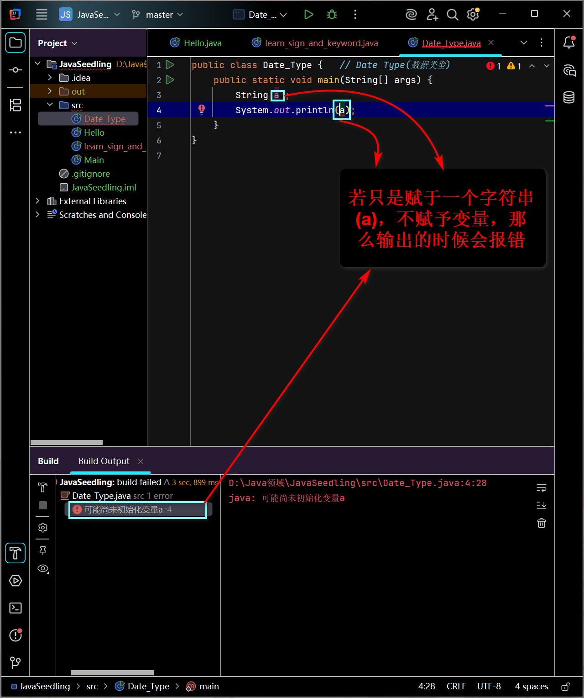
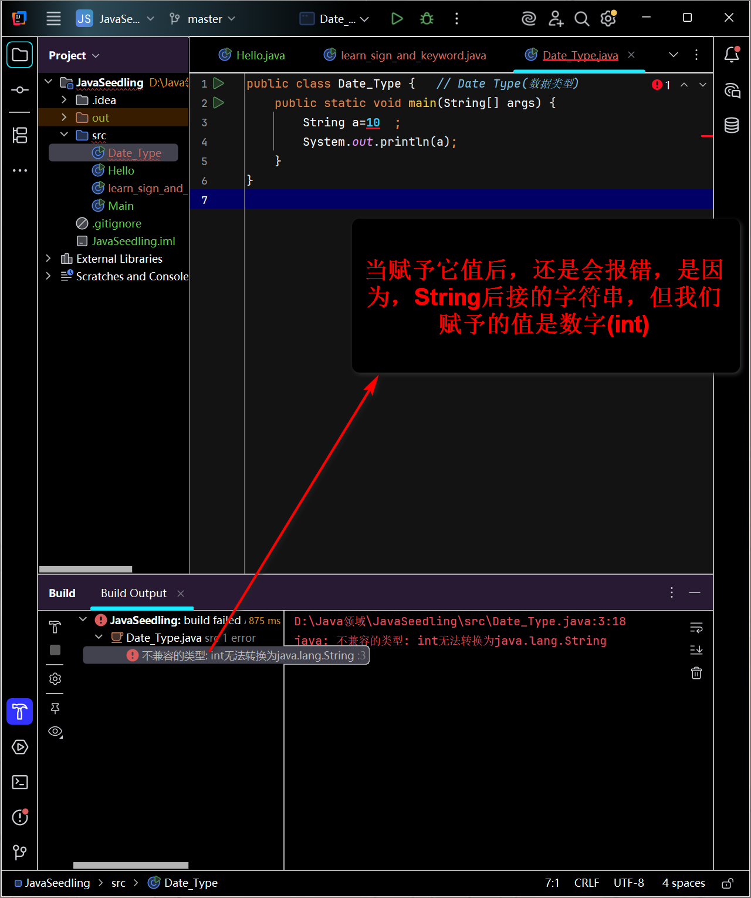
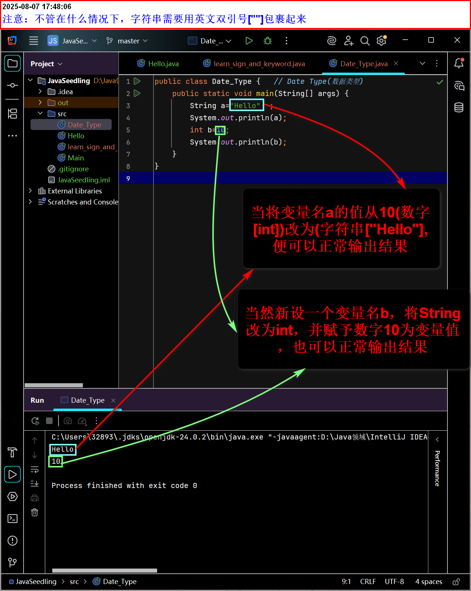
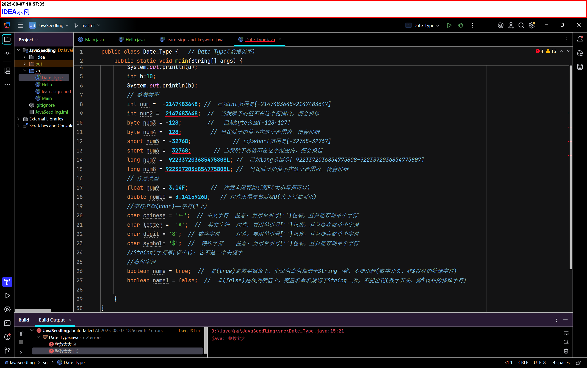

# java基础03——数据类型详解

## 数据类型(弱类型语言和强类型语言)

- 强类型语言：

  - 指在编程中，变量表达式和操作的数据类型受到**严格约束**和**检查**的语言。

  - 类型规则：在编译期和运行期都会被强制执行

  - 特点：

    1. 显式类型声明：
       - 必须在使用变量期间明确声明其数据类型(如：int、String、double)
       - var(Java 10+)仅用于局部变量的类型推断，编译时仍然会确定具体类型，本质仍是强类型。

    示例：

    

    

    

    2. 编译时类型检查：

       - 编译器在编译阶段会严格检查所有类型是否兼容。

       - 发现类型错误(如将String赋给int变量)会直接报错阻止程序运行。

    3. 禁止隐式危险转换：
       - 不同类型间操作(如int与String相加)通常不被允许或需特定处理(如String拼接)

    4. 核心目的：在程序运行前(编译期)捕获大多数类型相关的错误，确保代码的**安全性、清晰性和运行可靠性**但是速度会下降。

---

- 弱类型语言：

  - 指在编程中，对变量、表达式和操作的数据类型的约束和检查相对宽松的语言。

  - 它允许更灵活(有时甚至是隐式、自动)的类型转换，变量的类型可以在运行是改变，类型检查主要在运行时进行或规则较为宽松。

  - 特点：

    1. 隐式/宽松的类型声明：

       - 变量声明时通常不需要显式指定数据类型(或类型声明是可选的)

       - 同一个变量可以在不同时刻存储不同类型的数据

    如：

    ```javascript
    let value = 42;   //value 现在是number(数字) 类型
    value = "Hello";  //value 现在变成了String(字符串) 类型，不会显示错误
    value = "ture";  //value 现在变成了boolean(逻辑值——真[true]和假[false])类型，不会显示错误
    ```

    2. 运行时类型检查为主：
       - 许多类型相关的错误直到代码运行时才会被发现(而不是在编译时)
    3. 广泛的隐式类型转换：
       - 当操作涉及不同类型时，语言解释器/运行时会自动尝试进行类型转换("强制转换")，以使操作能够进行。
       - 这种转换规则有时复杂不直观，容易导致难以预料的错误。
         - 常见转换示例:
           - 数字+字符串
           - 字符串-数字
           - 布尔值参数运算
           - 非布尔值用于条件判断
    4. 操作符重载行为：
       - 同一个操作符(如+)根据操作数的类型执行完全不同的操作(加法vs.字符串拼接)。

---

## 弱类型语言与强类型语言的区别

| 特性            | 弱类型语言(如JavaScript、PHP)                  | 强类型语言(如Java、c#、C++)                              |
| --------------- | ---------------------------------------------- | -------------------------------------------------------- |
| 类型声明        | 通常不强制或可选；变量类型可动态改变           | 必须显式声明;变量类型在生命周期内固定                    |
| 类型检查时机    | 主要在运行时。许多类型错误在运行时才会暴露     | 主要在编译时，编译器严格把关，提前捕获错误               |
| 类型转换        | 广泛且隐式。解释器/运行时自动进行强制转换      | 严格且显式。除安全转换外，危险转换必须程序员手动强制转换 |
| 操作符行为      | 操作符行为常依赖操作数据类型(如+可加可拼接)    | 操作符行为严格定义，类型不匹配通常导致编译错误           |
| 安全性          | 更易写出能运行但有潜在逻辑错误的代码(类型相关) | 编译时类型检查提供更强的安全保障，减少运行时类型错误     |
| 灵活性/开发速度 | 初始开发可能更快，无需纠结类型声明             | 前期需要更多类型设计，可能感觉稍慢，但长期维护性更好     |
| 代码清晰度      | 阅读代码时，变量的当前类型和预期用途可能不清晰 | 显式类型声明使代码意图更明确，易于理解                   |
| 性能            | 运行时类型检查和转换可能带来额外的开销         | 编译时已知类型信息，通常运行效率更高                     |
| 典型代表        | JavaScript、PHP、Perl、VB(某些版本)            | Java、c#、C++、C、Go、Rust、Swift                        |

## 总结

- 强类型语言：严谨、安全、编译时把关，代码意图清晰，维护性好，性能通常更优，但需要程序员更显式地管理类型。

- 弱类型语言：灵活，宽容，开发初期可能快，，但依赖运行时的隐式转换，容易意图和安全性相对较低

---

## 名词解释

1. 隐式(lmplicit)
   - 含义：由系统自动完成，不需要程序员明确声明或操作
   - 特点：
     - 自动发生，无需额外代码
     - 基于语言规则或上下文推断
     - 简化代码但可能隐藏细节
   - 常见应用场景：
     - 类型转换(自动转换)
     - 构造函数调用
     - 变量类型推断
     - 默认接口方法

2. 显式：
   - 含义：需要程序员明确声明或操作
   - 特点：
     - 必须手动编写代码指定
     - 明确表达意图，避免歧义
     - 提供更多控制权
   - 常见应用场景：
     - 类型转换(强制转换)
     - 方法重写
     - 资源管理
     - 接口实现
   - 核心总结：
     - 隐式：系统自己做("默默完成")→简化代码但需理解底层规则。
     - 显式：程序员明确写("亲力亲为")→代码更可控且意图明显

---

## Java的数据类型分为两大类

- 基本类型(primitive type)

  - 数据类型：

    1. 整数类型：

       - byte占1个字节：
         - 范围：-128~127

       - short占2个字节：
         - 范围：-32768~32767

       - int占4个字节：
         - 范围：-2147483648~2147483647

       - long占8个字节：
         - 范围：-9223372036854775808~9223372036854775807
         - 注意：要想使用末尾要加L(尽量大写，好区分)

    ```java
    int num =  -2147483648; //  已知int范围是[-2147483648~2147483647]
            int num2 =  2147483648;  //  当我赋予的值不在这个范围内，便会报错
            byte num3 = -128;        //   已知byte范围[-128~127]
            byte num4 =  128;         // 当我赋予的值不在这个范围内，便会报错
            short num5 = -32768;             // 已知short范围是[-32768~32767]
            short num6 =  32768;       // 当我赋予的值不在这个范围内，便会报错
            long num7 = -922337203685475808L; //  已知long范围是[-9223372036854775808~9223372036854775807]
            long num8 = 9223372036854775808L; //  当我赋予的值不在这个范围内，便会报错
    ```

    

  - 注意：以上的都是整数类型，范围是它可以赋予对应变量值的范围

    2. 浮点类型(小数类型)：

       - float占4个字节
         - 注意：要想使用末尾要加F(大小写都可以)

       - double占8个字节

    ```java
     float num9 = 3.14F;       //  注意末尾要加后缀F(大小写都可以)
            double num10 = 3.1415926D;   // 注意末尾要加后缀D(大小写都可以)
    ```

    

    2. 字符类型：

       - char(中文)占2个字节

  ```java 
  char chinese = '中';  // 中文字符  注意：要用单引号['']包裹，且只能存储单个字符
          char letter =  'A';  //  英文字符  注意：要用单引号['']包裹，且只能存储单个字符
          char digit = '8';  // 数字字符     注意：要用单引号['']包裹，且只能存储单个字符
          char symbol= '$';  //  特殊字符    注意：要用单引号['']包裹，且只能存储单个字符
  ```

  

  - boolean(布尔)类型：占1位其值只有true(是)和false(非)两个

    ````java 
     boolean name = true;  //  是(true)是放到赋值上，变量名命名规则于String一致，不能出现(数字开头、除$以外的特殊字符)
            boolean name1 = false;  //  非(false)是放到赋值上，变量名命名规则于String一致，不能出现(数字开头、除$以外的特殊字符)
    ````

    

- 引用类型(reference type)：

  - 类
  - 接口
  - 数组

---

## 什么是字节

1. 位(bit)：是计算机内部数据，存储的最小单位
2. 字节(byte)：是计算机中数据处理的基本单位，习惯上用大写B表示
3. 1B(byte，字节)=8bit(位)
4. 字符：是指计算机中使用的字母、数字、字和符号
5. 1bit表示1位
6. 1byte表示1个字节，1B=8bit
7. 1024B=1KB
8. 1024KB=1MB
9. 1024MB=1GB
10. 1024GB=1TB
11. 一个英文占1个字节
12. 一个中文占2个字节
