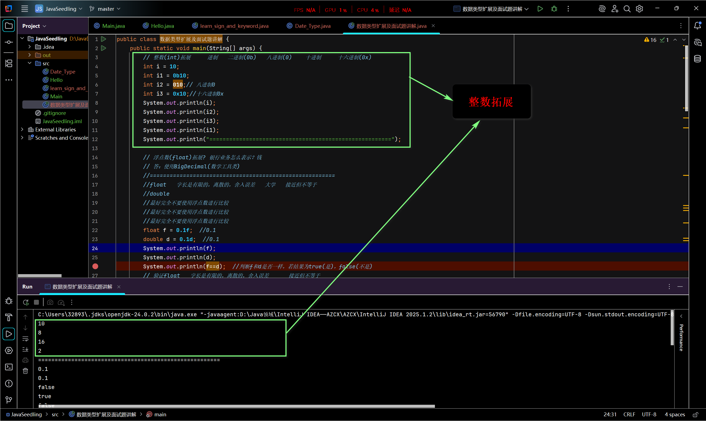
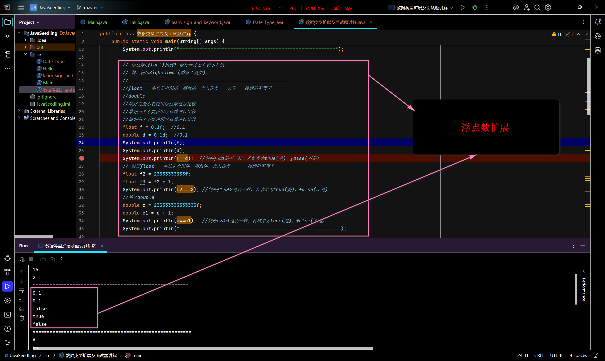
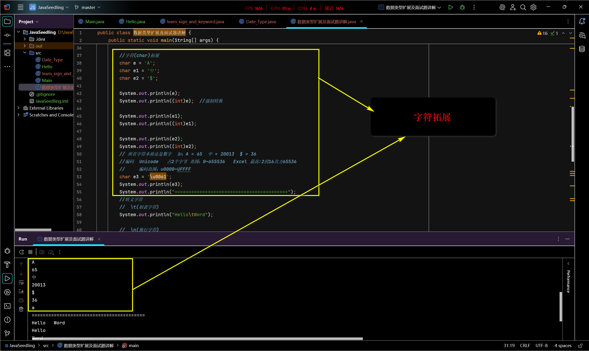
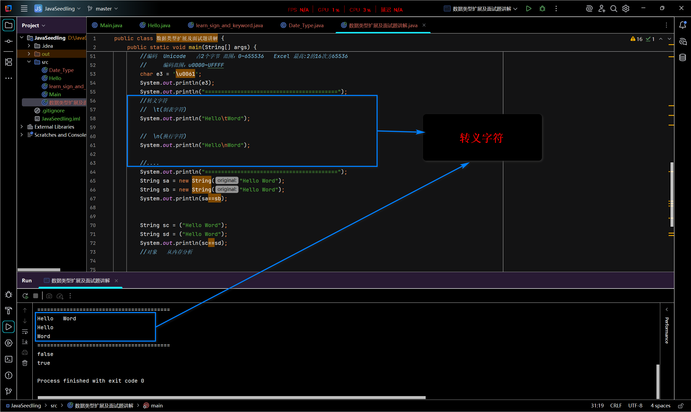
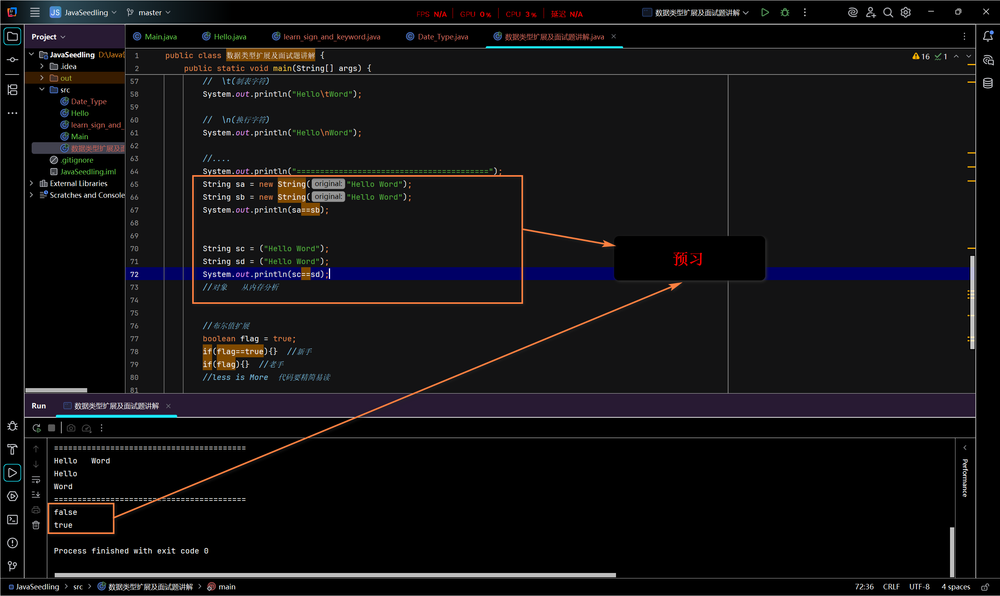
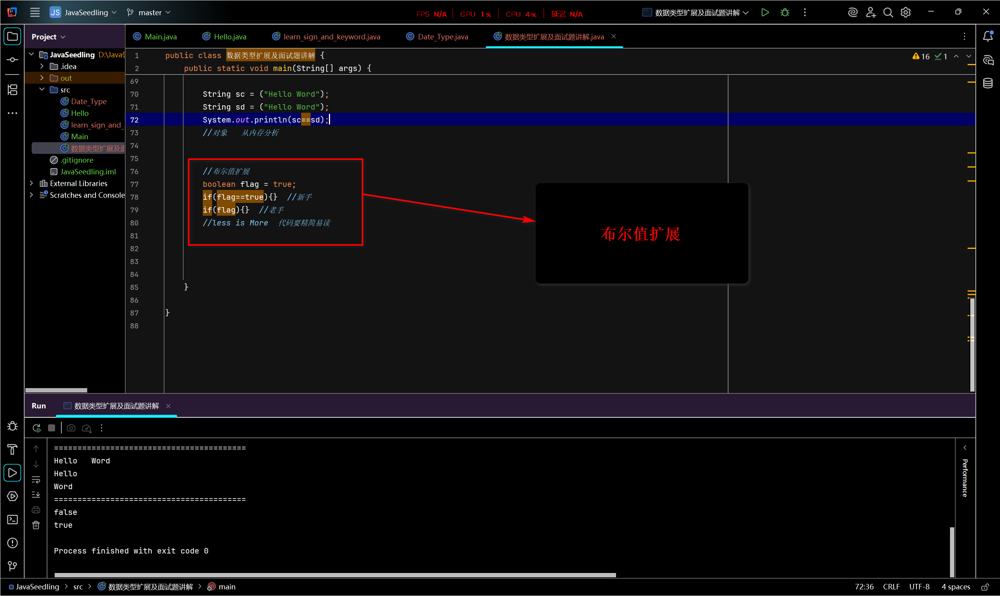

# java基础04——数据类型扩展、转义字符及面试题讲解

## 进制

 ### 各个进制的范围

1. 二进制：0~1
2. 八进制：0~7
3. 十进制：0~9
4. 十六进制：0~9，A~F

- 正常情况下：
  - 二进制(B)、八进制(O/Q)、十进制(D)、十六进制(H)

- 在Java中：
  - 二进制(0b)、八进制(0)、十进制(直接输入即可)、十六进制(0x)——【0】均位零

### 整数拓展：

```java
public class 整数拓展{
    public static void main(String[] args){
        // 整数拓展：
        int i = 10;  // 十进制   逢十进一
        int i1 = 0b10; // 二进制 
        int i2 = 010;  //  八进制 逢八进一
        int i3 = 0x10; //  十六进制  逢十六进一
        System.out.println(i);
        System.out.println(i1);
        System.out.println(i2);
        System.out.println(i3);
        // 以上这些是非十进制转十进制
    }
}   


```


## 非十进制转十进制的方法

非十进制数转十进制数

- 口诀：每位上的数码*$基数^位$求和

$$
\begin{aligned}
1101_{(B)} 
&= 1 \times 2^3 + 1 \times 2^2 + 0 \times 2^1 + 1 \times 2^0  \\
&= 8 + 4 + 0 + 1 \\
&= 13_{(D)}
\end{aligned}
$$

$$
\begin{aligned}
27_{(Q)} 
&= 2 \times 8^1 + 7 \times 8^0  \\
&= 16 + 7 \\
&= 23_{(D)}
\end{aligned}
$$

$$
\begin{aligned}
2C_{(H)} 
&= 2 \times 16^1 + 12 \times 16^0  \\
&= 32 + 12 \\
&= 44_{(D)}
\end{aligned}
$$

总结：

- 基数^位$中的位是**总的位数**由左到右从零开始**依次递增**

- 检查：最高**位**永远比总的位数少1

- 数码就是将整体照抄下来，1101→**1**x[]  +  **1**x[]    +   **0**x[]   +  **1**x[]

- 基数可以理解为(进制数)
- ### 浮点数拓展

```java
public class 浮点数拓展{
    public static void main(String[] args){
        // 浮点数(float)拓展? 银行业务怎么表示？钱
        // 答：使用BigDecimal(数学工具类)
        //========================================================
        //float   字长是有限的，离散的，舍入误差      接近但不等于(不适合银行业务)
        //double(同样有false特点，但比false精度更高，误差小，不能避免无误差，同样不适用于银行业务)
        //最好完全不要使用浮点数进行比较
        //最好完全不要使用浮点数进行比较
        //最好完全不要使用浮点数进行比较
        float f = 0.1f;  //0.1
        double d = 0.1d;  //0.1
        System.out.println(f);
        System.out.println(d);
        System.out.println(f==d);  //判断f和d是否一样，若结果为true(是)，false(不是)——结果false
        // 验证float   字长是有限的，离散的，舍入误差   大学   接近但不等于
        float f2 = 23333333333f;
        float f3 = f2 + 1;
        System.out.println(f2==f2); //判断f1和f2是否一样，若结果为true(是)，false(不是)——true
        //验证double
        double c = 233333333333333f;
        double c1 = c + 1;
        System.out.println(c==c1);  //判断c和c1是否一样，若结果为true(是)，false(不是)——结果false(只是因为精度高)
       
    }
}
```
#### false、double、BigDecimal

Java 浮点类型对比表

| 特性         | float (单精度)                     | double (双精度)                      | BigDecimal (精确小数)                   |
|--------------|------------------------------------|--------------------------------------|-----------------------------------------|
| **存储大小** | 32 位 (4 字节)                     | 64 位 (8 字节)                       | 可变大小 (基于精度)                     |
| **精度范围** | 6-7 位有效数字                     | 15-16 位有效数字                     | **任意精度** (仅受内存限制)             |
| **字面量**   | 必须加 `f`/`F` 后缀<br>`3.14f`     | 可省略后缀<br>`3.14` 或 `3.14d`      | 必须通过构造函数<br>`new BigDecimal("3.14")` |
| **内存占用** | 4 字节/值                          | 8 字节/值                            | 40-80 字节/对象 (含对象开销)            |
| **运算速度** | 较快 (硬件优化)                 | 快 (现代CPU优化)                  | 慢 (100-1000倍于double)             |
| **共同问题** | 二进制舍入误差<br>离散值表示<br>不能精确表示0.1等十进制小数 | 同float但误差更小 | ✅ 无舍入误差<br>✅ 精确十进制表示      |
| **主要区别** | 精度低<br>内存占用小               | 精度较高<br>Java默认浮点类型         | 完全精确<br>可控制舍入模式<br>非基本类型 |
| **典型应用** | • 图形处理 (OpenGL)<br>• 大型浮点数组<br>• 内存敏感场景 | • 科学计算<br>• 一般数学运算<br>• 工程计算 | • 金融计算 (货币)<br>• 税务系统<br>• 高精度需求领域 |

### 字符类型拓展

```java
//字符(char)拓展
        char e = 'A';
        char e1 = '中';
        char e2 = '$';

        System.out.println(e);
        System.out.println((int)e);  //强制转换

        System.out.println(e1);
        System.out.println((int)e1);

        System.out.println(e2);
        System.out.println((int)e2);
        // 所有字符本质还是数字  如：A = 65  中 = 20013  $ = 36
        //编码  Unicode   占2个字节 范围：0~655536   Excel 最高:2的16次方65536
        //     编码范围：u0000~UFFFF
        char e3 = '\u0061';
        System.out.println(e3);
```

总结：

1. 可以强制转换

2. 所有字符本质还是数字

3. 由编码(Unicode)构成

- 占2个字节，范围：0~655536(单位字节)
- 编码范围：u0000~uFFFF

### 转义字符

```java
//转义字符
        //  \t(制表字符)
        System.out.println("Hello\tWord");

        //  \n(换行字符)
        System.out.println("Hello\nWord");

        //....
```

转义字符表

| 转义序列 | 名称         | Unicode值 | 功能说明                     | 示例                  |
|----------|--------------|-----------|------------------------------|-----------------------|
| `\t`     | 制表符       | \u0009    | 插入水平制表符               | `"a\tb"` → "a    b"  |
| `\b`     | 退格符       | \u0008    | 回退一个字符                 | `"ab\bc"` → "ac"     |
| `\n`     | 换行符       | \u000a    | 插入新行                     | `"Line1\nLine2"`     |
| `\r`     | 回车符       | \u000d    | 光标移到行首                 | `"Hello\rWorld"` → "World" |
| `\f`     | 换页符       | \u000c    | 打印机翻页(屏幕显示为特殊符号)| `"Page1\fPage2"`     |
| `\'`     | 单引号       | \u0027    | 插入单引号字符               | `'\''` → '''         |
| `\"`     | 双引号       | \u0022    | 插入双引号字符               | `"\"Hi\""` → ""Hi""  |
| `\\`     | 反斜杠       | \u005c    | 插入反斜杠字符               | `"C:\\\\"` → "C:\\"  |
| `\ddd`   | 八进制转义   | -         | 1-3位八进制数对应字符        | `"\101"` → 'A'       |
| `\udddd` | Unicode转义 | -         | 4位十六进制Unicode字符       | `"\u03C0"` → 'π'     |


提前预习：面向对象、内存分析

```jav
 String sa = new String("Hello Word");
        String sb = new String("Hello Word");
        System.out.println(sa==sb);


        String sc = ("Hello Word");
        String sd = ("Hello Word");
        System.out.println(sc==sd);
        //对象   从内存分析
```

### 布尔值拓展

```java
//布尔值扩展
        boolean flag = true;
        if(flag==true){}  //新手
        if(flag){}  //老手
        //less is More  代码要精简易读
```

## IDEA上的示范

1. 整数拓展



2. 浮点数拓展



3. 字符拓展



4. 转义字符



5. 预习面向对象、内存分析



6. 布尔值拓展



