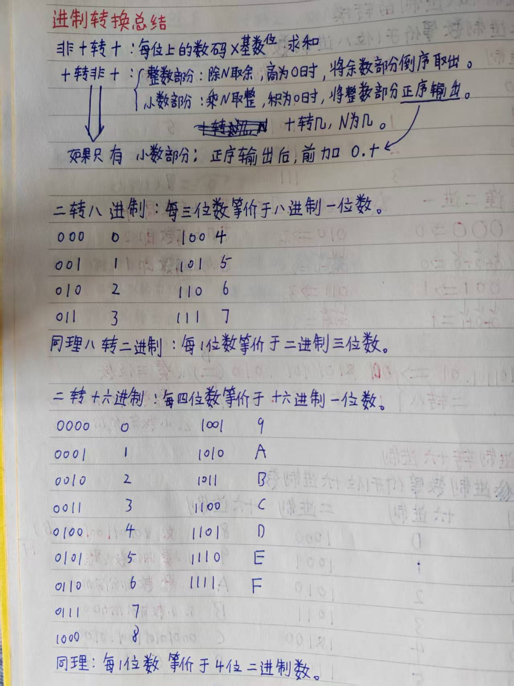

# 进制转换

## 进制(二、八、十、十六)

### 数码、基数、位权、尾符

- 数码：进制数的表示符号
- 基数：进制数数码的个数
- 位权：$基数^位$
- 尾符;区分进制数的标识

1. 二进制:
   - 数码：0~1
   - 基数：2
   - 位权：$2^n$
   - 尾符：B
2. 八进制
   - 数码：0~7
   - 基数：8
   - 位权：$8^n$
   - 尾符：O/Q
3. 十进制
   - 数码：0~9
   - 基数：10
   - 位权：$10^n$
   - 尾符:D
4. 十六进制
   - 数码：0~9，A~F
   - 基数：16
   - 位权：$16^n$
   - 尾符:H

### 进制转换

1. 非十进制数转十进制数
   - 口诀：每位上的数码*$基数^位$求和
$$
\begin{aligned}
1101.01_{(B)} 
&= 1 \times 2^3 + 1 \times 2^2 + 0 \times 2^1 + 1 \times 2^0 + 0 \times 2^-1 + 1 \times 1^-2 \\
&= 8 + 4 + 0 + 1 + 0 + 0.5\\
&= 13.5_{(D)}
\end{aligned}
$$
$$
\begin{aligned}
27_{(Q)} 
&= 2 \times 8^1 + 7 \times 8^0  \\
&= 16 + 7 \\
&= 23_{(D)}
\end{aligned}
$$
$$
\begin{aligned}
2C_{(H)} 
&= 2 \times 16^1 + 12 \times 16^0  \\
&= 32 + 12 \\
&= 44_{(D)}
\end{aligned}
$$

