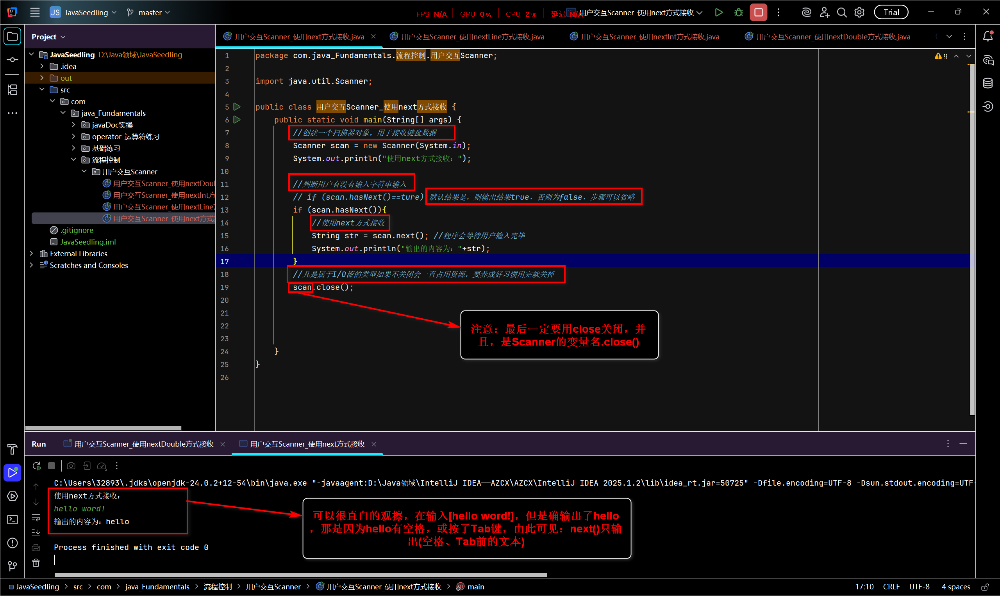
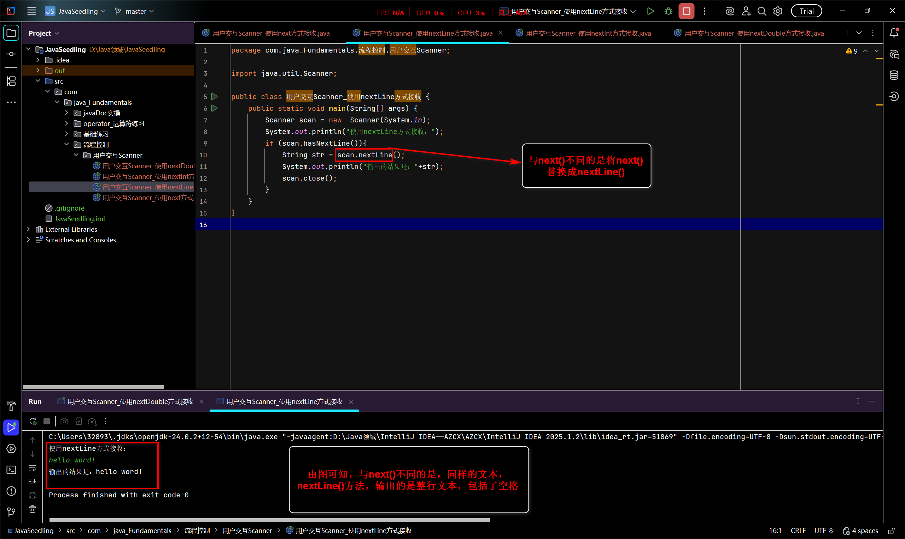
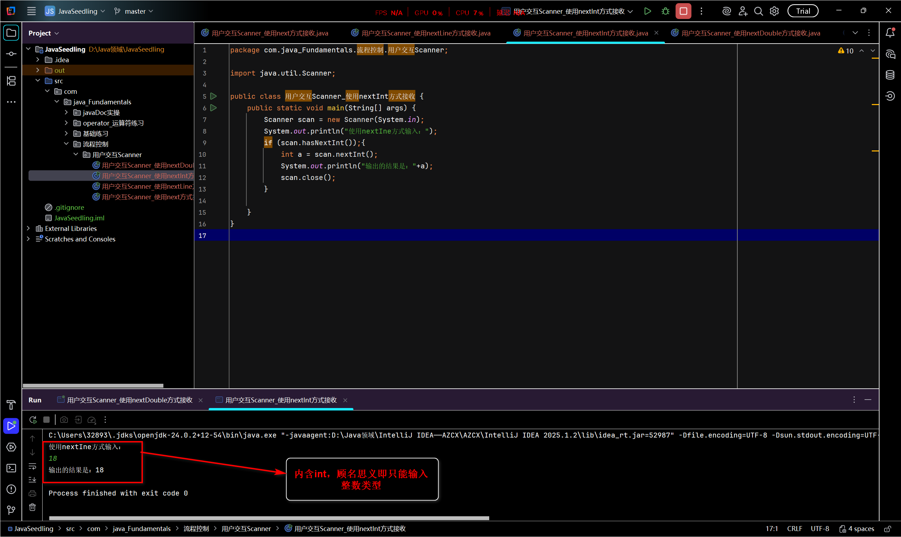
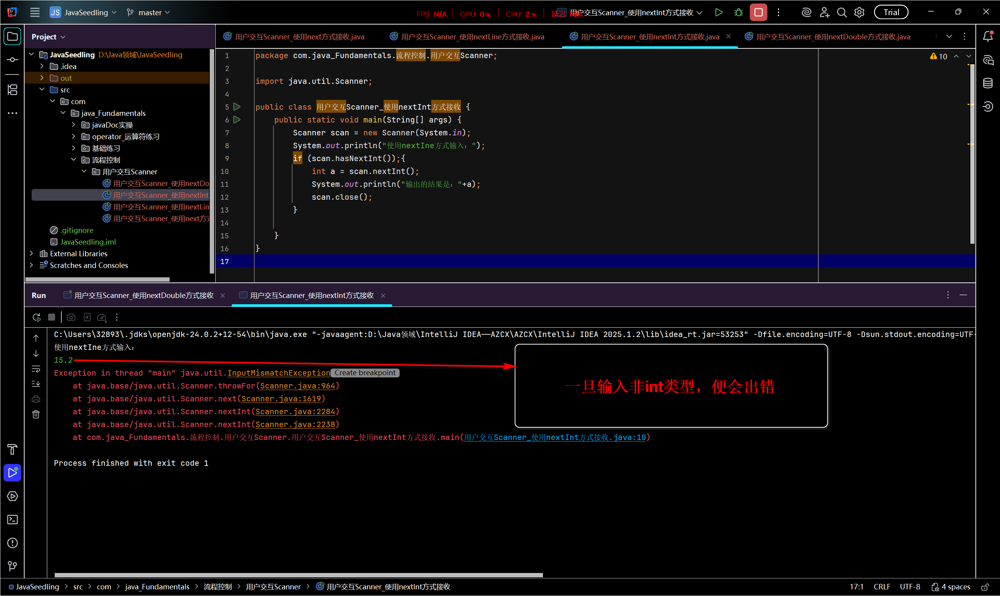
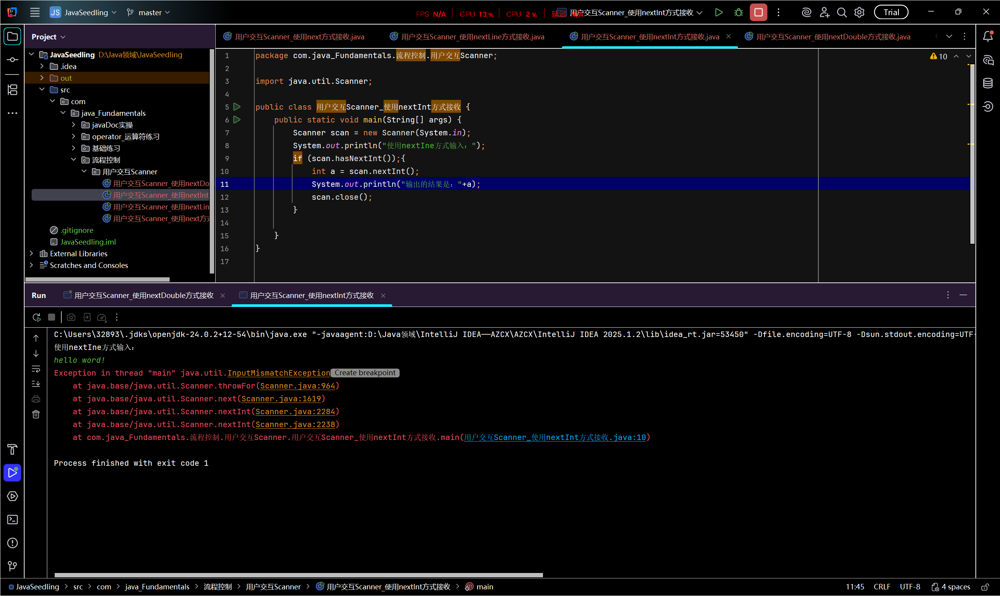
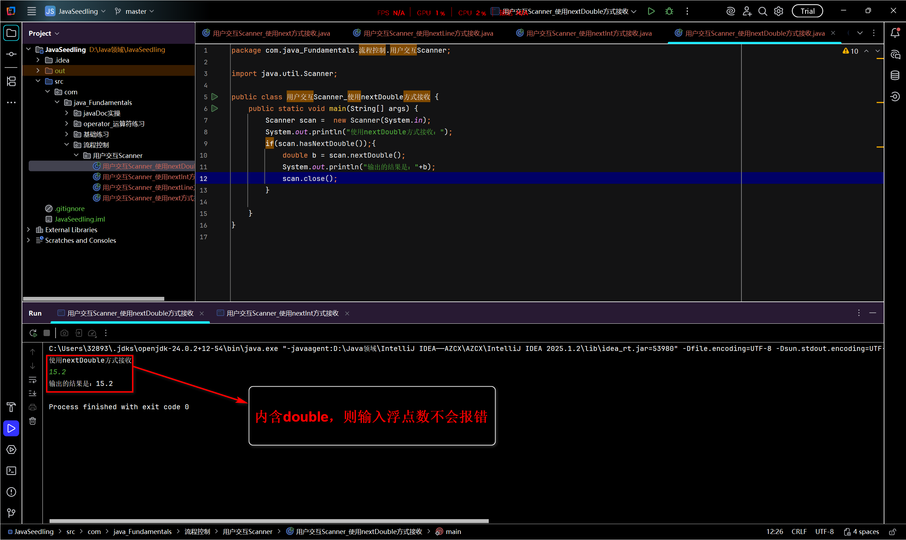
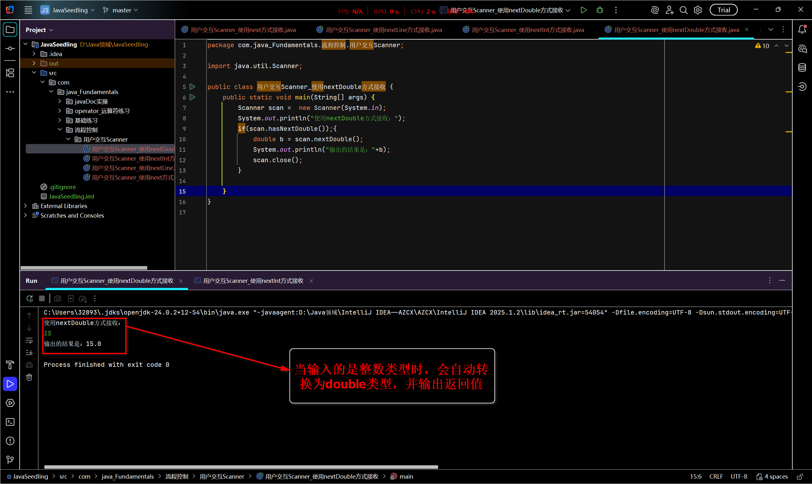
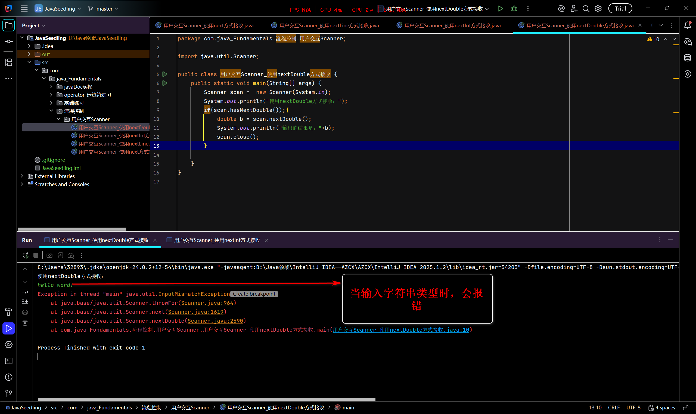

# Java流程控制01——用户交互Scanner

## Scanner对象

- 定义：它是Java中一个很实用的类，用于解析基本类型和字符串的简单文本扫描器。
- 主要工作就是：帮你的Java程序从外面"读"东西进来
- 它的基本语法：

```java
Scanner s = new Scanner(System.in);
```

- 使用Scanner的简单步骤：
  1. 导入：

     - 在程序的开头，输入：

     - ```java	
       import java.unil.Scanner;
       ```

     - 意思是："导入Java.util"工具包里的Scanner工具。

     - 准确来说：没有这句话，程序不知道Scanner是什么。

  2. 创建一个Scanner工具：

     - 在main方法里，输入：

     - ```JAVA
       Scanner scan = new Scanner(System.in);
       ```

     - 意思是：创建一个新的Scanner工具，并给它起个名字叫scan，这个工具专门**==用来监听键盘的输入==**

  3. 使用Scanner读取输入：

     - 读取用户输入的一连字(你空格，Tab为分格符，输出它们前面的文本)

       - ```JAVA
         String name = scan.next()
         ```

       - 

     - 读取用户输入的一行字(字符串——回车[Enter]为分隔符，输出整行的所有文本)：

       - ```JAVA
         String name = scan.nextline();
         ```

     - 读取用户输入的一个整数(比如年龄、数量)：

       - ```JAVA
         int age = scan.nextInt();
         ```

     - 读取用户输入的小数(比如价格、身高)：

       - ```JAVA
         double price = scan.nextDouble();
         ```

  4. 关闭Scanner：

     - 当你不需要从键盘读取任何输入后，为了节省资源，则需要输入：

       - ```JAVA
         scan.close();
         ```

       - 意思就是：关闭scan这个工具

总结：

1. 导入：import java.util.Scanner;

2. 创建并命名：Scanner scan = new

   ​			Scanner(System.in);

3. 使用：

   ```txt
   scan.next()
   scan.nextLine();
   scan.nextIne();
   scan.nextDouble;
   ```

   等方法获取输入。

4. 关闭：scan.close();

注意：**==next()与nextLine()方法==**是在Scanner类中用于获取输入的字符串，读取前一般需要使用**==hasNext()与hasNextLine()判断==**是否还有输入的数据。

## 实例：

### 使用next方法输入并返回结果

```JAVA
import java.util.Scanner;

public class 用户交互Scanner_使用next方式接收 {
    public static void main(String[] args) {
        //创建一个扫描器对象，用于接收键盘数据
        Scanner scan = new 	Scanner(System.in);
        System.out.println("使用next方式接收：");

        //判断用户有没有输入字符串输入
        // if (scan.hasNext()==ture):默认结果是，则输出结果true，否则为false，步骤可以省略
        if (scan.hasNext()){
            //使用next方式接收
            String str = scan.next(); //程序会等待用户输入完毕
            System.out.println("输出的内容为："+str);
        }
        //凡是属于I/O流的类型如果不关闭会一直占用资源，要养成好习惯用完就关掉
        scan.close();


    }
}

```

- 在IDEA中运行及注意事项



- 注意事项：
  1. 由图可见，在输入[hello word!]，但是确输出了hello，那是因为hello有空格，或按了Tab键，
  2. 则得出结论：**next()只输出(空格、Tab==前==的文本)**
  3. **最后要以：Scanner的变量名.close()**结尾

### 使用nextLine方法输入并返回结果

```JAVA

import java.util.Scanner;

public class 用户交互Scanner_使用nextLine方式接收 {
    public static void main(String[] args) {
        Scanner scan = new  Scanner(System.in);
        System.out.println("使用nextLine方式接收：");
        if (scan.hasNextLine()){
            String str = scan.nextLine();
            System.out.println("输出的结果是："+str);
            scan.close();
        }
    }
}

```

- 在IDEA中运行及注意事项：



- 注意事项：
  1. 由图可见，在输入[hello word!]，并且输出的结果也是[hello word!]
  2. 则得出结论：**nextLine是返回输入==整行==的值**
  3. **最后要以：Scanner的变量名.close()**结尾

以上是可以输入任何数据类型（整数、浮点数、字符串等）的两种方式[next()以及nextLine]

 ### 使用nextInt方法输入并返回结果

 ```JAVA
 
 import java.util.Scanner;
 
 public class 用户交互Scanner_使用nextInt方式接收 {
     public static void main(String[] args) {
         Scanner scan = new Scanner(System.in);
         System.out.println("使用nextIne方式输入：");
         if (scan.hasNextInt());{
             int a = scan.nextInt();
             System.out.println("输出的结果是："+a);
             scan.close();
         }
 
     }
 }
 
 ```

- 在IDEA运行及注意事项：







- 注意事项：
  1. 由图1可见，当输入15[整数]时，返回值是15，但是图2与图3，输入的是double(浮点数)和String(字符串)类型的，便会报错
  2. 则得出最后的结论：nextInt**==只支持整数类型输入==**
  3. **最后要以：Scanner的变量名.close()**结尾

### 使用nextDouble方法输入并返回结果

```JAVA

import java.util.Scanner;

public class 用户交互Scanner_使用nextDouble方式接收 {
    public static void main(String[] args) {
        Scanner scan =  new Scanner(System.in);
        System.out.println("使用nextDouble方式接收：");
        if(scan.hasNextDouble());{
            double b = scan.nextDouble();
            System.out.println("输出的结果是："+b);
            scan.close();
        }

    }
}

```

- 在IDEA运行及注意事项







- 注意事项：
  1. 图1可见：输入15.2(浮点数)，最后的返回值是15.2；但图2，输入15(整数)，但是返回值是15.0；图3，输入[hello word!]，会直接报错。
  2. 则得出最后结论：nextDouble()是，**==输入double(浮点数)==**类型时，**正常输入结果**；**==输入int(整数)类型==**会**先将int(整数)类型升为double(浮点数)类型，在输出**；**输入String(字符串)类型会直接报错。**
  3. **最后要以：Scanner的变量名.close()**结尾

## next()与nextLine()的区别总结

- **next**():
  1. 一定要读取到有效字符后才可以结束输入；
  2. 对输入有效字符之后遇到的空白，next()方法会自动将其 去掉
  3. 只有输入有效字符后才将其后面输入的空白作为分隔符或者结束符
  4. next()不能得到带有空格的字符串
- nextLine:
  1. 以Enter为结束符，也就是说nextLine()方法返回的值是输入回车之前的所有字符。
  2. 可以获得空白


