# Java流程控制04——if选择结构

## 选择结构分为：

- **if**单选择结构
- if双选择结构
- if多选择结构
- 嵌套的if结构
- **switch**多选择结构

## if单选结构

- 在生活中很多时候需要取判断一个东西是否可行，然后我们才去执行，这样一个过程在程序中用if语句表示。
- 语法：

```JAVA
if(布尔表达式){
    //如果布尔表达式为true将执行语句
    //若为false将跳过语句(不执行)
}
```

- 图解：

  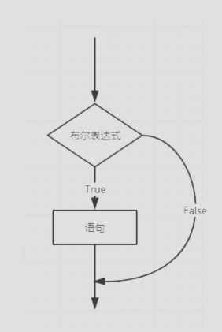

```JAVA
//导入Scanner包
import java.util.Scanner;

public class if单结构{    
    public static void main(String[] args){
        //创建一个Scanner工具
        Scanner scanner = new Scanner(System.in);
        //创建变量名，以及使用Scanner方法
        String s = Scanner.nextLine();
        //使用if单选结构。其中equals：判断字符串是否相等
        //判断输入结果是否是hello
        //如果不是会越过if内的内容，往后运行
        //如果是会先运行if的内容，然后按照循序结构依次从上到下运行
        if(s.equals("hello")){
            System.out.println("s");
        }
		System.out.printLn("End");
        scanner.close();
      
    }
    
}
```

- 在IDEA上实操及注意事项：
  - 输入相同的数据

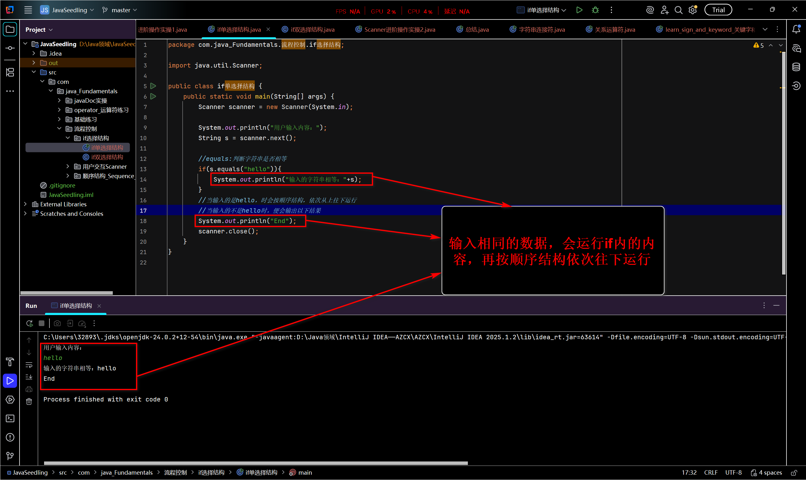

- 输入不同的数据

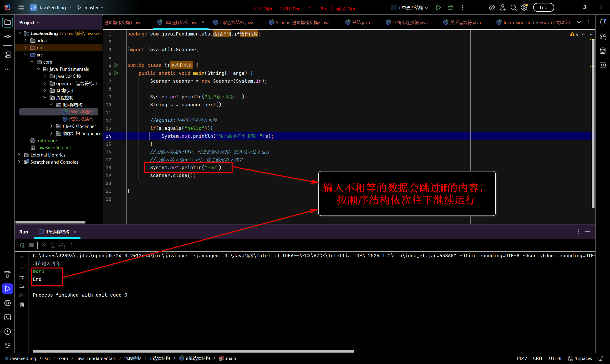

注意事项：

- 1. 由两张图可知：
     - 不管输入的是否相等，都会按照顺序结构依次运行到最后Scanner变量名.close()
     - 相等的时候：会运行if内的内容
     - 不相等的时候：会跳过if内的内容

###  equals

- equals是一个方法(函数)，用于比较两个对象的内容或值是否在逻辑上"相等"

- 它的目的是检查两个不同的对象实例所包含的数据是相同，而不是检查它们是否是内存中的同一个对象。

- - equals与==的根本区别

  | 特性     |                           ==操作符                           | .equals()方法                                              |
  | -------- | :----------------------------------------------------------: | ---------------------------------------------------------- |
  | 比较目标 |                     对象的引用(内存地址)                     | 对象的内容(值)                                             |
  | 本质     |                检查两个变量是否指向同一个对象                | 检查两个不同对象的内容是否逻辑相等                         |
  | 比喻     |          比较两个身份证号码是否完全一样(是同一个人)          | 比较两个人(不同身份证)的姓名、年龄等是否相同(是双胞胎码？) |
  | 适用类型 | ==**适用于所有基本数据类型（String、int、float、double）和对象引用**== | **==主要用于对象(不是基本数据类型)==**                     |

- 总结：

  1. equals:
     - 作用于对象则：只支持Scanner方法中的(next和nextLine)
       - 所以定义变量类型时只支持：String(字符串类型)
     - Scanner方法中的(nextInt、nextDouble、nextBoolean、nextFloat……)基本数据类型无法使用
       - 所以当定义的变量类型为：byte、short、int、long、float、double等的基本数据类型时，会报错无法使用

- 再IDEA上实操及总结

  - 使用Scanner方法：next()和nextLine()——对应的变量类型String

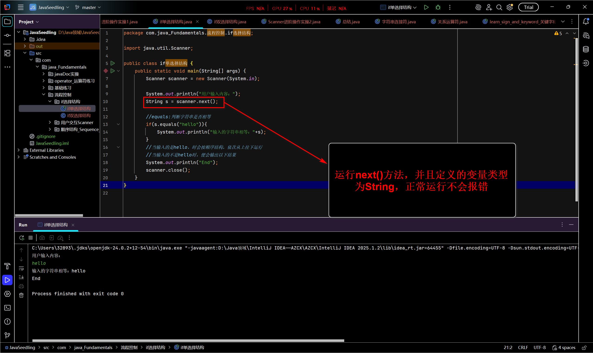

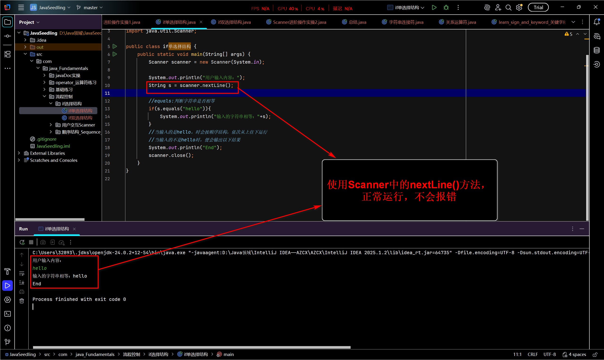

- - 使用Scanner方法：nextInt()、nextDouble()——对应的变量类型(int、double)

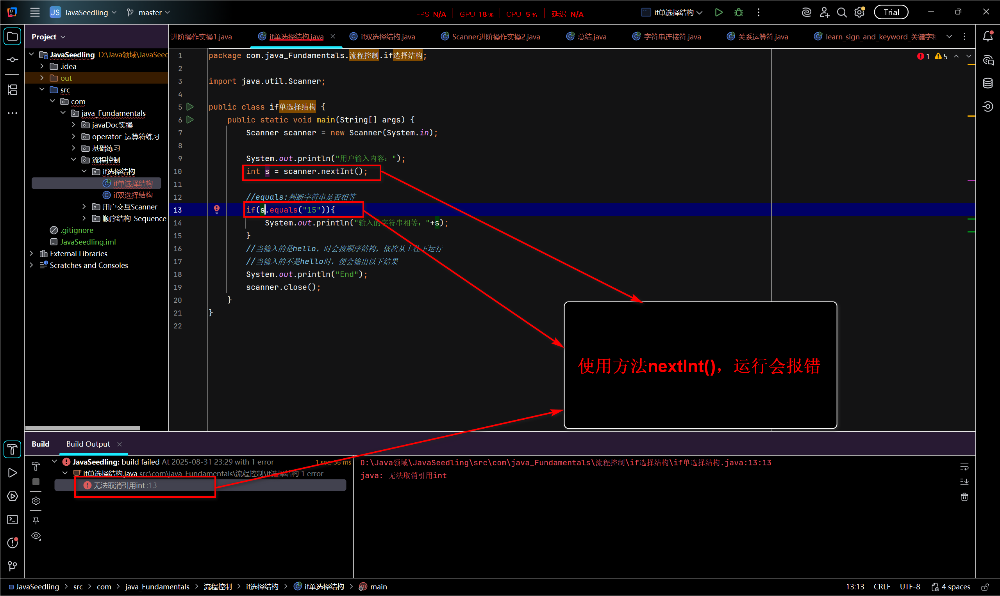

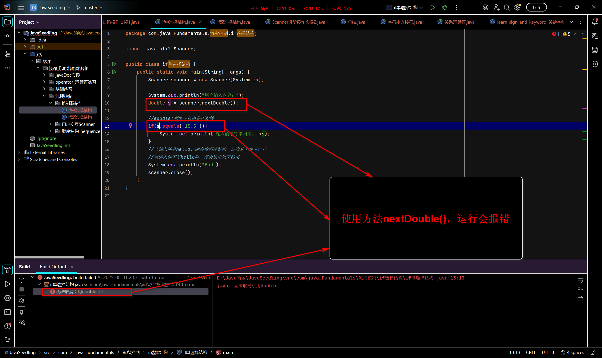

- 总结[再equals()方法当中]：
  - 由以上4张图可见;
    - 定义基本数据类型(int、double、Boolean……)以及对应的Scanner方法会报错。
    - 定义String类型以及对应的Scanner方法next()、nextLine()正常运行

## if双选择结构

- if双选择结构也通常称为(if-else语句)，它是一种基本的程序控制流程结构。
- 它根据一个条件的"真"(True)或"假"(false)，从两个可能的代码路径中选择且仅选择一条来执行。
- 它的核心逻辑是："如果条件成立，则做A；否则，就做B"
- 核心就是二选一：
  - 如果条件为真(true)，则执行if代码块中的语句("A"部分)，执行完毕后跳过else代码块，继续执行后面的程序。
  - 如果条件为假(false)，则跳过if代码块，转去执行else代码块中的语句("B"部分)，然后继续执行后面的程序。
- 流程图：

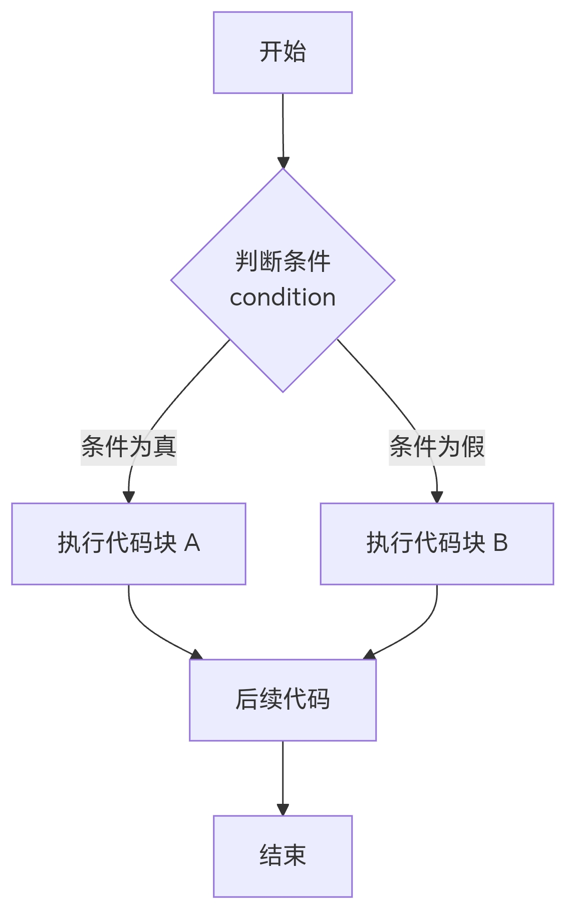

语法：

```txt
if(布尔表达式){
    //如果布尔表达式的值为true
}else{
    //如果布尔表达式为false
}
```

- 实操
  
  ```JAVA
  //导入Scanner方法
  import java.util.Scanner;
  
  public class if双结构实操{
      public static void main(String[] args){
          //任务写一个考试分数大于60分及格，小于60分就不及格的流程程序
          Scanner scanner=new Scanner(System.in);
          System.out.println("请输入考试成绩：");
          int Score = scanner.nextInt();
          //运用if表达式
          //Score(成绩)>60,运行if代码块
          if(Score>60){
              System.out.println("及格");
  
  
          }else{
              //否则Score≤60,运行else代码块
              System.out.println("不及格");
  
          }
          scanner.close()
           /*
           	最后输出的结果与输入的值挂钩
           	1.当输入符合的条件时，会运行if代码块，而不会运行else代码块；
           	2.当输入不符合的条件时，会跳过if代码块，运行else代码块；
           	3.但最后，都会运行到结尾
           	*/
           	
          
          
      }
  }
  ```

- 在IDEA运行及总结

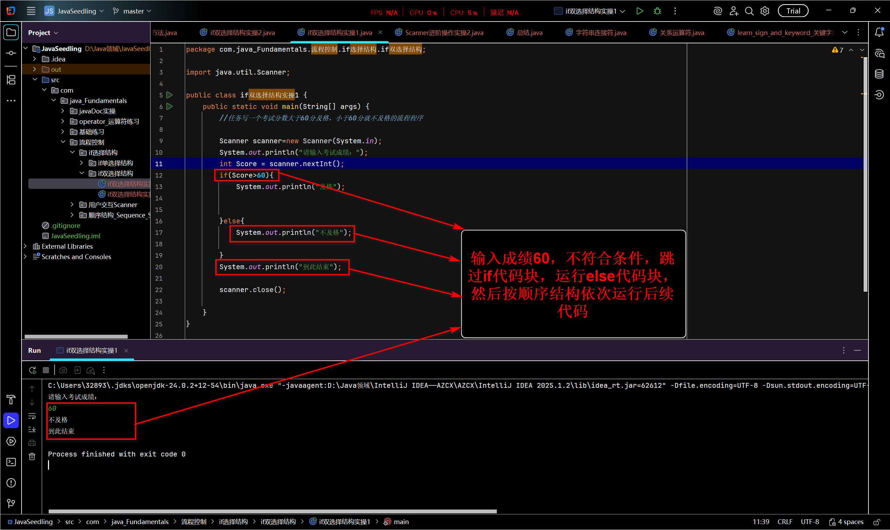

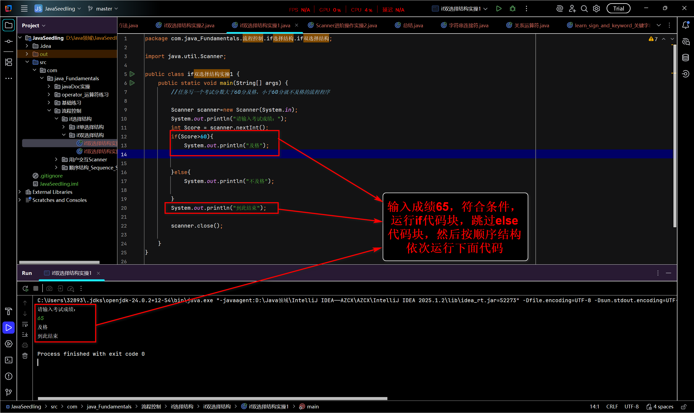

总结：

1. 如图所示：
   - 输入符合条件，运行if代码块
   - 输入不符合条件，运行else代码块
2. 注意：
   - 不管是符合还是不符合，都会按照顺序结构，从上到下，依次运行代码到最后。

| 特性         | 描述                                                         |
| ------------ | ------------------------------------------------------------ |
| 名称         | if双选择结构、if-else语句                                    |
| 目的         | 根据一个条件的真假，在两条互斥的代码路径中选择一条执行       |
| 执行逻辑     | 非此即彼，二选一。必定会执行其中一个分支，且只执行一个       |
| 关键字       | if、else                                                     |
| 与单选择区别 | 单选择结构(只有if)在条件为假时什么都不做，直接跳过；**==双选择结构在条件为假时也有对应的操作(else块)==** |

## if多选择结构

- if多选择结构，也称为**==多分支选择结构或if-else if阶梯==**，是编程中用用于处理多个互斥条件的一种流程控制语句。

- 它的核心思想是：按顺序检查一系列条件，一旦发现某个条件为真(true)，执行 与之对应的代码块，并且跳过其后所有其他分支，直接完成整个结构。

- 如果所有条件都不为真(true)，则可以选择执行一个默认的代码块(else部分)

- 语法结构：

  ```txt
  if(布尔表达式1){
    //如果布尔表达式   1的值为true执行代码块
  }else if(布尔表达式 2){
    //如果布尔表达式   2的值为true执行代码块
  }else if(布尔表达式 3){
    //如果布尔表达式   3的值为true执行代码块
  }else{
    //如果以上布尔表达式都不为true执行代码
  }
  ```

流程图：

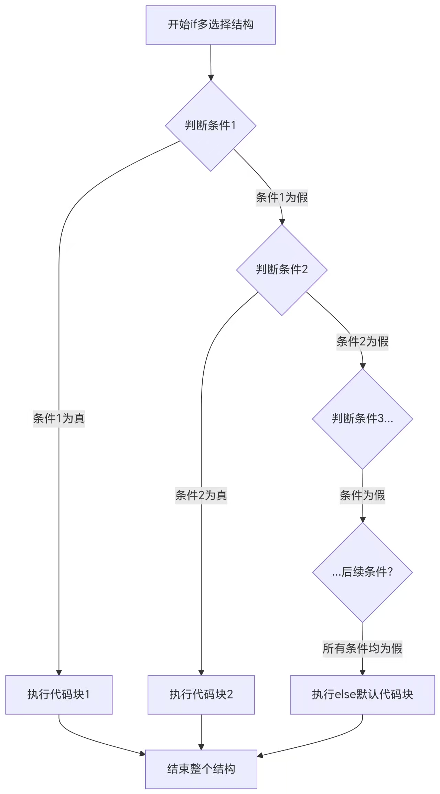

- 从上图总结关键点：
  - 自上而下判断：条件是从上到下依次进行判断的。
  - 互斥执行：一旦某个条件被满足并执行了对应的代码块，整个结构就立即结束，后面的(else if)或else不会再被判断或执行
  - else是可选的：你可以不写else部分。如果所有条件都不满足，且没有else，那么这个多选择结构将不会执行任何操作。
  - else if的数量：可以根据需要写任意多个else if分支。

```java
import java.util.Scanner;

public class if多选择结构{
    public static void main(String[] args){
        /*要求：写出考试评分系统；
        	100 满分；
        	90~100 A级；
        	80~90  B级；
        	70~80  C级；
        	60~70  D级；
        	0~60   不合格；
        	注意范围只在0~100为合法成绩
        	其他不合法
           进阶：采用循环while结构
           	 	定义循环退出程序
           	 */
        	
        //使用Scanner
        Scanner scanner = new Scanner(System.in);
        
        //打印标题
        System.out.println("请输出成绩");
        //使用while循坏结构
        while(scanner.hasNextInt()){
            //定义变量名，来接收scanner输入的返回值
            int score = scanner.nextInt();
            //设置退出循环结构
            if(score == -1){
                System.out.println("程序退出");
                break;
            //意思是当输入-1，整个循环终止。
            }if(score == 100){
                System.out.println("满分")；//意思是，当成绩再100(包含100)，评定为满分
            }else if(score<100 && score>=90){ //&&是逻辑与，意思是需要同时满足全部条件，才为真(true)
                System.out.println("A级");  //意思是，当成绩再90~100(包含90)，评定为A级
            }else if(score<90 && score>=80){
                System.out.print("B级"); //意思是，当成绩再80~90(包含80)，评定为B级
            }else if(score<80 && score>=70){
                System.out.print("C级"); //意思是，当成绩再70~80(包含70)，评定为C级
            }else if(score<70 && score>=60){
                System.out.println("D级"); //意思是，当成绩再60~70(包含70)，评定为D级
            }else if(score<60 && score == 0){
                Sysrem.out.println("不合格"); //意思是，当成绩再0~60(包含0)，评定为不合格
            }else{  //else：当输入的数据与以上条件都不符合，则运行。
                System.out.print("输入的成绩不合法")  //已知以上定义的成范围在0~100(包含0和100)，也就是说当输入的数据不在这个范围内时，将运行else代码块
            }
               //设置下一个循环的标题
            	System.out.println("请输入下一个成绩");
        }
           //结束Scanner方法
        		scanner.close();
        
    }
}
```

- 在IDEA上运行及总结

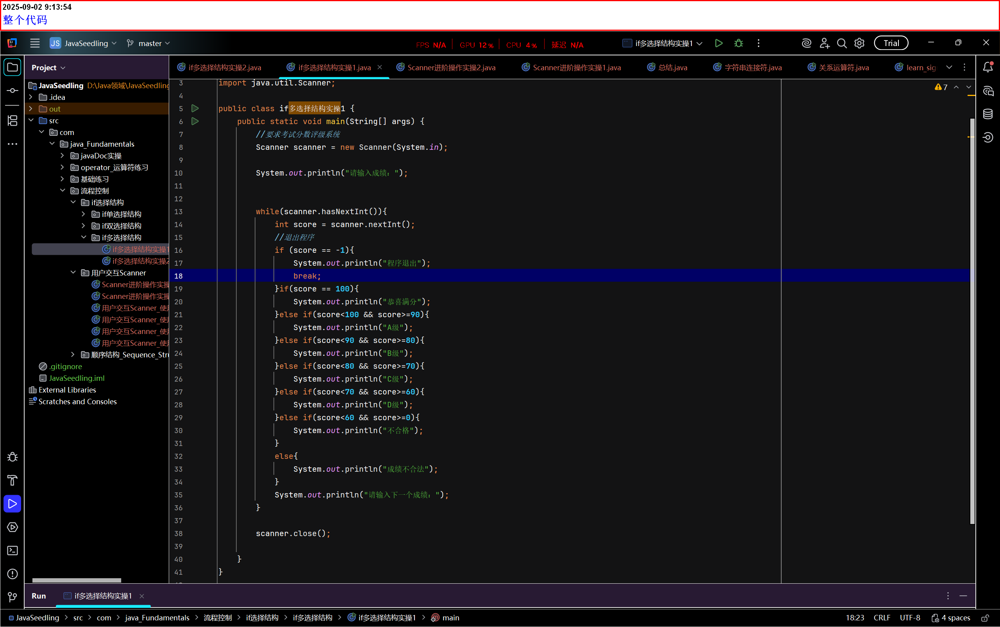

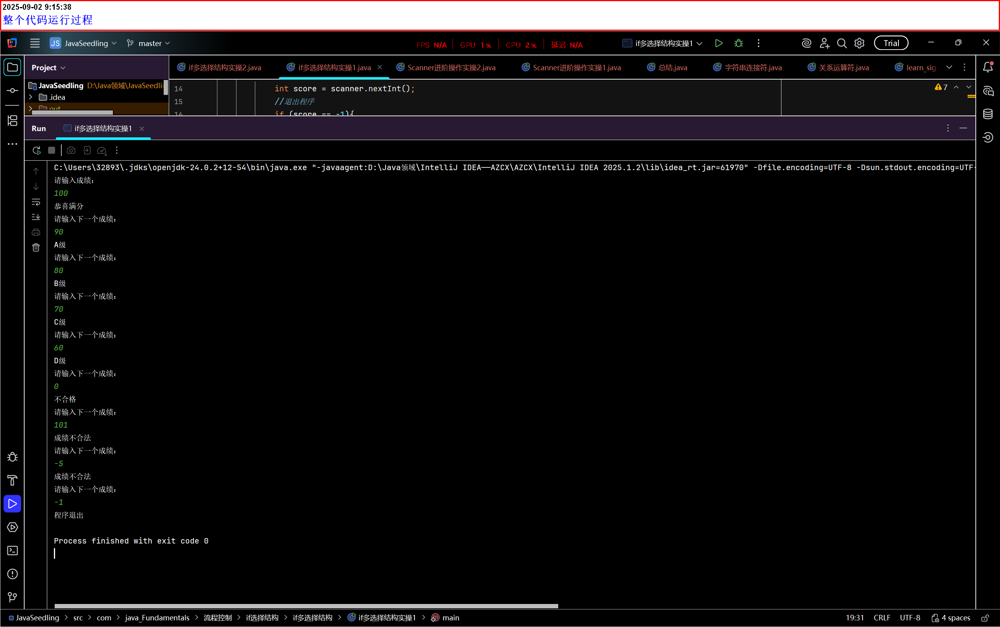

总结：

- - (else if)可以是无限个
  - 但是else代码块只能出现一个

## 嵌套的if结构

- 嵌套的if结构是指在一个if语句(或[else if]和else分支)的内部，再包含另一个完整的if语句。
- 这种结构允许程序进行多层次的、更复杂的条件判断。外层的条件首先被评估，如果为真(true)，程序才会进入其他代码块的内部，并评估内层的条件。
- 就想问："如果这是真的，那么再检查一下这个是不是也真的？"
- 工作原理与执行流程：
  - 程序会由内向外逐层检查条件。
    - 1. 首先判断最外层的条件
      2. 如果为真，则执行其代码块内的语句，包括内部嵌套的if语句。此时才会去判断内层条件。
      3. 如果外层为假，则跳过整个代码块(包括内层嵌套的if)，继续执行后续的代码。内层的条件根本不会被评估。

- 语法：

```JAVA
if(布尔表达式 1){
    //如果布尔表达式 1的值为true执行代码
    if(布尔表达式 2){
        //如果表达式 2的值为true执行代码
    }
}
```

- 流程图：

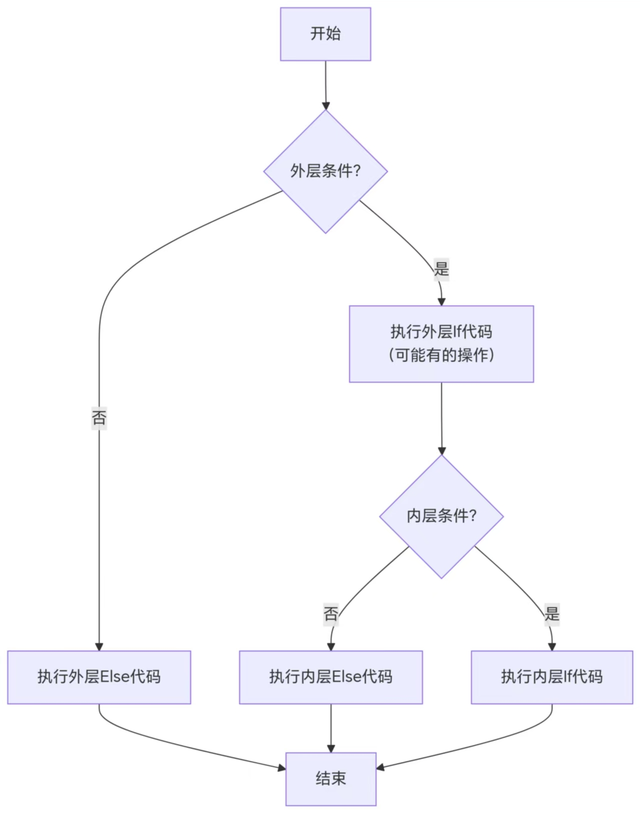

## if选择结构区别总结

| 特性 | if单选择结构 | if双选择结构 | if多选择结构 | 嵌套if结构 |
|------|-------------|-------------|-------------|------------|
| 分支数量 | 只有1个条件分支 | 有2个分支（条件成立/不成立） | 有3个或更多分支 | 在分支内部可包含任意层级的if结构 |
| 执行逻辑 | 条件成立时执行代码，否则跳过 | 条件成立执行if块，不成立执行else块 | 按顺序检查多个条件，执行第一个满足条件的分支 | 外层条件满足后，再检查内层条件，可形成多级判断 |
| else使用 | 不使用else分支 | 使用1个else分支 | 可使用多个else if和1个else分支 | 可在任意层级使用else或else if |
| 适用场景 | 只需处理条件成立的情况 | 需要处理条件成立和不成立两种情况 | 需要处理多种不同的条件情况 | 需要处理复杂的多条件组合判断 |
| 结构特点 | 最简单的条件判断结构 | 非此即彼的二选一结构 | 多条件依次判断的选择结构 | 层次化的条件判断结构，可形成决策树 |
