# Java流程控制05——Switch选择结构

## Switch多选择结构

- 多选择结构还有一个实现方式就是Switch case语句；
- switch case 语句判断一个变量与一系列中某个值是否相等，每个值称为一个**==分支==**。
- switch语句中的变量类型可以是：
  - byte、short、int、或则char(字符类型)。
  - **==从Java SE 7 开始==**
  - ==**switch支持字符串String类型**==
  - 同时case 标签必须为字符串常量或字面量
- 语法：

```JAVA
switch(expression){
    case value:
        //语句
        break;  //可选
    case value:
        //语句
        break; //可选
        //你可以有任意数量的case语句
        default : //可选
        //语句
}
```

- 实操：

```JAVA
import java.util.Scanner;

public class switch实操{
    public static void main(String[] args){
        /*
    	任务：
    		1.使用字符类型(char)
    		2.判断条件：
    			A——优秀
    			B——良好
    			C——及格
    			D——再接再厉
    			E——挂科
    			其他均为未知成绩
        进阶操作：
        	1.使用wile循环结构；
        	2.设置循环结束程序
        	*/
        //创建Scanner方法
     	Scanner scanner = new Scanner(System.in);
        
        //定义标题
     	System.out.println("请输入单一字符：");
        
        //使用循环结构
    	while(scanner.hasNext()){
            
            //定义接收输入数据的变量名
        	char grade = scanner.next().charAt(0);
            
            //设置循环解除程序
        	if(grade =='G'){
        		System.out.println("程序结束，谢谢使用");
        		break;
    	}
            //使用switch语句
        	switch(grade){
            	case 'A':
               	 	System.out.println("优秀");
                	break; //可选
           	 	case 'B':
                	System.out.println("良好");
                	break;
            	case 'C':
                	System.out.println("及格");
                	break;
            	case 'D':
                	System.out.println("再接再厉");
                	break;
            	case 'E':
                	System.out.println("挂科");
                	break;
            	default :
                	System.out.println("未知等级");
        }
            	System.out.println("输入G，终止程序");
            	System.out.println("请输入别的字符：");

        }
        scanner.close();

        
    }
    
    
        	
    
}
```

- 再IDEA运行及注意事项

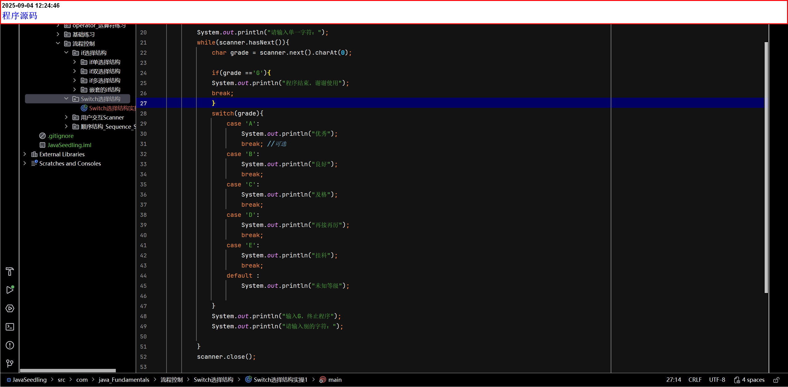

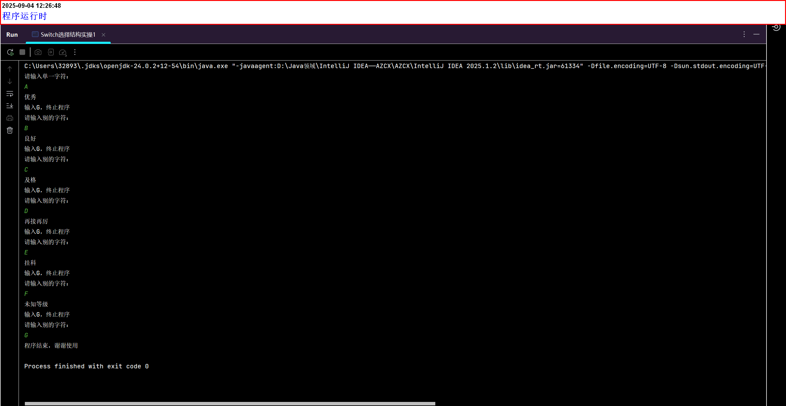

### switch穿透现象：

- 因为再switch语句中，break和defualt是可选项所以：
  1. 当不输入break时(也叫**switch穿透现象**)：

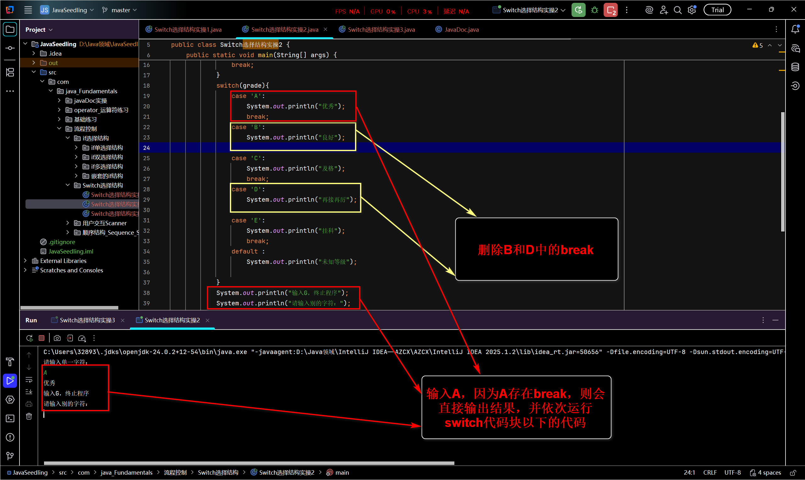

- - - 如图所示：如果判断条件(case)本身存在break，则会直接输出结果，然后继续依次执行switch case代码块下面的代码

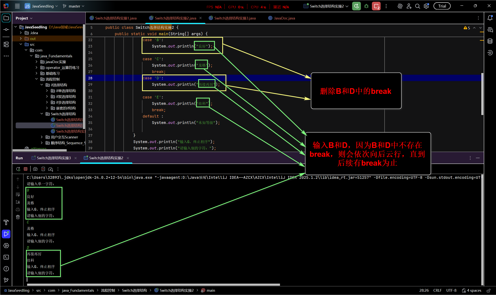

- - - 如图所示：如果判断条件(case)本身不存在break，则会从当前(条件为真)开始，往后依次输出switch代码块**==内的代码==**，直到后面存在break为止，然后再依次执行switch case代码块**==外的代码==**

2. 当不使用defualt时

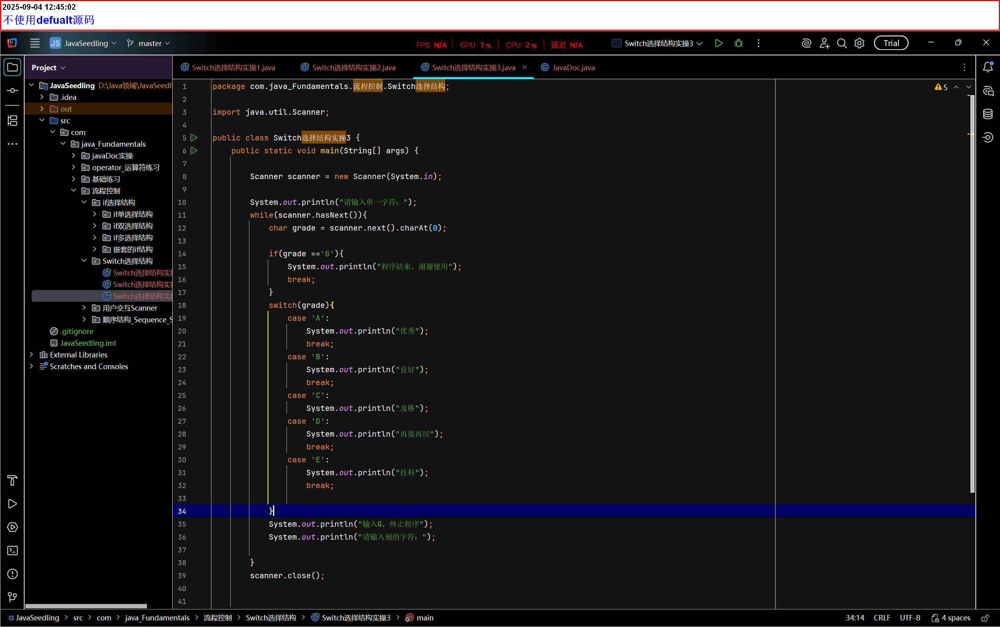

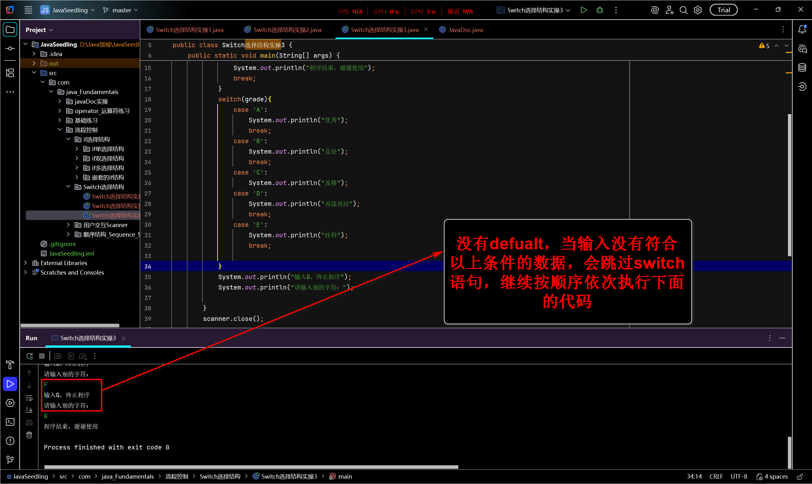

- - - 如图所示：switch末尾没有defualt，并且输入的数据没有符合以上全部条件的，会跳过switch代码块，继续按顺序依次执行下面的代码。

## jdk7的新特性

- 表达式结果可以是字符串！！！
- 字符的本质还是数字

## 反编译

- 定义：Java文件-------class(字节码文件)--------反编译

  - 意思是：写的Java文件，**==会先编译成class文件==**(字节码是计算机看的懂的文件，人看不懂)，所以需要反编译成人看的懂的文件即**==反编译器==**

  - 反编译器有：
    - 图形化界面工具(GUI Tools)
      - 1. JD-GUI
        2. Bytecode Viewer(BCV)
        3. Recaf
    - IDEA 内置反编译器

- 使用IDEA反编译过程

1. 找到装有Java储存class文件的地址

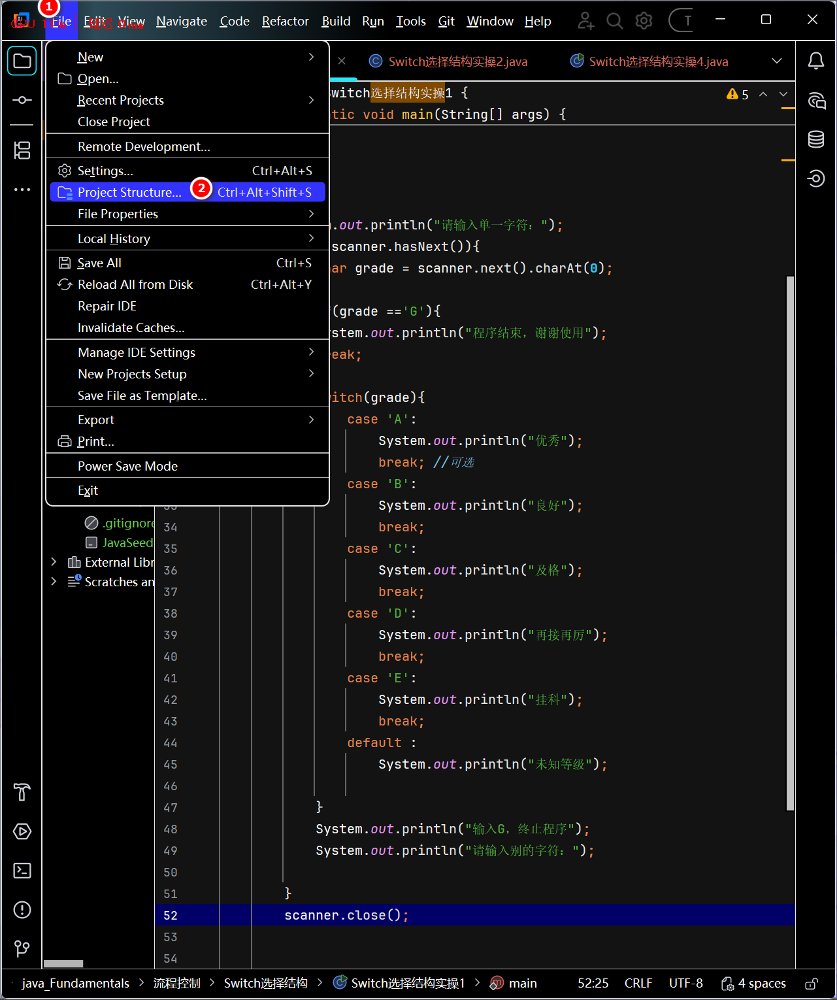

2. 复制，并打开资源管理器

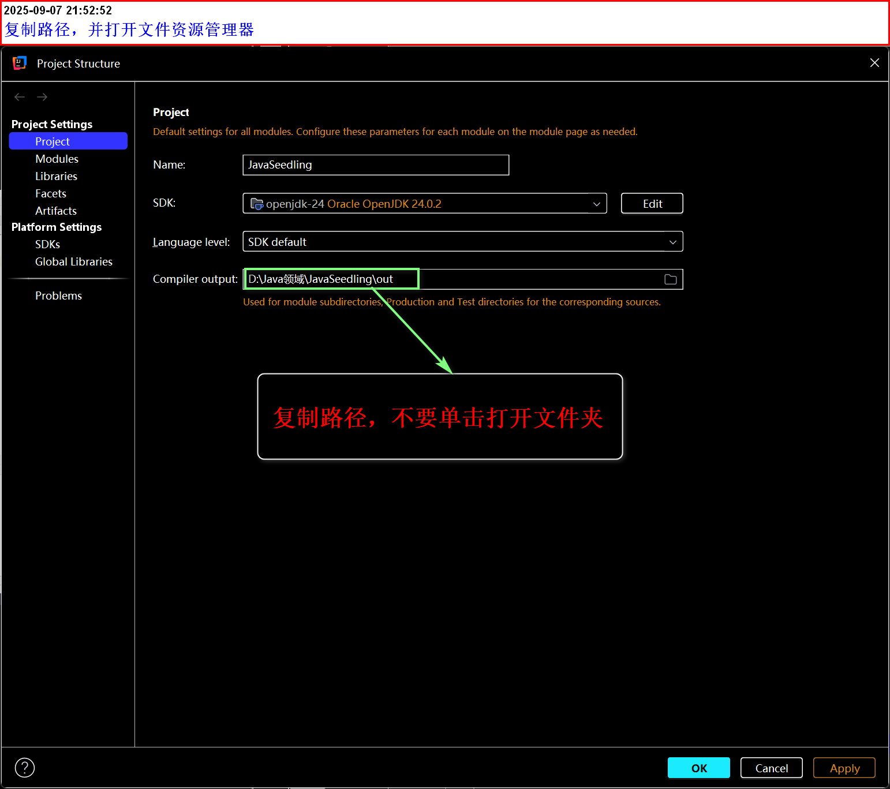

3. 粘贴并回车

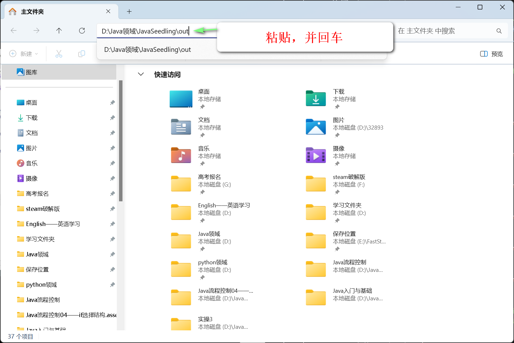

4. 找到需要反编译的文件

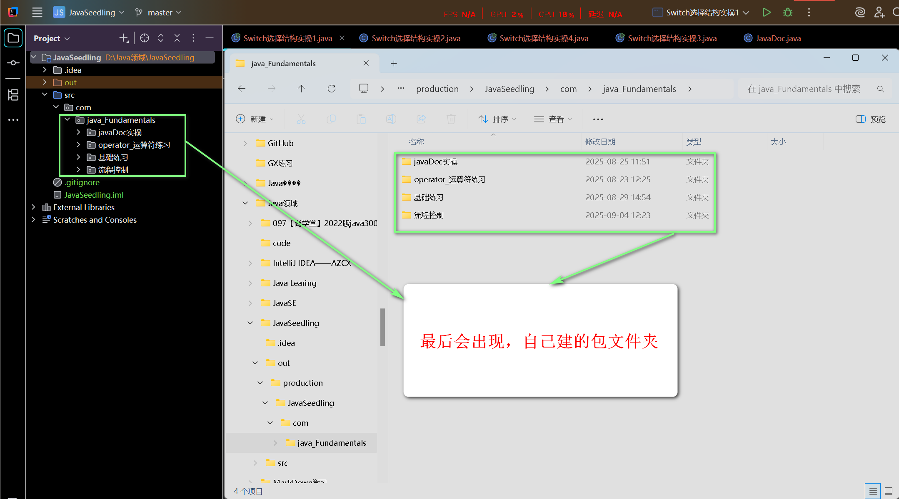

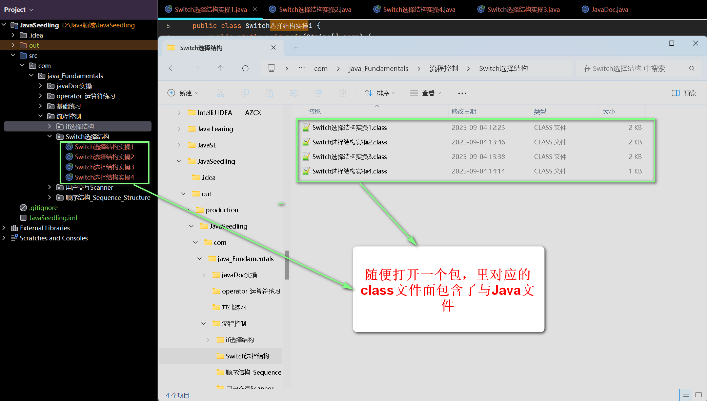

5. 看一遍，class(人看到的只是一堆看不懂的乱码)

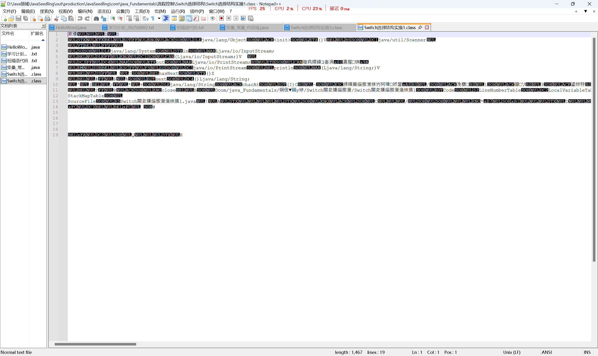

6. 使用IDEA反编译

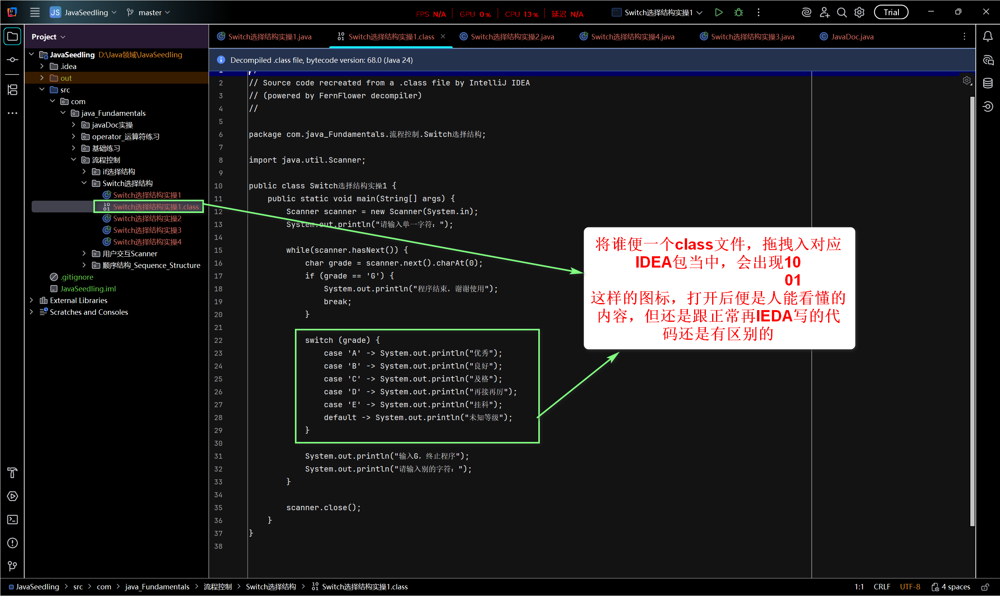

- 这里面会有hashCode，每一个对象都会有自己的hashCode值
- switch是通过hashCode判断是否条件相等

7. 将反编译的文件拖回对应的包文件夹当中(按需求来)

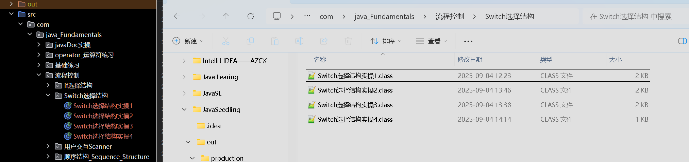

## 总结：

1. switch结构属于选择结构，它是通过class反编译中对象的hashCode值判断条件是否相等的
2. 当switch代码块中，没有break时，会发生switch穿透现象。
3. 当switch代码块中，没有defualt时，且没有条件相等时，会跳过switch结构，直接按顺序运行switch代码块外的代码。
4. jdk7后，表达式结果可以式字符串了
5. 我们人能看懂代码是通过：Java文件---------class文件---------------通过反编译器
6. 每一个对象都有对应的hashCod
